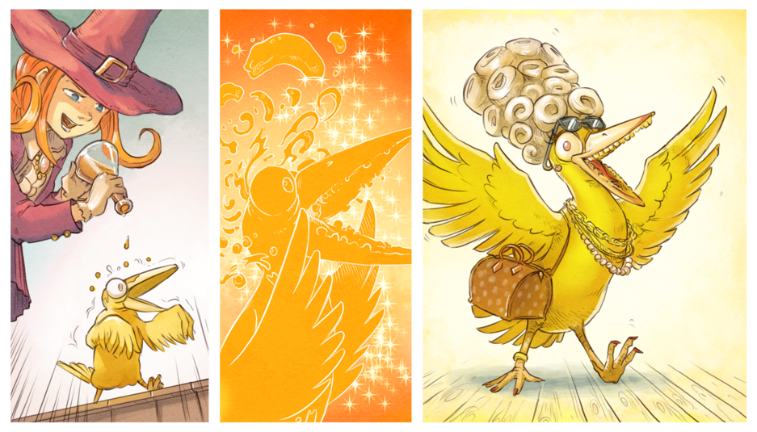

<link href="https://fonts.googleapis.com/css2?family=DM+Serif+Display&display=swap" rel="stylesheet">

<style type="text/css">
  @font-face {
font-family: 'Nodesto Caps Condensed';
font-style: normal;
font-weight: normal;
src: local('Nodesto Caps Condensed'), url(https://github.com/jonathonf/solbera-dnd-fonts/raw/master/Nodesto%20Caps%20Condensed/Nodesto%20Caps%20Condensed.otf) format('opentype');

unicode-range: U+0000-00FF, U+0131, U+0152-0153, U+02C6, U+02DA, U+02DC, U+2000-206F, U+2074, U+20AC, U+2212, U+2215; }

  .phb#p1{ text-align:center; }
  .phb#p1:after{ display:none; }
  .phb#p1 h1 { text-align: center; font-family: 'Nodesto Caps Condensed';font-size:90px;-webkit-text-fill-color: white;-webkit-text-stroke-width: 3px;
  -webkit-text-stroke-color: black;}
  .phb#p1 h2 { text-align: center; font-family: 'Nodesto Caps Condensed';font-size:60px;-webkit-text-fill-color: white;-webkit-text-stroke-width: 2px;
  -webkit-text-stroke-color: black;}
  .phb#p1 h5 { color: white; 
  font-size: 18px;
  font-family: 'arial';
  -webkit-text-fill-color: white;-webkit-text-stroke-width: 1.5px;
  -webkit-text-stroke-color: black;}
</style>

<div style='margin-top:150px;'></div>

<div class="wide">

<!--GenericItem-->

# <!--Name-->WITCHCRAFT<!--/Name-->

## La Magie d'Hereva

<div style='margin-top:600px;'></div>

##### Un supplément pour le plus grand jeu de rôle au monde.

##### Pour jouer des personnages de sorcières basés sur le web comic Pepper & Carrot

</div>

<div class='pageNumber auto'></div>

\page

## Un monde de magie et d'aventure

Bienvenue lecteurs ! Merci d'avoir choisi ce supplément, j'espère sincèrement qu'il vous plaira autant qu'à moi de l'écrire. Ce livre est le premier d'une série de suppléments inspirés du monde d'Hereva, basés sur la bande dessinée Pepper & Carrot de David Revoy.

Mais ce ne sont pas mes premiers travaux. J'ai déjà écrit quelques suppléments bien accueillis et ils sont disponibles à l'achat en ligne (certains sont payants).

Vous en trouverez quelques-unes ci-dessous sur cette page.


<div class="wide">

<div style='margin-top:500px;'></div>

## Plus de titres du même auteur

|  |  |  |
| :---: | :---: | :---: |
| Immortuos - <br>Undead Monsters for D&D | The Book of Many Eyes - <br>Beholders for 5e | The Cursed Mountain |

</div>

<div class='pageNumber auto'></div>

\page

<div class="wide" style="text-align: center">

# Witchcraft

## La Magie d'Hereva

<div style='margin-top:50px;'></div>

#### Un supplément pour le plus grand jeu de rôle au monde.

#### Pour jouer des personnages de sorcières basés sur le web comic Pepper & Carrot, créé par David Rejoy.

<div style='margin-top:50px;'></div>

#### Par Xacur

</div>

<div style='margin-top:450px;'></div>

- Design : Xacur.
- Design additionel : David Caamal.
- Developpement : Xacur, David Caamal.
- Edition : Xacur.
- Dessin de couverture : David Revoy.
- Illustrations intérieures : David Revoy, Xacur.
- Design graphique : Xacur.

Plus de détails sur les crédits et les licences à la fin de ce document.

Remerciements particuliers à mes deux groupes de jeu de rôle qui m'ont aidé à tester différentes parties de ce livre.

<div class='pageNumber auto'></div>

\page

<style>
  .toc a {
    color: inherit !important;	/*toc specifically wants black text. This resets the headers*/
  }

  .toc li span:nth-child(2){	/*Allow dot leaders to fill remaining space but not overlap*/
    width: auto;
    overflow: hidden;
    white-space: nowrap;
    display: block;
  }

  .toc li span:nth-child(2):after{
    font-family		: BookSanity;	/*Remove any header styles from dot leaders*/
    font-size   	: 0.317cm;
    font-weight		: normal;
    color			: black;
    content:
      " ........................................"
      "........................................."
      "........................................."; 
  }
  
  .toc li span:first-child{
    float: right;
    font-family		: BookSanity;	/*Remove any header styles from page numbers*/
    font-size   	: 0.317cm;
    font-weight		: normal;
    color			: black;
    margin-left		: 1px;	/*Leaves a small space between page numbers and dot leaders*/
  }
  
/*Special cases for headings*/    
  .toc li h3 span:nth-child(2):after{
  	content: " ";						/*Remove dot leaders on h3*/
  }
  
  .toc li h3 {
    margin-bottom: 4px !important;		/*Special spacing for h3*/
    margin-top: 10px !important;
    line-height: initial !important;	/*For some reason Multi-line h3 line spacing changed*/
  }
  
  .toc li h3 span:first-child{
  	line-height: 1.8em !important;  	/*Line page numbers up with Multi-line h3 better*/
  }
  
  .toc ul ul {
  	margin-left: 10px !important;		/*Original lists intented too much*/
  }
  
  .toc>ul>li {
    margin-bottom: initial !important;	/*margin for list items needs to be removed or 0*/
  }
</style>

<div class='wide' style="text-align: center">

# Sommaire

</div>

<div class='toc'>

- ### [<span>5</span><span>Introduction</span>](#p5)
- ### [<span>6</span><span>Remerciements</span>](#p6)
- ### Chapitre I : Les Sorcières d'Hereva
 - #### Classe de sorcière d'Hereva
- ### Chapitre II : Maisons de Sorcellerie
 - #### Maison de Ah
 - #### Maison d'Aquah
 - #### Maison de Chaosah
 - #### Maison de Hippiah
 - #### Maison de Magmah
 - #### Maison de Zombiah
- ### Chapitre III : Options des joueurs
 - #### Historiques
  - Chasseur de primes
  - Vétéran de la Grande Guerre d'Hereva
  - Erudit d'Hereva
  - Voyageur planaire égaré
  - Chercheur de bêtes magiques
  - Archiviste Mystique
  - Nomade
  - Noble de Qualicity
  - Oursin de l'écureuil
  - Paria de maison de sorcellerie
 - #### Dons
- ### Chapitre IV : Magie de Sorcellerie
 - #### Listes de sorts
  - Descriptions des sorts
 - #### Objets magiques
  - Descriptions des objets magiques
- ### APPENDICES
 - #### APPENDICE I : Familiers
 - #### APPENDICE II : Monstres

</div>

<div class='pageNumber auto'></div>

\page

# Introduction

Le monde d'Hereva est un monde de magie, habité par des créatures fantastiques et de courageux aventuriers. Le monde lui-même est si magique qu'il ne possède pas de carte figée, tout évolue si rapidement que les gens doivent mettre à jour leurs cartes régulièrement. Dans ce monde, tout le monde est capable de faire un peu de magie mais il y a peu de personnes aussi compétentes en magie que les sorcières d'Hereva.

Pepper & Carrot est un webcomic créé par David Revoy, à propos d'une jeune sorcière appelée Pepper et de son espiègle chat orange Carrot. Dans le comic, Pepper apprend comment être une sorcière grâce à ses trois professeurs qui, bien qu'elles ne soient pas comme les professeurs des autres écoles de magie, enseignent toujours de bonnes leçons à leur façon.

Dans Hereva, la magie est partout, tout le monde peut faire au moins un peu de magie, même les animaux et les lieux ont des côtés magiques en eux.

## À quoi sert ce livre ?

Ce livre a pour but d'établir les règles pour jouer des personnages inspirés de l'univers de Pepper & Carot dans le système 5e du plus grand jeu de rôle au monde. Ce supplément n'est pas une explication approfondie du monde, ou de la façon de jouer une campagne entière à Hereva, mais une introduction sur la façon de prendre des personnages de ce monde et de les utiliser dans n'importe quel le type de cadre de campagne.

Les informations contenues dans ce livre sont principalement destinées aux joueurs, il n'y a pas beaucoup de contenu pour un MD. Dans un avenir proche, je vais publier un bestiaire et une aventure sur la base de ces règles qui contiendront plus d'informations pour le MD.

## Comment utiliser ce livre

Tout d'abord, vous pouvez sauter l'introduction (mais si vous lisez ceci, vous ne l'avez pas encore fait) et allez lire le webcomic Pepper & Carrot. Dans ce livre, au lieu d'expliquer ce qui est différent de notre monde, je suppose que vous avez déjà lu le comic et que vous connaissez le genre d'histoires qu'il raconte.

Dans le premier chapitre, vous trouverez les règles pour créer une sorcière d'Hereva. Dans le deuxième chapitre, vous trouverez les descriptions des sous-classes de la sorcière d'Héréva appelées Maisons de sorcellerie. C'est le chapitre le plus important puisque le rôle d'une sorcière dans le jeu dépend beaucoup de la maison de sorcellerie à laquelle elle appartient.

Le chapitre trois contient de nouveaux historiques et dons pour personnaliser davantage les personnages des joueurs. Il ne sont pas seulement destinés aux sorcières mais pour toute autre classe de personnage. Le chapitre 4 traite de la magie, il contient la liste des sorts pour Sorcière d'Hereva et ses sous-classes, ainsi que les descriptions des nouveaux sorts. Il contient également une longue liste de nouveaux objets magiques inspirés de l'univers de Pepper & Carot.

<div class='pageNumber auto'></div>

\page

# Remerciements

Depuis la première fois que j'ai lu le comic, je l'ai toujours aimée, et elle m'a surpris à bien des égards. L'une des choses que j'ai le plus aimé dans ce comic est le monde créé par David Revoy dans lequel il prend lieu. J'ai toujours été fan d'histoires de fantasy, en particulier des mondes hauts en magie. C'est Hereva, un monde où tout ce que vous aviez pris pour acquis s'avère différent, plus passionnant et plus amusant.

Un autre charme de Pepper & Carrot est dans la beauté des dessins de M. Revoy. Il n'est pas seulement ingénieux et talentueux, il est également très ouvert dans sa façon de travailler. Ses vidéos sur YouTube, où il montre la façon dont il crée ses illustrations, sont très utiles pour tous ceux qui aspirent à créer des bandes dessinées comme la sienne.

C'est grâce à M. Revoy et à sa philosophie de publication de son contenu par le biais de licences Creative Commons, que ce livre est possible. Un grand merci à lui et à toutes les personnes qui rendent ce comic possible.

Je tiens également à remercier toutes les personnes qui ont soutenu la campagne Kickstarter, qui m'ont fait confiance pour la réalisation de ce livre et sans qui cela ne serait possible non plus.

Tout au long de la création de ce livre, j'ai constamment eu ce sentiment de créer quelque chose pour que les backers puissent ressentir que ça valait la peine de croire en moi et de me soutenir. Je vous suis profondément reconnaissant à tous.

Enfin, je tiens à remercier David Caamal, un ami depuis de si de nombreuses années, que je ne me souviens plus combien. Il fut suffisamment gentil pour m'aider à rassembler toutes ces règles et ajouter de nombreuses nouveautés pour améliorer ce livre.

<div class='pageNumber auto'></div>

\page

<div style='margin-top:450px;'></div>

<div style='text-align:center'>

# Chapitre I : Les Sorcières d'Hereva

</div>

<div style='margin-top:25px'></div>

<div class='pageNumber auto'></div>

\page

<!--ClassItem-->

# <!--Name-->Sorcière d'Hereva<!--/Name-->

E _lle est allongée sur la toile d'araignée, un livre à la main, absorbée par sa lecture, et un sourire aux lèvres. Dans son cartable elle transporte tous les ingrédients qu'elle a collecté pendant la journée, et près d'elle il y a un chat. Le  chat regarde attentivement un petit groupe d'araignées qui ne savent pas si elles doivent se rapprocher de ce qui est censé être leur proie._

Les sorcières d'Hereva s'entraînent dès leur plus jeune âge pour apprendre à contrôler la magie et l'utiliser à leur profit et pour les autres. Ce sont des spécialistes du mystère et du banal et elles aiment résoudre les problèmes. En général, elles ont une aptitude d'aventurière et leur meilleure qualité est qu'elles n'abandonnent jamais, même si cela peut causer des problèmes parfois.

Mais il existe de nombreux types de sorcières, chaque Maison de Sorcellerie voit le monde d'un œil différent, et apprend à contrôler la magie et l'utiliser de différentes façons. Toutefois, de nombreuses caractéristiques sont  communes à la plupart des sorcières d'Hereva.

Une sorcière d'Héréva est disciplinée. Même la chaotique maison de Chaosah exige un certain degré de discipline pour être capable de maîtriser les pouvoirs qui ont donné naissance à l'univers.

<div class='classTable wide' > 

<!--ClassEvolutionItem-->

##### <!--Name-->Table d'évolution des Sorcières<!--/Name-->

<!--EvolutionTable-->

|Niveau|Bonus de maîtrise|Aptitudes|Tours de magie connus|Sorts connus|Recherche de sorts|Points de Réa|Niveau de sorts|
|:---:|:---:|---|:---:|:---:|:---:|:---:|:---:|
|1|+2|Sorcellerie, familier|2|2|-|2|1|
|2|+2|Maison de sorcellerie|2|3|-|3|1|
|3|+2|Préparation de potions|2|4|-|4|2|
|4|+2|Amélioration de caractéristiques|3|5|-|5|2|
|5|+3|Chevauchage de balai|3|6|-|6|3|
|6|+3|-|3|7|-|6|3|
|7|+3|Aptitude de maison de sorcellerie|3|8|-|7|4|
|8|+3|Amélioration de caractéristiques|3|9|-|7|4|
|9|+4|-|3|10|-|8|5|
|10|+4|Recherche de sorts|4|10|-|8|5|
|11|+4|Aptitude de maison de sorcellerie|4|11|1|9|6|
|12|+4|Amélioration de caractéristiques|4|11|1|9|6|
|13|+5|Focus de Réa|4|12|2|10|7|
|14|+5|-|4|12|2|10|7|
|15|+5|Aptitude de maison de sorcellerie|4|13|3|11|8|
|16|+5|Amélioration de caractéristiques|4|13|3|11|8|
|17|+6|-|4|14|4|12|9|
|18|+6|-|4|14|4|12|9|
|19|+6|Amélioration de caractéristiques|4|15|4|13|9|
|20|+6|Aptitude de maison de sorcellerie|4|15|4|13|9|

<!--/EvolutionTable-->

<!--/ClassEvolutionItem-->

</div>

<div class='pageNumber auto'></div>

\page

<!--ClassFeatureItem-->

### <!--Name-->Aptitude de recherche<!--/Name-->

De nombreuses voies existent pour atteindre le pouvoir du Chaos et des évolutions, mais presque toutes nécessitent beaucoup d'études.

Les sorcières d'Hereva passent presque autant de temps en immersion dans leurs livres qu'en voyageant et en ayant des aventures.

Elles apprennent à lancer des sorts enseignés par leurs mentors, mais elles ne s'arrêtent jamais là, et cherchent toujours de nouvelles formules, de nouveaux secrets et technologies pour créer de nouveaux sorts, potions et même leurs propres objets magiques.

La magie est un monde avec d'immenses zones inexplorées, et les sorcières veulent explorer tout cela.

<!--/ClassFeatureItem-->

<!--ClassFeatureItem-->

### <!--Name-->Nature concurrentielle<!--/Name-->

On pourrait penser que les sorcières d'Hereva ne savent jamais se contenter des standards fixés par les anciennes générations, mais c'est parce qu'elles essaient toujours de s'améliorer. Elles sont naturellement compétitives, elles aiment tester leurs compétences entre elles et ne manquent jamais l'occasion d'un concours.

<!--/ClassFeatureItem-->

### Créer une sorcière d'Hereva

Pour créer une sorcière d'Hereva, vous devez connaître au moins un peu le monde d'où elles viennent. Si vous  créez un personnage pour jouer dans une campagne différente vous devez répondre aux questions suivantes : comment votre personnage est arrivé dans ce monde ? quel est le but de ce voyage ou de cette aventure ?

Une expérience ratée, une quête accordée par les esprits, en suivant les pas d'un magicien très puissant, la recherche de la recette d'une potion légendaire ; celles-ci et bien d'autres pourraient être les raisons qui poussent votre personnage à voyager à partir du monde d'Hereva et commencer une aventure dans votre monde de campagne.

#### Création rapide

Vous pouvez créer une sorcière d'Hereva rapidement en suivant ces suggestions. Premièrement, le charisme doit être votre plus haut score de caractéristique, suivi de la constitution ou de la dextérité. En fonction de la maison de sorcellerie à laquelle vous comptez vous joindre, votre prochain meilleur score pourrait changer (vérifiez chaque description de Maison pour des suggestions de construction rapide). Ensuite, choisissez l'historique de l'école des sorcières. Troisièmement, choisissez ces tours de magie : _contact glacial_, _main du mage_. Et enfin, choisissez ces sorts de 1er niveau : _compréhension des langues_, _serviteur invisible_.

## Aptitudes de classe

En tant que sorcière d'Hereva, vous possédez les aptitudes de classe suivantes.

<!--ClassHitPointsItem-->

#### <!--Name-->Points de vie<!--/Name-->
___
- **Dés de vie :** <!--HitDice-->1d8 par niveau de sorcière<!--/HitDice-->
- **Points de vie au niveau 1 :** <!--HitPointsAt1stLevel-->8 + votre modificateur de Constitution<!--/HitPointsAt1stLevel-->
- **Points de vie aux niveaux supérieus :** <!--HitPointsAtHigherLevels-->1d8 (ou 5) + votre modificateur de Constitution par niveau de sorcière après le niveau 1<!--/HitPointsAtHigherLevels-->

<!--/ClassHitPointsItem-->

<!--ClassProficienciesItem-->

#### <!--Name-->Maîtrises<!--/Name-->
___
- **Armures :** <!--Armor-->aucune<!--/Armor-->
- **Armes :** <!--Weapons-->dagues, fléchettes, frondes, bâton, arbalètes légères<!--/Weapons-->
- **Outils :** <!--Tools-->Alchemist supplies<!--/Tools-->
- **Jets de sauvegarde :** <!--SavingThrows-->Sagesse, Charisme<!--/SavingThrows-->
- **Compétences :** <!--Skills-->choisissez deux compétences parmi les suivantes : Arcanes, Histoire, Perspicacité, Investigation, Médecine, Religion<!--/Skills-->

<!--/ClassProficienciesItem-->

<!--ClassEquipmentItem-->

#### <!--Name-->Equipement<!--/Name-->

Vous commencez avec l'équipement suivant, en plus de l'équipement accordé par votre historique :

- *(a)* un bâton ou *(b)* une dague 
- une baguette magique (focaliseur arcanique)
- une sacoche à composantes
- *(a)* un paquetage d'érudit ou *(b)* un paquetage d'explorateur
- un grimoire

<!--/ClassEquipmentItem-->

<!--ClassFeatureItem-->

### <!--Name-->Sorcellerie<!--/Name-->

En tant que sorcière d'Hereva, vous êtes une étudiante en magie du Chaos et Evolutions. La magie d'Hereva varie un peu de celle de la magie des autres plans d'existence mais en même temps elle conserve certaines similitudes. Les secrets de ces pouvoirs sont découverts grâce à l'étude et à la recherche, et sont maîtrisés par la formation.

Vous pouvez apprendre des sorts à partir de la liste de sorts de sorcière d'Hereva. Au fur et à mesure que vous gagnez des niveaux de personnage, vous pouvez ajouter des sorts à votre liste de sorcière d'Hereva et vous pouvez remplacer certains sorts de bas niveau par d'autres. De plus, vous apprendrez comment ajouter des sorts à partir de la liste des sorciers à votre grimoire aussi.

#### Tours de magie

Au niveau 1, vous connaissez deux tours de magie de votre choix issus de la liste de sorts de sorcière d'Hereva. Vous apprenez d'autres tours de magie de sorcière d'Hereva à certains niveaux, comme indiqué dans le tableau d'évolution de sorcière d'Hereva, dans la colonne Tours de magie connus.

#### Points de Réa

Réa est l'unité magique utilisée pour mesurer les forces magiques qui ont créé le monde d'Hereva. Réa est l'abréviation de "Réalité". Réa peut être considéré comme collecter les sous-produits d'une tâche. Chaque point de Réa peut être utilisé pour jeter un sort. Vous disposez d'un nombre de points Réa comme figurant dans le tableau de la sorcière d'Hereva. Vous récupérez tous vos points Réa dépensés après un long repos.

<div class='pageNumber auto'></div>

\page

Les sorts de niveau 6 ou supérieur sont particulièrement difficiles à lancer. Le Réa stocké dans le corps d'une sorcière seulement leur permet de lancer un nombre limité de ces sorts. Vous ne pouvez lancer qu'un seul sort de chaque niveau de 6 ou plus entre les longs repos en utilisant vos réserves normales de points de Réa. Le tableau indique également le niveau des sorts que vous pouvez lancer. Vous lancez tous vos sorts au même niveau.

> ##### Par exemple
>
> Lorsque vous êtes au niveau 5, vous avez six points de Réa et votre niveau de sort est 3. Pour lancer le sort de 1er niveau, vous devez dépenser un de vos points Réa, et vous le lancez comme un sort de niveau 3.
> 
> Lorsque vous êtes au niveau 15, vous avez 10 points de Réa et votre niveau de sort est 8. Pour lancer le sort _contre-sort_ de niveau 3, vous devez dépenser un de vos points Réa, et il est considéré comme un sort de niveau 8. Ce sort ne compte pas dans votre limite de seulement un sort de niveau 8 que vous pouvez lancer, car il s'agit à l'origine d'un sort de niveau 3.


#### Sorts connus

Au 1er niveau, vous connaissez deux sorts de 1er niveau de votre choix de la liste de sorts de la Sorcière d'Hereva. 

La colonne des sorts connus de la table des sorcières d'Hereva indique quand vous apprenez d'autres sorts de sorcellerie de votre choix de niveau 1 et supérieur. Un sort que vous choisissez doit être d'un niveau non supérieur à ce qui est indiqué dans la colonne "Niveau de sorts" du tableau pour votre niveau. Lorsque vous atteignez le 6e niveau, par exemple, vous apprenez un nouveau sort de sorcière, qui peut être de niveau 1, 2 ou 3.

En outre, lorsque vous gagnez un niveau dans cette classe, vous pouvez choisir un des sorts de sorcière que vous connaissez et le remplacer par un autre sort de la liste des sorcières d'Hereva, qui doit également être d'un niveau pour lequel vous avez un sort des niveaux de sorts.

#### Caractéristique d'incantation

La caractéristique d'incantation qui vous permet de lancer les sorts de sorcière d'Hereva est le Charisme, donc vous utilisez votre Charisme dès qu'un sort de sorcière d'Hereva vous demande d'utiliser votre caractéristique d'incatation pour être lancé. De plus, vous utilisez votre modificateur de Charisme quand vous calculez le DD du jet de sauvegarde d'un sort de sorcière d'Hereva que vous avez lancé ou quand vous faites une attque avec un sort.

<div align="center">

**DD d'un jet de sauvegarde** = 8 + votre bonus de maîtrise + votre modificateur de Charisme

**Modificateur de sort de combat** = votre bonus de maîtrise + votre modificateur de Charisme

</div>

#### Focaliseur d'incantation (baguette magique)

Vous pouvez utiliser une baguette magique (voir la section Equipement) comme focaliseur d'incantation pour vos sorts de sorcière d'Hereva.

<!--/ClassFeatureItem-->

<!--ClassFeatureItem-->

### <!--Name-->Familier<!--/Name-->

A partir du premier niveau, vous pouvez choisir un animal compagnon qui vous sert de familier. Un familier d'une sorcière d'Hereva peut être un animal courant ou un esprit qui développe une relation profonde avec elle.

Pour se familiariser avec lui, il faut effectuer un rituel avec un animal de la table des familiers de sorcières. Ce rituel prend une heure, après quoi la créature est liée à vous. Une sorcière d'Hereva ne peut avoir qu'un seul familier à la fois, indépendamment de la manière dont il a été obtenu. En outre, en tant qu'action, vous pouvez libérer votre familier du lien qui le lie à vous.

Votre familier agit indépendamment de vous, mais il obéit à vos ordres. Au combat, il prend l'initiative et agit à son tour. Un familier ne peut pas attaquer, lancer des sorts ou utiliser des armes respiratoires, mais il peut effectuer d'autres actions comme d'habitude.

#### Familiers de sorcière

|Familier|Valeur de caractéristique|Element|
|---|---|---|
|Chat|Dexterité|Feu|
|Chien|Force|Force|
|Renard à deux queues|Sagesse|Radiant|
|Cockerel|Intelligence|Tonnerre|
|Betta splendens|Charisme|Froid|
|Arraignée jaune|Dexterité|Poison|
|Chouette|Sagesse|Foudre|
|Dragon Canard|Force|Psychique|
|Zombie-Canari|Constitution|Nécrotique|
|Dragonchat|Constitution|Acide|
|Chauve-souris fantôme|Charisme|Slashing|
|Plante féerique|Intelligence|Bludgeoning|

Si votre familier se trouve à moins de 30 mètres de vous, vous pouvez communiquer avec lui par télépathie.

En réaction, votre familier peut vous donner un  avantage sur un lancer de sauvegarde, s'il s'agit de la valeur de caractéristique indiquée dans le tableau "Familiers de sorcières". Vous pouvez également lui faire vous accorder, en tant que réaction, la résistance à une attaque si elle est de son type de dommage, comme indiqué dans le tableau "Familiers de sorcières". Vous ne pouvez utiliser ces capacités que si votre familier se trouve à moins de 30 mètres de vous et une fois chacun, puis vous devez terminer un repos long pour les utiliser à nouveau.

<!--/ClassFeatureItem-->

<!--ClassFeatureItem-->

### <!--Name-->Maison de sorcellerie<!--/Name-->

À partir du niveau 2, vous devez choisir l'une des 6  écoles de magie d'Hereva pour vous spécialiser, c'est-à-dire que vous avez été acceptée par l'une des 6 maisons de Sorcellerie ou que vous obtenez une tutrice d'une de ces maisons. Dans dans tous les cas, votre choix vous accorde des fonctionnalités au niveau 2 et à nouveau aux niveaux 7, 11, 15 et 20.

<div class='pageNumber auto'></div>

\page

> Les maisons de sorcellerie diffèrent des autres sous-classes en ce qu'elles ont plus d'influence sur l'évolution de la classe que la normale.
>
> Elles changent totalement le rôle que la sorcière a dans son groupe d'aventuriers et comment vous jouez tactiquement votre personnage.

<!--/ClassFeatureItem-->

<!--ClassFeatureItem-->

### <!--Name-->Préparation de potions<!--/Name-->

A partir du niveau 3, vous pouvez créer vos propres potions magiques, à condition que vous soyez prêt à dépenser du temps et des ressources dessus. Vous fabriquerez normalement ces objets pendant les interruptions de votre campagne.

##### Table de préparation de potions
|Rareté de potion|Niveau de sorcière|Durée de la recette|DD de la recette|Durée de brassage|Coût|
|:---:|:---:|:---:|:---:|:---:|:---:|
|Commune|3|1 semaine|13|2 jours|25po|
|Peu commune|5|2 semaines|15|4 jours|50po|
|Rare|7|5 semaines|20|10 jours|500po|
|Très rare|9|10 semaines|25|3 semaines|5000po|
|Légendaire|11|20 semaines|30|10 semaines|25000po*|

(*) Pour les potions légendaires, votre MJ pourrait exiger que vous obteniez des ingrédients particulièrement rares que l'on ne peut obtenir que dans une quête.

Tout d'abord, vous devez créer une recette de potion, vous ne pouvez recherchez une recette que si vous êtes du niveau minimum de sorcière indiqué sur le tableau de préparation de la potion pour la rareté de la potion. En fonction de la rareté de la potion, vous devez dépenser un temps de recherche de la recette comme indiqué sur la colonne "Durée de la recette" sur la table.

Après cette période, vous devez faire une test de caractéristique d'Intelligence (fournitures d'alchimistes) selon le tableau. En cas de succès, vous obtenez la recette et vous pouvez alors commencer à faire des potions basées dessus.

Tant que vous gardez la recette avec vous physiquement, vous pouvez créer des potions sans recherches supplémentaires. Si jamais vous perdez la recette, vous devrez en créer une nouvelle.

Une fois que vous avez la recette, pour préparer une potion, vous devez consacrer le temps et l'argent nécessaires aux ingrédients figurant sur le tableau de brassage de potions. Après la durée du brassage, vous devez faire un test d'Intelligence (fournitures de l'alchimiste) et comparer vos résultats dans le tableau des résultats de brassage de potions.

Si votre MJ utilise des règles pour créer des objets magiques, la sorcière d'Hereva peut aussi utiliser ces règles. Normalement,  les options sont ici plus rapides et moins coûteuses, car il s'agit d'une compétence de classe. Si la création d'objets magiques est exceptionnellement facile dans votre campagne, votre MJ pourrait vouloir ajuster la table de préparation de potions et la table des résultats de préparation de potions.


<div class='wide'>

##### Table des résultats de préparation de potions
| Commune | Peu Commune | Rare | Très rare | Légendaire | Résultats |
|:---:|:---:|:---:|:---:|:---:|---|
| - | - | 5- | 10- | 15- | Votre potion explose. Vous perdez tous les ingrédients et vos outils d'alchimiste sont cassés. |
| - | 5- | 6-8 | 11-13 | 16-18 | Echec critique, vous perdez tous les ingrédients de cette potion. |
| 5 ou moins | 6-8 | 9-13 | 14-18 | 19-23 | Vous échouez, mais vous pouvez réessayer sans perdre les ingrédients. |
| 6-8 | 8-13 | 14-18 | 19-23 | 24-28 | Vous réussissez, mais il vous faut encore moitié moins de temps pour terminer la potion. |
| 9-20 | 14-25 | 19-30 | 24-35 | 29+ | Vous réussissez. |
| 21-25 | 26-30 | 31+ | 36+ | - | Vous réussissez dans la moitié du temps initialement nécessaire. |
| 26+ | 31+ | - | - | - | Vous réussissez dans la moitié du temps et ne dépensez que la moitié des ingrédients dont vous aviez besoin à l'origine. |

</div>

<!--/ClassFeatureItem-->

<!--ClassFeatureItem-->

### <!--Name-->Amélioration de caractéristiques<!--/Name-->

Quand vous atteignez les niveaux 4, 8, 12, 16 et 19, vous gagnez un bonus de +2 ou deux bonus de +1 aux valeurs de caractéristiques de votre choix. Cette aptitude ne vous permet pas de dépasser 20 dans une valeur de caractéristique.

Si vous utilisez la règle optionnelle des Dons, vous pouvez oublier cette règle pour prendre un Don à la place.

<!--/ClassFeatureItem-->

<div class='pageNumber auto'></div>

\page

<!--ClassFeatureItem-->

### <!--Name-->Chevauchage de balai<!--/Name-->

À partir du niveau 5, vous apprenez à enchanter un balai pour le transformer en un balai volant. Le rituel pour enchanter le balai prend 1 heure et les matériaux coûtent 50po. Cet enchantement dure 1 heure, et vous ne pourrez le refaire qu'après un repos long.

Pendant qu'il est enchanté, le balai fonctionne exactement comme un balai volant, sauf qu'il ne peut être activé que par vous ou votre familier.

Au niveau 10, vous pouvez utiliser cette capacité à deux reprises entre les repos longs et l'enchantement dure 2 heures. Au niveau 15, vous pouvez le faire 3 fois et il dure 5 heures.

À partir du niveau 15, chaque fois que vous montez sur un balai volant, qu'il soit enchanté par vous ou non, sa vitesse devient le double de sa vitesse normale.

> ##### Balai volant
>
> équipement d'aventurier (objet merveilleux)
>
> catégorie : objets
>
> rareté : peu commun
>
> poids : 3lbs
>
> Ce balai en bois, qui pèse 1,5 kgs, fonctionne comme un balai banal jusqu'à ce que vous vous mettiez à cheval sur lui et disiez son mot de commande. Il plane alors sous vous et peut être conduit en l'air. Il a une vitesse de vol de 15 mètres. Il peut transporter jusqu'à 200 kilos, mais sa vitesse de vol devient de 10 mètres en transportant plus de 100 kilos. Le balai cesse de planer lorsque vous atterrissez. 
>
> Vous pouvez envoyer le balai pour voyager seul vers une destination dans un rayon de 1,5 km de vous si vous dites le mot de commande, nommez l'endroit, et connaissez bien cet endroit. Le balai vous revient lorsque vous prononcez un autre mot de commande, à condition que le balai soit toujours à moins d'1,5 km de vous.

<!--/ClassFeatureItem-->

<!--ClassFeatureItem-->

### <!--Name-->Recherche de sorts<!--/Name-->

En plus des sorts que vous obtenez sur la base de la colonne des sorts connus de la table de la sorcière d'Hereva, vous pouvez également apprendre des sorts qui ne figurent pas sur la liste des sorts de sorcières grâce à la Recherche de sorts. L'apprentissage de ces sorts prend du temps et coûte cher en argent. À partir du niveau 10, vous pouvez apprendre un certain nombre de sorts de la liste de sorts de Magicien en fonction de votre niveau dans la colonne Recherche de sorts dans le tableau de sorcière d'Hereva.

Vous ne pouvez apprendre des sorts de cette façon que s'ils sont d'un niveau inférieur à votre niveau de sort.

De plus, chaque fois que vous gagnez un niveau après le dixième, vous pouvez remplacer un sort que vous avez appris par la  recherche par un autre par le biais d'une autre recherche.

#### Processus de recherche de sorts

La recherche d'un sort de cette manière prend deux jours et coûte 150 po par niveau. À la fin de la recherche, vous devez faire un test d'Intelligence (arcanes) avec un DD égal à 15 + Niveau du sort. Si vous réussissez, vous ajoutez le sort à votre livre magique, si vous échouez, vous pouvez réessayer. Les tentatives suivantes prennent la moitié du temps et coûtent un tiers du coût, soit 1 jour et 50po par niveau de sort.

##### Coûts et difficultés de recherche de sorts

| Niveau de sort | Niveau de sorcière | Durée de recherche | Coût de recherche | DD d'apprentissage |
|:---:|:---:|:---:|:---:|:---:|
| 1 | 10 | 2 jours | 150 po | 16 |
| 2 | 10 | 4 jours | 300 po | 17 |
| 3 | 10 | 6 jours | 450 po | 18 |
| 4 | 10 | 8 jours | 600 po | 19 |
| 5 | 10 | 10 jours | 750 po | 20 |
| 6 | 11 | 12 jours | 900 po | 21 |
| 7 | 13 | 14 jours | 1050 po | 22 |
| 8 | 15 | 16 jours | 1200 po | 23 |

<!--/ClassFeatureItem-->

<!--ClassFeatureItem-->

### <!--Name-->Focus de Réa<!--/Name-->

En tant que sorcière d'Hereva, vous avez naturellement une réserve de Réa que vous pouvez utiliser pour jeter des sorts, et vous récupérez toute votre Réa dépensée après un repos long. Cependant, Réa se trouve partout et il est possible d'utiliser le Réa en dehors du corps d'une personne pour contrôler la magie.

Peu de sorcières sont assez compétentes pour canaliser et manipuler Réa sans avoir besoin de constituer des réserves. Une telle canalisation peut être dangereuse. Bien qu'il soit difficile d'obtenir trop de Réa, il est possible pour certains sorts consomme tout le Réa du lanceur et de la la zone environnante. De tels sorts peuvent conduire à des résultats catastrophiques.

Au niveau 13, vous apprenez à canaliser Réa pour lancer des sorts. Lorsque vous avez dépensé tous vos points de Réa, vous pouvez essayer de lancer un sort d'un niveau inférieur à votre niveau de sort actuel ou moins de votre liste de sorts connus.

Pour lancer un sort de cette manière, vous devez d'abord canaliser le Réa autour de vous. Cela pourrait provoquer une explosion d'énergie magique sauvage autour de vous qui pourrait vous blesser, vous et les êtres vivants autour de vous.

Lancez un nombre de d6 égal au niveau du sort que vous tentez de lancer. L'explosion causée par votre canalisation a une puissance négative égale au nombre de résultats de 1 sur ces d6, et une puissance positive égale au nombre de résultats de 6 dans ces d6. Chaque créature dans une zone de 60 pieds de rayon centrée sur vous perdent un nombre de points de vie égal à la puissance négative x 5, et gagnent un nombre de points de vie égal à la puissance positive x 5.

<div class='pageNumber auto'></div>

\page

Des effets supplémentaires en fonction de la puissance positive et de la puissance négative de la canalisation se produisent.

* Si la puissance négative est égale ou supérieure à 2, toute créature quasi réelle dans la zone de l'explosion cesse d'exister immédiatement.
* Si la puissance positive est de 3 ou plus, toutes les illusions dans la zone sont dissipées.
* Si la puissance négative est de 5 ou plus, toute la végétation dans la zone est tuée.
* Si la puissance positive est de 6 ou plus, vous récupérez une utilisation de Focus de Réa.

Après avoir jeté un sort de cette manière, vous devrez finir un repos long pour recommencer.

À partir du niveau 18, vous pouvez essayer de lancer un sort avec Focus de Réa à deux reprises, avant d'avoir besoin d'un repos long pour récupérer vos tentatives.

<!--/ClassFeatureItem-->

<div class='pageNumber auto'></div>

\page

<div style='margin-top:450px;'></div>

# Chapitre II : Maisons de sorcellerie

<div style='margin-top:25px'></div>

<div class='pageNumber auto'></div>

\page

<!--SubClassItem-->

# <!--Name-->Maison de Ah<!--/Name-->

A _près votre long voyage au pays des couchers de lunes, vous la trouvez. Ses yeux sont concentrés sur ce qui est à l'intérieur de ce grand chaudron. Près d'elle, il y a une tente, à quelques pas d'une petite cascade. Sa robe rouge contraste avec le vert de l'herbe et ses cheveux blancs, qu'elle a attachés avec le croc d'un énorme animal, peut-être un dragon. A côté d'elle, un petit renard à deux queues se tient debout, vous regardant._

### Magie de Ah

Ah est la maison de l'au-delà, des fantômes, des âmes, et est la porte ouverte sur des univers parallèles. C'est l'une des plus mystérieuses maisons, elles traitent avec le monde des esprits et gardent les secrets de la vie éternelle. Une autre raison pour laquelle cette maison est si secrète est que les esprits sont très sélectifs sur les gens avec qui ils communiquent.

Elles diffèrent des autres écoles comme Hippiah en ce que Ah ne documentent pas leurs pratiques, les gens du commun ne pratiquent pas la magie de Ah, et les apprenties sont soigneusement choisies par les esprits.

### Jouer une Sorcière de Ah

Les pratiquantes de Ah ont tendance à être seules, parfois ellles voyagent en petits groupes. Ces groupes de voyageurs sont souvent dirigés par un esprit ou une prophétie.

Cependant il n'est pas rare de voir une sorcière de Ah voyager dans une ville, et les gens disent que c'est une bonne chance de vous en trouver une. Vous pouvez également voir des sorcières de Ah avec d'autres voyageurs, les rejoignant généralement pour un objectif commun ou guidées par l'esprit.

### Magie de Ah en combat

En tant que sorcière de Ah, votre rôle est de protéger et de guérir. L'une de vos fonctions principales est de protéger vos coéquipiers en utilisant vos sorts de guérison.

Cependant, une Sorcière de Ah attaque aussi quand c'est nécessaire et ne manque pas de puissance offensive.

<!--GenericItem-->

### <!--Name-->Liste des sorts de Ah<!--/Name-->

Les sorcières de cette maison ont accès à une liste de sorts pour elles. Ces sorts leur sont accessibles en plus de ceux trouvés dans la liste des sorts de classe de la sorcière d'Hereva au chapitre 4.

```
```

##### Sorts de sorcière de Ah par niveau

| Niveau | Sorts |
| --- | --- |
| Tours de magie (Niveau 0) | _Lumière_, _Épargner les mourants_ |
| Niveau 1 | _Soin des blessures_, _Sanctuaire_ |
| Niveau 2 | _Pas brumeux_, _Arme spirituelle_|
| Niveau 3 | _Lux Maxima_*, _Revigorer_|
| Niveau 4 | _Banissement_, _Fantôme de lumière_*|
| Niveau 5 | _Contacter un autre plan_, _Rappel à la vie_ |
| Niveau 6 | _Guérison_, _Lumière des lunes_*|
| Niveau 7 | _Forme éthérée_, _Régénération_|
| Niveau 8 | _Demi-plan_, _Invoquer un esprit de Ah_*|
| Niveau 9 | _Guérison de groupe_, _Portail_|

<!--/GenericItem-->

<!--GenericItem-->

### <!--Name-->Aptitudes par niveau<!--/Name-->

Le tableau suivant décrit les aptitudes qu'une sorcière de Ah gagne à différents niveaux.

| Niveau | Aptitudes |
| :---: | --- |
| 2 | [Bouclier fantômatique](#bouclier-fant-matique) |
| 7 | [Transe spirituelle](#transe-spirituelle) |
| 11 | [Résistance d'outre-monde](#r-sistance-d-outre-monde) |
| 15 | [Marche planaire](#marche-planaire) |
| 20 | [Terminus](#terminus) |

<!--/GenericItem-->

<!--ClassFeatureItem-->

#### <!--Name-->Bouclier fantômatique<!--/Name-->

Lorsque vous lancez un sort de guérison de niveau 1 ou plus, vous pouvez simultanément créer un gardien magique sur vos cibles qui dure jusqu'à la fin d'un repos long. Le gardien a des points de vie égaux à deux fois votre niveau de sorcière + votre modificateur de Charisme. Chaque fois que la créature gardée subit des dommages, le gardien prend les dégâts à sa place. Si ces dommages réduisent le gardien à 0 pv, la créature surveillée subit les dommages restants.

Pendant qu'il est actif, le gardien regagne des points de vie lorsque les créatures gardées sont guéries par vous, mais il ne peut pas aller au-delà de ses points de vie initiaux. Si le gardien est réduit à 0 pv, il est détruit et vous ne pouvez pas en créer un autre sur la même créature jusqu'à ce que vous ayez terminé un repos long.

<!--/ClassFeatureItem-->

<div class='pageNumber auto'></div>

\page

<!--ClassFeatureItem-->

#### <!--Name-->Transe spirituelle<!--/Name-->

À partir du niveau 7, vous êtes capable de méditer pendant 4 heures pour profiter des avantages d'un repos long. Pendant cette période vous entrez dans un état de transe connu sous le nom de transe spirituelle.

##### Renforcement de Réa

Lorsque vous entamez une transe spirituelle, vous pouvez choisir de dépenser un point de Réa de vos réserves. Si vous le faites, vous pouvez laisser un nombre de créatures égal à 1 + votre bonus de Charisme entrer en état de transe avec vous. Vous et les créatures bénéficiez d'un repos long après la transe de quatre heures.

<!--/ClassFeatureItem-->

<!--ClassFeatureItem-->

#### <!--Name-->Résistance d'outre-monde<!--/Name-->

À partir du niveau 11, vous pouvez choisir l'un des types de dommages suivants : feu, froid, électricité ou acide. Votre capacité de bouclier fantômatique accorde une résistance à ce type de dommages à sa créature gardée. Vous pouvez choisir un type de dommages différent après un repos court ou long.

<!--/ClassFeatureItem-->

<!--ClassFeatureItem-->

#### <!--Name-->Marche planaire<!--/Name-->

À partir du niveau 15, vous apprenez à utiliser les liaisons entre les plans pour marcher d'un point à un autre dans le même plan. En tant qu'action, vous pouvez vous téléporter avec un nombre de créatures égal à un tiers votre niveau arrondi en dessous à un point que vous sélectionnez dans le même plan d'existence que vous. Votre familiarité avec la destination détermine si vous y arrivez avec succès. Vous devez faire un test de Charisme et comparer votre résultat avec le tableau des **résultats de marche planaire**.

"Très familier" est un endroit où vous avez été très souvent, un endroit que vous avez étudié avec soin ou un endroit que vous pouvez voir quand vous lancez le sort. "Vu occasionnellement" est un endroit que vous avez vu plus d'une fois mais avec lequel vous n'êtes pas très familier. "Vu une fois" est un endroit que vous avez vu une fois, éventuellement en utilisant la magie. "Description" est un lieu dont vous connaissez l'emplacement et l'apparence grâce à une description de quelqu'un d'autre, peut-être à partir d'une carte.

"Fausse description" est un lieu qui n'existe pas. Vous avez peut-être essayé d'explorer le Sanctuaire d'un ennemi, mais au lieu de cela avez vu une Illusion, ou vous tentez de vous téléporter vers un lieu familier qui n'existe plus.

Sur la cible : vous et votre groupe apparaissez où vous voulez aller.

Hors cible : vous et votre groupe apparaissez à une distance aléatoire de la destination dans une direction aléatoire. La distance par rapport à la cible est de 1d10 x 1d10 pour cent de la distance à parcourir. Par exemple, si vous aviez essayé de parcourir 120 miles, et atterri hors cible, et avez effectué un 5 et 3 sur les deux d10, vous seriez alors hors cible de 15 pour cent, soit 18 miles. Le MD détermine la direction au hasard en lançant un d8 et en désignant 1 comme nord, 2 comme nord-est, 3 comme est, et ainsi de suite autour des points cardinaux de la boussole. Si vous vous téléportiez sur une ville côtière et vous retrouviez à 18 miles en mer, vous pourriez être en difficulté.

Zone similaire : Vous et votre groupe (ou l'objet cible) vous retrouvez dans une zone différente qui est visuellement ou thématiquement similaire à la zone cible. Si vous êtes en direction de votre laboratoire d'origine, par exemple, vous pourriez vous retrouver dans le laboratoire d'un autre sorcier ou dans un magasin d'approvisionnement d'alchimie qui dispose d'un grand nombre des mêmes outils que votre laboratoire. En général, vous apparaissez dans le lieu similaire le plus proche, mais comme le sort n'a pas de portée vous pourriez vous retrouver n'importe où sur ce plan.

Incident : la magie imprévisible du sort entraîne un voyage difficile. Chaque créature téléportée (ou l'objet cible) subit des dommages de force 3d10 et vous refaites un test de Charisme sur la table pour voir où vous êtes arrivé (plusieurs accidents peuvent survenir, causant à chaque fois des dommages).

<div class='wide'>

##### Résultats de marche planaire

| Familiarité | Incident | Zone similaire | Hors cible | Sur la cible |
| --- | --- | --- | --- | --- |
| Très familier | 1 ou moins | 2-5 | 6-9 | 10 ou plus |
| Vu occasionnellement | 5 ou moins | 6 – 9 | 10 – 14 | 15 ou plus |
| Description | 10 ou moins | 11 – 15 | 16 – 19 | 20 ou plus |
| Fausse description | Voir description | -- | -- | -- |

<!--/ClassFeatureItem-->

</div>

<div class='pageNumber auto'></div>

\page

<!--ClassFeatureItem-->

#### <!--Name-->Terminus<!--/Name-->

Au niveau 20, vous apprenez à canaliser les énergies planaires et spirituelles pour pacifier vos adversaires. Lorsque vous utilisez cette capacité vous pouvez choisir entre les deux options suivantes :

* Comme action, vous pouvez choisir une créature cible qui est située dans votre champ de vision et pas plus loin que 250 pieds de vous. Les esprits des autres plans hantent la cible pendant ses 5 prochains tours. Au début du tour de la cible, elle doit faire un jet de sauvegarde de Charisme. Sur un jet de sauvegarde réussi, la cible peut choisir de perdre son action ou son mouvement pour ce tour. Si la cible échoue à son jet de sauvegarde, elle sera violemment téléportée au travers des plans spirituels pour le reste de la durée et subira 3d10 dégâts de Force à chaque tour. À la fin du 5e tour, la cible retourne dans l'espace qu'elle occupait avant ou dans l'espace vide le plus proche. Par exemple : si la cible  sauve avec succès ses deux premiers tours et échoue le troisième, elle pourra se déplacer ou agir durant les deux premiers tours, puis elle disparaîtra pour les trois tours restants, elle recevra des dégâts de force de 3d10 trois fois, au 3ème, 4ème et 5ème tour, puis reviendra à l'espace qu'elle occupait auparavant à la fin de son 5e tour. 
*  En tant qu'action, vous pouvez choisir jusqu'à 5 créatures cibles qui ne doivent pas être à plus de 30 mètres de vous et l'une de l'autre. Les cibles doivent faire un jet de sauvegarde de Charisme. Sur un jet de sauvegarde réussi, la créature ne peut pas bouger ou entreprendre d'actions avant le début de votre prochain tour. Si la créature échoue à son jet de sauvegarde,  elle est violemment transportée à travers les plans de l'esprit et subit 3d6 dommages de Force. Au début de son prochain tour, la créature retourne à l'espace qu'elle occupait auparavant, ou l'espace vide le plus proche. Si une créature est réduite à 0 point de vie par ces dommages, elle ne reviendra pas et son corps sera perdu dans les plans de l'esprit. Elle ne peut être ramenée que par un sort de Souhait.

Les créatures Démoniaques et Mort-vivantes sont désavantagées dans leur jet de sauvegarde contre Terminus, alors que les créatures Célestes et les Fées ont l'avantage.

Lorsque vous utilisez cette capacité, vous ne pouvez pas l'utiliser à nouveau pour jusqu'à ce que vous ayez terminé 7 repos longs.

<!--/ClassFeatureItem-->

<!--/SubClassItem-->

<div class='pageNumber auto'></div>

\page

<!--SubClassItem-->

# <!--Name-->Maison d'Aquah<!--/Name-->

V _otre bateau s'approche du petit îlot et vous la voyez assise sur un rocher voisin, ce n'est pas une sirène mais une jeune fille de race elfique avec les yeux fixés sur le livre couché sur le sol. Ses vêtements verts et bleus semblent être faits d'algues et de corail, ses longs cheveux blancs sont trempés dans l'eau. Lorsque vous vous approchez, vous voyez un poisson bêta qui saute hors de l'eau, vous jureriez qu'il vous observait._

### Magie d'Aquah

Aquah est la maison de l'eau, du vent, des nuages et des abîmes. C'est la maison de sorcellerie la plus mystérieuse d'Hereva, peu de gens connaissent leur mode de vie ou leurs coutumes. En raison du fait qu'ils vivent sous l'eau, les gens à la surface n'ont pas connu leurs villes, situées à proximité des abîmes de la mer. 

Les sorcières d'Aquah sont connues pour être, en partie,  responsables de la grande guerre d'Hereva. Elles sont également connues pour avoir un tempérament particulier et pour être physiquement très capables.

La magie d'Aquah se concentre sur le contrôle de l'eau, les courants, le vent et le tonnerre. Elles ont également la capacité d'invoquer des créatures terribles inconnues des habitants de la surface.

### Jouer une Sorcière d'Aquah

Il est compliqué de jouer une sorcière d'Aquah dans son propre environnement. La plupart des campagnes de jeux de rôle se déroulent sur la terre ferme ou à la surface de la mer, mais peu d'entre elles le font en profondeur dans les abîmes. C'est pourquoi votre personnage est plus susceptible d'être un outsider, que vous jouiez dans le monde d'Hereva ou dans un cadre de campagne différent.

Les règles de ce supplément considèrent que votre personnage, bien que vivant sous la mer, peut respirer l'air comme les humanoïdes normaux, et l'air est en fait ce que votre personnage respirait avant d'entrer dans l'école de magie d'Aquah. C'est pourquoi vous n'aurez aucun problème à entreprendre des aventures en surface.

### Magie d'Aquah en combat

Au combat, les Sorcières d'Aquah ont un rôle en combat rapproché. L'un des principaux pouvoirs de cette école est le fouet à eau, que les sorcières utilisent pour attaquer les ennemis proches.

Une peau plus dure que la normale, couverte d'écailles, vous offre une meilleure classe d'armure lorsque vous ne portez pas d'armure.

<!--GenericItem-->

### <!--Name-->Liste des sorts d'Aquah<!--/Name-->

Les sorcières de cette maison ont accès à une liste de sorts pour elles. Ces sorts leur sont accessibles en plus de ceux trouvés dans la liste des sorts de classe de la sorcière d'Hereva au chapitre 4.

```
```

##### Sorts de sorcière d'Aquah par niveau
| Niveau | Sorts |
| --- | --- |
| Tours de magie (Niveau 0) | Rayon de givre, Message |
| Niveau 1 | Water Shield, Water Expulsion* |
| Niveau 2 | Bourrasque, Water Steed* |
| Niveau 3 | Respiration aquatique, Appel de la foudre |
| Niveau 4 | Releasus Krakenis*, Tempête de grêle |
| Niveau 5 | Cône de froid, Conjure Water Elemental* |
| Niveau 6 | Mur de glace, Marche sur le vent |
| Niveau 7 | Manoir somptueux, Sword of the Lake* |
| Niveau 8 | Contrôle du climat, Deep Dark Ocean* |
| Niveau 9 | Emprisonnement, Tempête vengeresse |

Bien qu'ayant une capacité d'invocation de sorts aussi bonne que d'autres écoles de sorcellerie, en tant que sorcière Aquah, vous pouvez changer des points de Réa pour améliorer vos compétences au combat.

<!--/GenericItem-->

<!--GenericItem-->

### <!--Name-->Aptitudes par niveau<!--/Name-->

Le tableau suivant décrit les aptitudes qu'une sorcière d'Aquah gagne à différents niveaux.

| Niveau | Aptitudes |
| :---: | --- |
| 2 | Armure d'écaille, Respiration sous l'eau, Fouet à eau |
| 7 | Invocation de serpent élémentaire d'eau |
| 11 | Bloc de glace |
| 15 | Adaptation à l'eau |
| 20 | Invocation de monstre abyssal |

<!--/GenericItem-->

<!--ClassFeatureItem-->

#### <!--Name-->Armure d'écaille<!--/Name-->

A partir du niveau 2, lorsque vous sélectionnez cette maison de sorcellerie, vous gagnez une peau faite d'écailles plus adaptée pour vivre sous l'eau et plus résistante. Tant que vous ne portez pas d'armure ou de bouclier, votre CA est égal à 13 + votre modificateur de Dextérité.

<!--/ClassFeatureItem-->

<!--ClassFeatureItem-->

#### <!--Name-->Respiration sous l'eau<!--/Name-->

La première des compétences que vous apprenez en tant qu'étudiant à l'école d'Aquah est de respirer sous l'eau, ce qui est nécessaire pour s'approcher des écoles de sorcellerie sous la mer. À partir du niveau 2, vous pouvez respirer sous l'eau, en plus de toute autre capacité respiratoire que vous possédez normalement.

<!--/ClassFeatureItem-->

<div class='pageNumber auto'></div>

\page

<!--ClassFeatureItem-->

#### <!--Name-->Fouet à eau<!--/Name-->

Au niveau 2, vous apprenez à contrôler une petit quantité d'eau et à l'utiliser comme une arme. En action bonus, vous pouvez contrôler un gallon d'eau pour qu'il prenne la forme d'un fouet à eau qui flotte près de vous. Le fouet à eau se déplace avec vous.

En tant qu'action, vous pouvez contrôler le fouet à eau pour attaquer un adversaire, il s'agit d'une attaque à l'arme de mêlée avec portée qui utilise votre modificateur de Charisme pour l'attaque et les dégâts.

Au niveau 2, le fouet à eau inflige 1d4 dégâts sur un coup. Ces dommages augmentent pour atteindre 1d6 au niveau 7, 1d8 au niveau 11 et 1d10 au niveau 15. 

Le fouet à eau dure aussi longtemps que vous maintenez votre concentration. Vous ne pouvez avoir qu'un seul fouet à eau à la fois, si vous transformez un autre gallon d'eau en fouet à eau le précédent revient à la normale et tombe au sol comme de l'eau normale.

##### Renforcement de Réa

A partir du niveau 11, chaque fois que vous créez un fouet à eau vous pouvez choisir de dépenser jusqu'à 3 points de Réa. Si vous le faites, pour chaque point de Réa dépensé de cette manière, vous pouvez choisir l'une des prestations suivantes.

* Vous pouvez attaquer avec votre fouet à eau deux fois, au lieu d'une fois, chaque fois que vous entreprenez l'action Attaque à votre tour.
* Vous ajoutez le niveau de votre sort aux dommages causés par votre Fouet à eau sur un coup.
* Lorsque vous subissez des dégâts de la part d'une créature qui est à moins d'un mètre de vous, vous pouvez utiliser votre réaction pour faire une attaque à l'arme de mêlée contre cette créature avec votre fouet à eau.

Vous ne pouvez choisir qu'un seul effet chaque fois que vous utilisez cette capacité, et vous ne pouvez pas la choisir à nouveau avant de terminez un repos long. Si votre fouet à eau est renvoyé, les bénéfices continueront à affecter le prochain que vous créez si vous n'avez pas terminé un repos long.

<!--/ClassFeatureItem-->

<!--ClassFeatureItem-->

#### <!--Name-->Invocation de serpent élémentaire d'eau<!--/Name-->

À partir du niveau 7, vous pouvez invoquer un allié élémentaire qui étouffera vos ennemis. En tant qu'action, vous invoquez un élémentaire qui prend la forme d'un serpent d'eau élémentaire (ses statistiques se trouvent dans l'annexe sur les créatures) et apparait dans des espaces inoccupés que vous pouvez voir à moins de 60 pieds de vous.

L'élémentaire disparaît lorsqu'il tombe à 0 point de vie ou après une heure.

La créature invoquée est amicale envers vous et vos compagnons. La créature agit avec la même initiative que vous. Il obéit à tout ordre verbal que vous lui donnez (pas d'action requise pour vous). Si vous ne lui donnez pas d'ordres, la créature se défend contre les créatures hostiles, mais ne prend aucune autre mesure.

Le serpent d'eau élémentaire tentera d'étouffer toute créature que vous lui ordonnez d'attaquer.

<!--/ClassFeatureItem-->

<!--ClassFeatureItem-->

#### <!--Name-->Bloc de glace<!--/Name-->

À partir du niveau 11, vous apprenez à vous protéger de toute attaque de glace, mais vous restez immobile en le faisant. En réaction, vous pouvez créer un cube de glace qui vous entoure et qui occupe tout votre espace. Si une autre créature se trouve dans le même espace que vous lorsque le bloc apparaît, elle est poussée en dehors de celui-ci et le bloc lui inflige 1d6 de dégâts contondants.

Le bloc a un nombre de points de vie égal à trois fois votre niveau de sorcière d'Hereva. Lorsque le bloc est réduit à 0 point de vie, il disparaît et les dommages restants vous sont attribués.

Tant que vous êtes à l'intérieur du bloc, vous ne pouvez pas vous déplacer ou effectuer toute action sauf l'utilisation d'une réaction pour dissiper le bloc de glace.

Une fois que vous avez utilisé cette capacité, vous ne pouvez pas l'utiliser à nouveau avant de terminer un repos court ou long.

##### Renforcement de Réa

Lorsque vous créez un bloc de glace, vous pouvez choisir de dépenser un point de Réa. Si vous le faites, vous pouvez utiliser une action durant votre tour pour déplacer magiquement le bloc de glace de 30 pieds.

De plus, lorsqu'il est réduit à 0 point de vie, il se brise et explose. Toutes les créatures dans un rayon de 10 pieds autour de vous doivent faire un jet de sauvegarde de Constitution. Si une créature échoue à son jet de sauvegarde, elle subit 4d6 dommages de froid, et est repoussée de 3 mètres. Si la créature réussit, elle subit  seulement la moitié de ces dommages et n'est pas repoussée.

<!--/ClassFeatureItem-->

<!--ClassFeatureItem-->

#### <!--Name-->Adaptation à l'eau<!--/Name-->

Au niveau 15, vous vous adaptez mieux aux conditions extrêmes de l'océan. Vous devenez résistant aux dommages de froid et de foudre; et aux dégâts contondants, perforants et tranchants causés par des attaques non magiques.

<!--/ClassFeatureItem-->

<!--ClassFeatureItem-->

#### <!--Name-->Invocation de monstre abyssal<!--/Name-->

Au niveau 20, vous apprenez à appeler certaines des plus puissantes créatures des abysses de l'océan. En tant qu'action, vous invoquez un monstre abyssal à partir de la liste suivante, qui apparaît dans un espace inoccupé que vous pouvez voir dans un rayon de 120 pieds.

* Herevan Kraken
* Megashark
* Baleine géante
* Tortue abyssale

Les statistiques concernant ces monstres sont dans l'appendice des créatures.

La créature invoquée est amicale envers vous et vos compagnons. Lancez l'initiative pour la créature, qui a ses propres tours. Elle obéit à tout ordre verbal que vous lui donnez (aucune action requise de votre part). Si vous ne lui donnez pas d'ordre, la créature se défend contre les créatures hostiles, mais ne prend aucune autre mesure.

Une fois que vous avez utilisé cette capacité, vous ne pouvez pas l'utiliser à nouveau avant d'avoir terminé sept repos longs.

<!--/ClassFeatureItem-->

<!--/SubClassItem-->

<div class='pageNumber auto'></div>

\page

<!--SubClassItem-->

# <!--Name-->Maison de Chaosah<!--/Name-->

L _es trois lunes éclairent votre chemin vers la petite maison de la sorcière, quand vous vous approchez vous voyez un panneau vous avertissant que vous pénétrez dans cette propriété à vos propres risques. Au travers de la fenêtre, vous voyez un chat dans la cuisine, qui remue une énorme cuillère dans un chaudron  tout en lisant les instructions d'un livre. À ce moment, une fille ouvre la porte et vous regarde, sa sombre tenue démodée indiquant clairement qu'elle est une sorcière de Chaosah._

### Magie de Chaosah

Chaosah est la maison du temps, de la gravité, des effets nucléaires, et des forces divines souterraines.

Chaosah est l'une des principales écoles de magie du système magique d'Hereva. Après la grande guerre d'Hereva, il reste peu de sorcières de Chaosah aujourd'hui car elles n'ont pas d'écoles comme toutes les autres Maisons de la Sorcellerie. Parfois des filles qui ont des aptitudes pour la magie de Chaosah apparaissent, mais sans écoles où elles pourraient être suivies, elles doivent chercher d'autres sorcières et demander à être formées, ou apprendre par elles-mêmes.

Les sorcières de Chaosah ont l'étrange habitude d'enterrer leurs erreurs. Elles enterrent littéralement toutes leurs expériences sous terre. On pense qu'il s'agit d'un moyen de rendre au monde le Réa utilisé dans une tentative ratée de créer de la magie.

Cette pratique a parfois fait que les terres autour des maisons des sorcières de Chaosah commencent à se comporter curieusement, avec des plantes auxquelles des dents poussent , des animaux d'une intelligence exceptionnelle, et plusieurs autres phénomènes. Mais pour les Sorcières de Chaosah, cela ressemble à des accidents plutôt heureux.

### Jouer une Sorcière de Chaosah

Les Sorcières de Chaosah sont généralement très sérieuses, directes et déterminées. Elles ne tournent pas autour de sujets triviaux, elles vont toujours droit au but.

Parmi toutes les maisons de sorcellerie, ce sont les moins compétitives, car elles n'aiment pas se vanter de leurs pouvoirs ou perdre du temps sur des choses insignifiantes ou frivoles. Bien sûr, il y a des exceptions à chaque règle.

La magie de Chaosah est liée aux forces surnaturelles du monde souterrain, mais cela ne signifie pas que les sorcières de Chaosah doivent être mauvaises, bien qu'elles le soient généralement (ou l'étaient généralement, avant la grande guerre). Le regard d'une sorcière de Chaosah est intimidant, il inspire le respect et a de  l'influence sur les puissants.

Bien qu'il s'agisse d'un type de magie très puissant, les sorcières d'Hereva sont très prudentes quant au type d'utilisation qu'elles donnent à leurs pouvoirs. Elles font la plupart de leurs corvées sans magie. Elles essaient de se débrouiller seules et n'utiliser la magie que pour les questions vraiment importantes.

### Magie de Chaosah en combat

Au combat, les Sorcières de Chaosah ont un rôle de contrôle. Elles sont expertes en matière de confusion, de contrôle des esprits, de création d'illusions et provoquent des explosions de chaos qui peuvent changer le déroulement d'un combat.

En tant que Sorcière de Chaosah, certaines de vos principales fonctions vont être de créer la confusion pour affaiblir vos adversaires et aider vos alliés.

En outre, comme toute autre sorcière d'Hereva, la magie d'attaque à distance a une place importante dans votre style de combat.

<!--GenericItem-->

### <!--Name-->Liste des sorts de Chaosah<!--/Name-->

Les sorcières de cette maison ont accès à une liste de sorts pour elles. Ces sorts leur sont accessibles en plus de ceux trouvés dans la liste des sorts de classe de la sorcière d'Hereva au chapitre 4.

##### Sorts de sorcière de Chaosah par niveau
| Niveau | Sorts |
| --- | --- |
| Tours de magie (Niveau 0) | _Résistance_, _Moquerie cruelle_ |
| Niveau 1 | _Fou rire_, Grease |
| Niveau 2 | _Toile d'araignée_, _Briser_ |
| Niveau 3 | _Nuage puant_, _Image majeure_ |
| Niveau 4 | _Confusion_, _Métamorphose_ |
| Niveau 5 | Zone of Chaos*, Micro Dimension of Chaos |
| Niveau 6 | _Mauvais oeil_, _Danse irrésistible_ |
| Niveau 7 | Conjure Chaosah Demon*, _Inversion de la gravité_ |
| Niveau 8 | _Esprit faible_, _Labyrinthe_ |
| Niveau 9 | _Arrêt du temps_, Nuclear Chaos* |

Vous pouvez trouver les descriptions des nouveaux sorts au chapitre 4 de ce document.

<!--/GenericItem-->

<!--GenericItem-->

### <!--Name-->Aptitudes par niveau<!--/Name-->

En tant que Sorcière de Chaosiah, vous apprenez différentes capacités quand vous progressez dans votre étude du Chaos & des Évolutions. Voici une liste des capacités que vous acquérez à différents niveaux.

| Niveau | Capacités |
| --- | --- |
| 2 | Confusion du Chaos |
| 7 | Contrôle du Chaos |
| 11 | Adaptation à l'entropie |
| 15 | Allié du monde du dessous |
| 20 | Fracture dimensionnelle |

<!--/GenericItem-->

<div class='pageNumber auto'></div>

\page

<!--ClassFeatureItem-->

#### <!--Name-->Confusion du Chaos<!--/Name-->

A partir du niveau 2, lorsque vous choisissez cette maison, vous commencez à comprendre le chaos qui vous entoure et à l'utiliser pour votre confort. Comme action, vous pouvez choisir une créature cible que vous pouvez voir à moins de 60 pieds de vous. Cette créature doit faire un jet de sauvegarde de Sagesse. Si la créature échoue à son jet de sauvegarde, elle agira au cours de son prochain tour en fonction d'un résultat sur la table suivante.

##### Résultats de la confusion du chaos
| d10 | Résultat |
| --- | --- |
| 1-2 | La créature utilise tous ses mouvements pour se déplacer dans une direction aléatoire. Pour déterminer la direction, lancez un d8 et attribuez une direction à chaque face du dé. La créature ne peut pas effectuer d'action à ce tour. |
| 3-7 | La créature ne bouge pas et ne fait pas d'actions ce tour. |
| 8-9 | La créature utilise son action pour faire une Attaque de mêlée contre une créature déterminée au hasard et à sa portée. Si aucune créature n'est à sa portée, la créature ne fait rien à ce tour. |
| 10 | La créature peut agir et se déplacer normalement. |

Vous pouvez utiliser cette fonction un nombre de fois égal à votre modificateur de Charisme (une fois au minimum). Vous récupérez toutes les utilisations dépensées lorsque vous terminez un repos long.

<!--/ClassFeatureItem-->

<!--ClassFeatureItem-->

#### <!--Name-->Contrôle du Chaos<!--/Name-->

Au niveau 7, vous apprenez à mieux contrôler le chaos qui vous entoure et à en tirer des avantages pour vous et vos camarades. Vous utilisez une action bonus à votre tour pour choisir une autre créature que vous-même à moins de 60 pieds de vous. Lancez un d10, la créature obtient un avantage selon le tableau suivant.

<!--/ClassFeatureItem-->

<!--ClassFeatureItem-->

#### <!--Name-->Adaptation à l'entropie<!--/Name-->

A partir du niveau 11, le Chaos n'a plus de secret pour vous. Vous êtes immunisé contre la condition charmé et le sort _Confusion_. En outre, vous avez l'avantage sur les jets de sauvegarde contre les sorts de l'école de l'illusion.

<!--/ClassFeatureItem-->

<!--ClassFeatureItem-->

#### <!--Name-->Allié du monde du dessous<!--/Name-->

Au niveau 15, vous apprenez à faire appel aux pouvoirs du monde souterrain.

Vous invoquez l'un des nombreux démons de Chaosah à la discrétion du MD. Lorsque la créature apparaît, c'est sans aucune obligation de se comporter d'une manière particulière. Vous pouvez demander à la créature d'exécuter un service en échange d'un paiement, mais elle n'est pas obligée de le faire. La tâche demandée pourrait aller du plus simple au plus complexe. Vous êtes en mesure de communiquer avec la créature par télépathie. 

Le paiement peut prendre différentes formes. Le démon pourrait exiger un sacrifice ou un don de trésor, ou il pourrait échanger son service pour une quête entreprise par vous.

En règle générale, une tâche qui peut être mesurée en minutes nécessite un paiement d'une valeur de 100 po par minute. Une tâche mesurée en heures nécessite 1 000 po par heure. Et  une tâche mesurée en jours (jusqu'à 10 jours) nécessite 10 000 po par jour.

Les tâches non dangereuses ne nécessitent généralement que la moitié du paiement suggéré, alors que des tâches particulièrement dangereuses pourraient nécessiter un don plus important. Les démons n'hésitent pas à accepter des tâches qui risquent leur vie, car ils savent qu'ils retourneront dans leur plan et ressusciteront.

Une fois que la créature a terminé la tâche, ou lorsque la durée de service convenue expire, la créature retourne dans son plan d'origine après vous avoir fait un rapport, si c'est approprié à la tâche et si c'est possible. Si vous n'êtes pas en mesure de convenir d'un prix pour le service de la créature, la créature retourne immédiatement dans son plan d'origine.

Une créature enrôlée dans votre groupe compte comme un membre de celui ci, recevant un partage complet des points d'expérience accordés.

Vous pouvez utiliser cette capacité deux fois. Vous récupérez tous les usages de cette capacité après un repos long.

<!--/ClassFeatureItem-->

<!--ClassFeatureItem-->

#### <!--Name-->Fracture dimensionnelle<!--/Name-->

Au  niveau 20, vous obtenez le pouvoir de créer un chaos aux niveaux planaires. Une zone de 100 pieds de rayon autour de vous devient un chaos total, des réflexions d'autres mondes commencent à apparaître comme des illusions, et les objets changent de taille constamment, ce qui rend difficile d'agir pour toute créature de la région. La région devient un terrain difficile pour toute créature à l'intérieur, y compris vous.

Chaque fois qu'une créature commence son tour à l'intérieur de la zone affectée, la créature doit réussir un jet de sauvegarde de Sagesse contre votre DC d'invocation de sorts ou subir 4d10 dégâts de Force et être affectée jusqu'au début de son prochain tour. Vous êtes immunisé contre cet effet, vos alliés ont l'avantage sur leurs jets de sauvegarde et vos adversaires sont désavantagés sur ce jet de sauvegarde.

Une cible affectée ne peut pas réagir et doit lancer un d10 pour déterminer son comportement pour ce tour.

Une fois que vous avez utilisé cette capacité, vous ne pouvez pas l'utiliser à nouveau avant de terminer sept repos longs.

##### Comportement de la cible en cas de fracture dimensionnelle
| d10 | Comportement |
| --- | --- |
| 1 | La créature utilise tous ses mouvements pour se déplacer dans une direction aléatoire. Pour déterminer la direction, lancez un d8 et attribuez une direction à chaque face du dé. La créature n'agit pas à ce tour. |
| 2-6 | La créature ne bouge pas ou ne fait aucune action ce tour. |
| 7-8 | La créature utilise son action pour faire une attaque de mêlée contre une créature déterminée au hasard et à sa portée. S'il n'y a pas de créature à sa portée, la créature ne fait rien à ce tour. |
| 9-10 | La créature peut agir et se déplacer normalement |

<!--/ClassFeatureItem-->

<!--/SubClassItem-->

<div class='pageNumber auto'></div>

\page

<!--SubClassItem-->

# <!--Name-->Maison de Hippiah<!--/Name-->

C _'est une citrouille géante, la maison que vous cherchiez et près de la fenêtre, vous la voyez assise devant le table de cuisine, elle a un livre dans les mains et cela semble absorber toute son attention. Ses oreilles d'animal dépassent de ses abondants cheveux blancs. Par la même fenêtre, vous apercevez une petite fée aux allures végétales, qui vous regarde à travers le verre._

### Magie de Hippiah

Hippiah est la maison des plantes, des créatures, des insectes et de tous les êtres vivants. En termes de nombre d'adeptes, Hippiah est numéro un, les habitants de tout Hereva utilisent ce genre de magie pour l'agriculture, le jardinage et la fertilité et autres pratiques importantes, toutes très bien documentées par les érudits d'Hippiah.

Bien que la plupart des gens utilisent de petits pouvoirs d'Hippiah pour faire leur travail quotidien, le niveau de magie d'Hippiah pratiquée par les sorcières est complètement différent. Seules quelques personnes ont été témoins de l'ampleur de la magie d'Hippiah. Certaines personnes racontent des histoires de légumes et de céréales qui sont si savoureuses qu'elles font même pleurer de joie les écoles de Magmah.

### Jouer une Sorcière de Hippiah

Les sorcières d'Hippiah respectent beaucoup la nature, elles protègent la vie des créatures des forêts, les plantes, les insectes et les êtres magiques qui habitent Hereva. Leurs pouvoirs sont axés sur la protection et la croissance des êtres vivants au lieu de leur nuire. 

Malgré leur nature pacifique, certaines sorcières d'Hippiah sont souvent capricieuses, tout comme la nature elle-même, et la magie d'Hippiah.

L'étude d'Hippiah, comme celle des autres écoles, est très stricte et très compétitive. Étant l'un des types les plus populaires de magie, ses écoles doivent choisir parmi les meilleurs praticiens, ceux qui montrent le plus de potentiel pour la magie d'Hippiah, avant de les accepter comme étudiants.

### Magie de Hippiah en combat

Dans un groupe 5e, la sorcière d'Hippiah peut jouer un rôle de combattante de mêlée ou d'invocatrice de créatures de combat.

<!--GenericItem-->

### <!--Name-->Liste des sorts de Hippiah<!--/Name-->

Les sorcières de cette maison ont accès à une liste de sorts pour elles. Ces sorts leur sont accessibles en plus de ceux trouvés dans la liste des sorts de classe de la sorcière d'Hereva au chapitre 4.

```
```

##### Sorts de sorcière de Hippiah par niveau
| Niveau | Sorts |
| --- | --- |
| Tours de magie (Niveau 0) | _Druidisme_, _Gourdin magique_ |
| Niveau 1 | _Amitié avec les animaux_, _Baies nourricières_ |
| Niveau 2 | _Agrandir/rétrécir_, Nature's Healing |
| Niveau 3 | _Invoquer des animaux_, _Croissance végétale_ |
| Niveau 4 | _Insecte géant_, _Invoquer des êtres des bois_ |
| Niveau 5 | _Passage par les arbres_, Shepherd of Hereva* |
| Niveau 6 | _Invoquer une fée_, _Mur d'épines_ |
| Niveau 7 | _Régénération_, Wild Transformation* |
| Niveau 8 | _Tremblement de terre_, _Dominer un monstre_ |
| Niveau 9 | _Résurraction suprême_, _Changement de forme_ |

<!--/GenericItem-->

<!--GenericItem-->

### <!--Name-->Aptitudes par niveau<!--/Name-->

En tant que sorcière d'Hippiah, vous obtenez différentes capacités à certains niveaux, comme le montre le tableau ci-dessous.

| Nveau | Capacités |
| --- | --- |
| 2 | Bénédiction de la nature |
| 7 | Sauvagerie |
| 11 | Aura sylvestre |
| 15 | Invocation d'un allié naturel |
| 20 | Étreinte de la Terre Mère |

<!--/GenericItem-->

<!--ClassFeatureItem-->

#### <!--Name-->Bénédiction de la nature<!--/Name-->

A partir du niveau 2, lorsque vous choisissez cette école, vous obtenez la capacité de soigner vos alliés.

En tant qu'action, vous pouvez invoquer le pouvoir de la nature pour guérir 1d4 pv pour quatre créatures au maximum que vous pouvez voir dans un rayon de 30 pieds centré sur vous. Une fois que vous avez utilisé cette capacité, il vous faudra terminer un repos long pour l'utiliser à nouveau. À partir du niveau 10, vous récupérez l'utilisation de cette capacité après chaque repos court également.

##### Renforcement de Réa

À partir du niveau 3, chaque fois que vous utilisez la capacité Bénédiction de la nature, vous pouvez choisir de dépenser un point de Réa de votre réserve pour augmenter son pouvoir. Si vous choisissez d'utiliser un point de Réa, Bénédiction de la nature soignera 1d4 pv fois votre niveau de sort.

<!--/ClassFeatureItem-->

<div class='pageNumber auto'></div>

\page

<!--ClassFeatureItem-->

#### <!--Name-->Sauvagerie<!--/Name-->

A partir du niveau 7, les pouvoirs de la nature se manifestent en vous, en vous donnant des capacités particulières. En tant qu'action, vous pouvez entrer dans un état de communion avec la nature qui vous accorde des capacités d'animal ou de plante et vous bénéficiez des avantages suivants :

* Vous pouvez lancer un d6 à la place des dégâts normaux de votre attaque sans armes.
* Vous pouvez utiliser la Dextérité au lieu de la Force pour les jets d'attaque et de dommages de vos attaques sans armes.
* Lorsque vous ne portez pas d'armure et que vous ne portez pas de bouclier, votre CA est égal à 13 + votre modificateur de Dextérité.

Vous pouvez rester sous cette forme sauvage pendant plusieurs minutes égales à la moitié de votre niveau de sorcière (arrondi à l'unité inférieure). Vous revenez alors à votre forme normale, sauf si vous réutilisez cette capacité. Vous pouvez revenir à votre forme normale plus tôt en utilisant une action bonus à votre tour. Vous revenez automatiquement à votre forme normale si vous êtes inconscient, descendu à 0pv, ou mort.

Vous pouvez utiliser cette fonction deux fois. Vous récupérez les utilisations dépensées lorsque vous terminez un repos court ou long.

##### Renforcement de Réa

Chaque fois que vous utilisez votre capacité de Sauvagerie, vous pouvez choisir de dépenser un point de Réa pour renforcer son pouvoir, si vous prenez par magie la forme d'une bête que vous avez déjà vue auparavant, cet état sauvage renforcé vous accorde les avantages suivants :
* La transformation fonctionne comme la capacité de druide Wild Shape (voir l'encadré vert sur cette page).
* Vous pouvez vous transformer en une bête que vous avez vue avant, qui a une dangerosité d'un tiers de votre niveau arrondi à l'unité inférieure.
* Vous pouvez rester à l'état sauvage pendant un certain nombre de minutes égal à votre niveau de sorcière d'Hereva.
* Vos attaques sous la forme sauvage comptent comme magiques pour l'objectif de surmonter la résistance et l'immunité aux attaques et dommages non magiques.
* Vous pouvez conserver votre taille ou prendre celle de la bête.
* Vous pouvez choisir d'avoir des caractéristiques visuelles provenant de plantes.
* Vous pouvez passer une minute à changer votre forme en une autre créature.
* Vous pouvez revenir à votre forme normale plus tôt en utilisant une action bonus à votre tour.

> Pendant que vous êtes transformé, les règles suivantes s'appliquent :
> * Vos statistiques de jeu sont remplacées par les statistiques de la bête, mais vous conservez votre alignement, votre personnalité et vos scores d'Intelligence, de Sagesse et de Charisme. Vous conservez également toutes vos compétences et vos jets de sauvegarde, en plus de gagner ceux de la créature. Si la créature a la même compétence que vous et que son est plus élevé que le vôtre, utilisez le bonus de la créature au lieu du vôtre. Si la créature a des actions légendaires ou de repaire, vous ne pouvez pas les utiliser.
> * Lorsque vous vous transformez, vous prenez les points de vie et le dé de vie de la bête. Lorsque vous revenez à votre forme normale, vous revenez au nombre de points de vie que vous aviez avant de vous transformer. Cependant, si vous revenez à la suite d'une chute à 0 points de vie, tous dommages en excès se répercutent sur votre forme normale. Par exemple, si vous subissez 10 points de dégâts sous forme animale et n'avez plus qu'un point de vie, vous revenez à votre forme normale et subissez 9 points de dégâts. Tant que l'excédent de dommages ne réduit pas votre forme normale à 0 point de vie, vous n'êtes pas inconscient.
> * Vous ne pouvez pas jeter de sorts, et votre capacité à parler ou à effectuer des actions qui nécessitent des mains est limitée aux capacités de votre forme de bête. Cependant, la transformation ne brise pas votre concentration sur un sort que vous avez déjà jeté, ni ne vous empêche d'effectuer des actions qui font partie d'un sort, comme l'appel de la foudre, si vous l'avez déjà lancé.
> * Vous conservez le bénéfice de tout élément de votre classe, de votre race, ou autre source et pouvez les utiliser si la nouvelle forme en est physiquement capable. Cependant, vous ne pouvez utiliser aucun de vos sens, comme la vision nocturne, à moins que votre nouvelle forme n'en dispose également.
> * Vous choisissez si votre équipement tombe au sol dans votre espace, se fond dans votre nouvelle forme, ou est porté par elle. Porté, l'équipement fonctionne normalement, mais c'est le MD qui décide s'il est pratique pour la nouvelle forme de porter un équipement, basé sur la forme et la taille de la créature. Votre équipement ne change pas de taille ou de forme pour correspondre à la nouvelle forme, et tout équipement que le nouvelle forme ne peut pas porter doit soit tomber par terre, soit fusionner avec elle. L'équipement qui fusionne avec la forme n'a aucun effet jusqu'à ce que vous quittiez la forme.

<!--/ClassFeatureItem-->

<div class='pageNumber auto'></div>

\page

<!--ClassFeatureItem-->

#### <!--Name-->Aura sylvestre<!--/Name-->

Lorsque vous atteignez le niveau 11, vous bénéficiez d'un avantage sur les jets de sauvegarde contre les effets des bêtes, fées et des créatures végétales. En outre, vous et tous vos alliés à 15 pieds de vous ou moins acquièrent une résistance aux dommages causés par le poison.

Au niveau 17, vous devenez immunisé contre les dommages causés par le poison. De plus, vos alliés à une distance de 15 pieds de vous ou moins gagnent l'avantage sur les jets de sauvegarde contre les effets des bêtes, des fées et des créatures de type végétal.

<!--/ClassFeatureItem-->

<!--ClassFeatureItem-->

#### <!--Name-->Invocation d'un allié naturel<!--/Name-->

Au niveau 15, vous apprenez la capacité d'invoquer des créatures sauvages pour vous aider, vous et vos alliés. En tant qu'action, vous pouvez invoquer une créature de type Bête dont la dangerosité est égale à votre niveau de sort ou moins.

La créature apparaît à un endroit inoccupé que vous désignez à une distance maximale de 60 pieds de vous. La créature est amicale envers vous et vos alliés et obéit à vos ordres. La créature reste un nombre de minutes égal à votre niveau de sorcière d'Hereva et disparaît ensuite en revenant à son lieu d'origine. Si la créature est réduite à 0 pv, elle disparaît également et retourne à son plan d'origine avec tous ses pv restaurés.

<!--/ClassFeatureItem-->

<!--ClassFeatureItem-->

#### <!--Name-->Étreinte de la Terre Mère<!--/Name-->

Au niveau 20, vous apprenez l'un des plus grands secrets de la nature, vous pouvez appeler la fureur de la nature sauvage contre vos adversaires. En tant qu'action, vous pouvez faire que la terre commence à se déplacer et que des vignes épineuses commencent à pousser autour de vous dans une zone de 120 pieds de rayon. Les créatures à l'intérieur de la zone d'effet se déplacent à la moitié de leur vitesse.

Les créatures dans la zone d'effet doivent faire un jet de sauvegarde de Dextérité. En cas d'échec, une créature prend 5d6 dégâts contondants et seulement la moitié de ce montant sur un jet de sauvegarde réussi.

A chaque round que vous restez concentré sur cette capacité, elle produit des effets différents à votre tour.

**Round 2.** Les adversaires dans la zone sont attaqués par les vignes et les épines. Chaque créature que vous considérez comme hostile doit faire un jet de sauvegarde de Constitution. Lors d'un jet de sauvegarde raté, une créature prend 5d6 dégâts de poison et seulement la moitié montant sur une sauvegarde réussie.

**Round 3-10.** Les vignes tenteront de cerner leurs adversaires. Chaque tour, chaque créature que vous considérez comme hostile subit 1d6 de dommages perforants. En outre, ces créatures doivent faire un jet de sauvegarde de Force ou de Dextérité. Sur un échec, une créature perd son mouvement et son action à ce tour et reçoit un 1d6 dégâts perforants supplémentaires.

Une fois que vous avez utilisé cette capacité, vous ne pouvez pas l'utiliser à nouveau avant d'avoir terminé sept repos longs.

<!--/ClassFeatureItem-->

<!--/SubClassItem-->

<div class='pageNumber auto'></div>

\page

<!--SubClassItem-->

# <!--Name-->Maison de Magmah<!--/Name-->

E _lle commence par sortir quelques éléments de son sac. Elle fait quelques gestes de la main en récitant quelques mots que vous ne comprenez pas. Elle jette de la poudre dans le chaudron et ses mains deviennent rougeoyantes, le feu émane du bout de ses doigts et réchauffe le mélange. Son chat, qui était endormi, se lève rapidement et bondit sur la table juste avant qu'elle ne déclare "le dîner est prêt"._

### Magie de Magmah

L'école de sorcellerie de Magmah est la maison de cuisine, cuisson au four, grillage, ébullition, friture, cuisson à la vapeur, toast. Son domaine est le feu et les matériaux chauds. Cependant, leur attention n'est pas entièrement tournée vers la cuisine, les sorcières de Magmah étudient également les pouvoirs de l'alchimie et des métaux rares.

La magie de Magmah est la seconde plus appréciée d'Hereva après Hippiah, et souvent les deux sont mélangées pour la cuisine. Les sorcières de Magmah créent également des alliages de métaux rares qui sont utilisés dans la production industrielle, et sont aussi utilisés par d'autres sorcières pour créer des artefacts, en particulier celles de la Maison de Zombiah, qui les utilisent pour fabriquer des créatures qu'elles animent ensuite. En général, la magie de Magmah est très utile, ce qui explique que presque tous les habitants d'Hereva l'utilisent à un niveau élémentaire, mais seules ses Sorcières parviennent à découvrir et contrôler la majeure partie de son pouvoir.

### Jouer une Sorcière de Magmah

Les sorcières de Magma sont passionnées par leur travail. Elles sont les sorcières les plus compétitives de toutes les maisons de sorcellerie d'Hereva, et n'apprécient pas les quelques rares occasions où elles perdent. La grande guerre d'Hereva a été causée par une dispute entre elles et les Sorcières d'Aquah, la guerre a eu de nombreuses conséquences, et à ce jour ces deux écoles n'entretiennent pas les meilleures relations.

### Magie de Magmah en combat

Au combat, le rôle d'une sorcière de Magmah est le combat à distance. La magie de Magmah est très puissante pour créer du feu et des explosions, mais pas pour se défendre. Cependant, l'attaque n'est pas son seul métier, la magie de Magmah fonctionne aussi comme soutien aux alliés avec des améliorations sous forme de nourriture. En outre, les Sorcières de Magmah sont adeptes de la magie de l'enchantement.

En tant que sorcière de Magmah, vous devrez principalement améliorer vos compagnons, enchanter vos ennemis et causer des dommages avec du feu et des explosions.

Tout comme la magie de Magmah est utile dans la vie quotidienne et puissante au combat, elle est également dangereuse si elle n'est pas utilisée avec prudence. La concentration est l'une des meilleures qualités d'une Sorcière de Magmah.

<!--GenericItem-->

### <!--Name-->Liste des sorts de Magmah<!--/Name-->

Les sorcières de cette maison ont accès à une liste de sorts pour elles. Ces sorts leur sont accessibles en plus de ceux trouvés dans la liste des sorts de classe de la sorcière d'Hereva au chapitre 4.

##### Sorts de sorcière de Magmah par niveau
| Niveau | Sorts |
| --- | --- |
| Tours de magie (Niveau 0) | Flambé*, _Produire une flamme_ |
| Niveau 1 | _Mains brûlantes_, _Charme-personne_ |
| Niveau 2 | _Flamme éternelle_, _Chauffer le métal_ |
| Niveau 3 | _Boule de feu_, _Motif hypnotique_ |
| Niveau 4 | _Bouclier de feu_, Witches' Dinner* |
| Niveau 5 | _Colonne de flamme_, Alchemize Armor* |
| Niveau 6 | _Festin des héros_, _Rayon de soleil_ |
| Niveau 7 | _Tempête de feu_, _Cage de force_ |
| Niveau 8 | _Bagou_, _Nuage incendiaire_ |
| Niveau 9 | _Nuée de météores_, Summon Dragon* |

<!--/GenericItem-->

<!--GenericItem-->

### <!--Name-->Aptitudes par niveau<!--/Name-->

En tant que Sorcière de Magmah, vous apprenez différentes capacités au fur et à mesure que vous progressez dans votre étude du Chaos et des Évolutions. Voici une liste des capacités que vous acquérez à différents niveaux.

| Niveau | Capacités |
| --- | --- |
| 2 | Gourmet du Feu |
| 7 | Coercition mystique brûlante, Température alchimique |
| 11 | Magie du Dragon |
| 15 | Alchimiser un sort |
| 20 | Résurrection du phénix |

<!--/GenericItem-->

<div class='pageNumber auto'></div>

\page

<!--ClassFeatureItem-->

#### <!--Name-->Gourmet du Feu<!--/Name-->

Le magmah est la maison de la cuisine, de la cuisson au four, du grillage, de l'ébullition, de la friture, de la cuisson à la vapeur et du grillage. En commençant au niveau 2, lorsque vous choisissez cette maison, vous gagnez en compétence sur les outils d'artisan (Ustensiles de cuisine). En outre, vous pouvez utiliser des outils improvisés pour effectuer des tests de cuisine sans aucune pénalité.

Vous acquérez également la capacité de créer du feu en posant vos mains pendant une minute sur un matériau inflammable. La quantité de feu créée est suffisante pour allumer un petit feu de camp, ou un four pour cuisiner.

De plus, vous pouvez vous concentrer sur un repas que vous préparez pendant 10 minutes pour en faire ressortir les bienfaits pour ceux qui l'ingèrent. La nourriture préparée suffit à nourrir 6 créatures, quelles que soient leurs tailles.

Une créature qui ingère cette nourriture ne se sentira pas affamée pendant 24 heures. En outre, selon votre niveau, la créature bénéficie d'autres avantages pendant 24 heures :

| Niveau | Avantage |
| --- | --- |
| 1 et plus | La créature gagne des points de vie temporaires égaux à votre niveau + votre modificateur de Charisme. |
| 5 et plus | En mangeant, la créature choisit un score de caractéristique, la créature fait tous les tests de cette caractéristique avec avantage. |
| 11 et plus | La créature est guérie de toutes les maladies et du poison, devient immunisée contre le poison et la peur, et effectue tous ses jets de sauvegarde de Sagesse avec avantage. |
| 17 et plus | En mangeant, la créature choisit un type de dégâts, la créature gagne une résistance à ce type de dégâts. |

Après avoir utilisé cette capacité, vous devez prendre un repos long avant de l'utiliser à nouveau.

<!--/ClassFeatureItem-->

<!--ClassFeatureItem-->

#### <!--Name-->Coercition mystique brûlante<!--/Name-->

Au niveau 7, vous avez la possibilité d'enchanter les esprits de vos adversaires et les contrôler pour qu'ils suivent vos ordres.

Vous choisissez une créature que vous pouvez voir à portée de main, l'obligeant à effectuer un service ou à s'abstenir d'une l'action ou lui faire suivre la ligne de conduite que vous décidez. Si la créature peut vous comprendre, elle doit réussir un jet de sauvegarde de Sagesse 
(contre votre DD de lanceur de sorts) ou devenir charmée
par vous pendant 24 heures. Une créature qui ne peut pas vous comprendre n'est pas concernée par cette capacité.

Vous pouvez émettre n'importe quelle commande de votre choix, à l'exception d'une activité qui entraînerait une mort certaine. Si vous donnez un ordre de suicide, le sort se termine.

Vous pouvez mettre fin à ce charme en utilisant une action pour l'annuler. Un sort _lever de malédiction_, _restauration supérieure_ ou _souhait_ y met également fin.

Une fois que vous avez utilisé cette fonction, vous ne pouvez pas l'utiliser à nouveau avant de terminer un repos court ou long.

##### Renforcement de Réa

Lorsque vous utilisez cette capacié, vous pouvez choisir de dépenser 1 ou plusieurs points de Réa. Pour chaque point de Réa dépensé de cette façon, vous pouvez cibler une créature supplémentaire.

<!--/ClassFeatureItem-->

<!--ClassFeatureItem-->

#### <!--Name-->Température alchimique<!--/Name-->

À partir du niveau 7, vous pouvez contrôler la température des métaux autour de vous. Comme action, vous pouvez choisir un objet métallique que vous pouvez voir à votre portée, il peut s'agir d'une arme métallique ou d'un ensemble d'armures métalliques lourdes ou moyennes, ou de tout autre pièce de métal ne dépassant pas la taille d'une créature moyenne, telle qu'une cage, une porte ou une statue. Vous pouvez choisir l'une de ces deux options :

* L'objet se met à briller de mille feux. Toute créature en contact physique avec l'objet prend 3d8 dégâts de feu lorsque vous utilisez cette capacité.
* Vous faites geler l'objet. Toute créature en contact physique avec l'objet prend 3d8 de dégâts de froid lorsque vous utilisez cette capacité.

L'effet dure 1 minute. Toute créature qui entre à son tour en contact avec la pièce de métal subit à nouveau les mêmes dégâts.

Si une créature tient ou porte l'objet et en subit les dégâts, elle doit réussir un jet de sauvegarde de Constitution ou laisser tomber l'objet si elle le peut. Si elle ne laisse pas tomber l'objet, elle est désavantagée sur les jets d'attaque et les tests de caractéristique jusqu'au début de son prochain tour.

Vous pouvez utiliser cette fonction pour plier les portes ou ouvrir les cages si vous vous concentrez sur l'objet pendant une minute entière.

Une fois que vous avez utilisé cette fonction, vous devez terminer un repos court ou long avant de pouvoir l'utiliser à nouveau. À partir du niveau 17, vous pouvez l'utiliser deux fois avant un repos.

<!--/ClassFeatureItem-->

<!--ClassFeatureItem-->

#### <!--Name-->Magie du Dragon<!--/Name-->

A partir du niveau 11, vous gagnez une résistance aux dégâts de feu. De plus, lorsque vous lancez un sort qui affecte une zone, vous pouvez choisir un nombre quelconque de créatures dans cette zone, ces créatures ne seront pas affectées par le sort.

<!--/ClassFeatureItem-->

<!--ClassFeatureItem-->

#### <!--Name-->Alchimiser un sort<!--/Name-->

Au niveau 15, vous apprenez à modifier la composition magique de certains de vos sorts. Chaque fois que vous lancez un sort qui inflige des dégâts, vous pouvez choisir : Acide, Froid, Feu, Foudre ou Tonnerre. Tous les dégâts qu'une créature subit de votre sort sont convertis dans le type de dégâts que vous avez choisi.

Vous pouvez utiliser cette fonction un nombre de fois égal à votre modificateur de Charisme (au moins une fois). Vous récupérez toutes les utilisations dépensées lorsque vous terminez un repos long.

<!--/ClassFeatureItem-->

<div class='pageNumber auto'></div>

\page

<!--ClassFeatureItem-->

#### <!--Name-->Résurrection du phénix<!--/Name-->

À partir du niveau 20, chaque fois que vous subissez des dégâts qui réduisent vos points de vie à 0, vous pouvez utiliser votre réaction pour préparer une résurrection du Phénix. Si vous le faites, après avoir pris les dégâts, elle provoquera une explosion dans un rayon de 40 pieds autour de vous. Toutes les autres créatures de la zone doivent faire un jet de sauvegarde de Dextérité contre votre DC de lancement de sort. Lors d'un jet de sauvegarde raté, la créature prend 20d6 de dégâts de feu et 20d6 de dégâts de force, et seulement la moitié de ces dommages en cas de sauvegarde réussie.

Ensuite, vous récupérez la moitié de vos points de vie et vous tombez inconscient. Au début de chacun de vos tours, vous devez réussir un jet de sauvegarde de Charisme (DD 15) pour vous réveiller. Vous vous réveillez si vous subissez des dégâts, ou si quelqu'un utilise une action pour vous secouer ou vous réveiller.

Une fois que vous avez utilisé cette capacité, vous ne pouvez pas l'utiliser à nouveau avant de terminer sept repos longs.

<!--/ClassFeatureItem-->

<!--/SubClassItem-->

<div class='pageNumber auto'></div>

\page

<!--SubClassItem-->

# <!--Name-->Maison de Zombiah<!--/Name-->

E _nfin, vous êtes devant la petite maison que vous cherchiez. La porte s'ouvre lentement et une jeune silhouette sympathique répond à votre appel. La sorcière que vous voyez maintenant n'est peut-être pas exactement celle à laquelle vous vous attendiez. Cette jeune fille élégamment vêtue porte une paire de lunettes de protection sur le front et tient dans ses mains un artefact que vous n'avez jamais vu. Son visage plein de curiosité vous regarde. Vous savez que c'est une sorcière de Zombiah._

### Magie de Zombiah

Zombiah est l'une des trois sous-écoles d'Évolution.

L'école de sorcellerie de Zombiah est la maison du macabre, de la mort, des zombies et de l'obscurité. Mais c'est aussi la maison de l'animation des objets, du recyclage et de la réutilisation. Les sorcières de Zombiah sont fascinées de découvrir de nouvelles utilisations pour les objets inanimés, pour apprendre comment les choses fonctionnent et inventer de nouveaux artefacts.

Le but ultime de Zombiah n'est pas exactement de réanimer les morts, mais de trouver une nouvelle utilisation aux corps inanimés. Cela peut être mal vu par certaines personnes dans Hereva et d'autres mondes, mais d'autres trouvent cela aussi utile que le recyclage de tout autre objet, une fois que l'esprit a quitté le corps d'une créature autrefois vivante.

### Jouer une Sorcière de Zombiah

Dans un groupe d'aventuriers, la sorcière de Zombie remplit le rôle de lanceuse de sorts utilitaires et d'invocation. Relever des morts-vivants et animer des objets inertes sont leurs spécialités.

Les caractéristiques sociales d'une sorcière de Zombiah ne sont généralement pas les meilleures. Leur tendance à la curiosité fait qu'elles sont distraites et moins concernées par les principes de l'étiquette que par la façon dont les choses fonctionnent autour d'elles.

Une sorcière de Zombiah s'ennuie facilement si elle n'a rien à analyser sous la main. Au bout d'un certain temps, elle va sûrement trouver quelque chose pour se divertir, généralement l'animation des objets proches.

Cependant, les sorcières de Zombiah sont très observatrices lorsque ça concerne des choses qui les intéressent.

### Magie de Zombiah en combat

Au combat, l'une de vos forces sont les morts-vivants, qui peuvent être à la fois défensifs et offensifs. En outre, vous pouvez animer des objets inertes tels que des armes et des armures pour se battre à votre place.

<!--GenericItem-->

### <!--Name-->Liste des sorts de Zombiah<!--/Name-->

Les sorcières de cette maison ont accès à une liste de sorts pour elles. Ces sorts leur sont accessibles en plus de ceux trouvés dans la liste des sorts de classe de la sorcière d'Hereva au chapitre 4.

##### Sorts de sorcière de Zombiah par niveau
| Niveau | Sorts |
| --- | --- |
| Tours de magie (Niveau 0) | _Poigne électrique_, _Réparation_ |
| Niveau 1 | _Simulacre de vie_, _Identification_ |
| Niveau 2 | Zombification*, _Corde enchantée_ |
| Niveau 3 | _Animation des morts_, Animate Object* |
| Niveau 4 | _Fabrication_, Imbue Spell* |
| Niveau 5 | _Animation des objets_, _Éveil_ |
| Niveau 6 | _Protections et sceaux_, Apparatus* |
| Niveau 7 | _Cage de force_, _Simulacre_ |
| Niveau 8 | Store Spell*, Construct Clone* |
| Niveau 9 | Power Word Create*, _Métamorphose suprême_ |

Tous les sorts de cette liste sont dans le SRD 5e, sauf ceux qui ont un astérisque, il s'agit de nouveaux sorts et leur description se trouve au chapitre 4 de ce document.

<!--/GenericItem-->

<!--GenericItem-->

### <!--Name-->Aptitudes par niveau<!--/Name-->

Le tableau suivant décrit les capacités qu'une sorcière de Zombiah acquiert à différents niveaux.

| Niveau | Capacités |
| --- | --- |
| 2 | Soupçon de vie |
| 7 | Animation augmentée |
| 11 | Réparation des dégâts |
| 15 | Commandement d'un être animé |
| 20 | Souffle de vie |

<!--/GenericItem-->

<div class='pageNumber auto'></div>

\page

<!--ClassFeatureItem-->

#### <!--Name-->Soupçon de vie<!--/Name-->

En commençant au deuxième niveau, lorsque vous choisissez Zombiah comme votre maison de sorcellerie, vous gagnez la capacité d'animer des objets Très Petits. Vous touchez un objet Très Petit ou plus petit pendant une minute pour contrôler le Réa à l'intérieur. L'objet est maintenant capable de se déplacer et semble vivre pendant 24 heures.

En prime, vous pouvez commander mentalement n'importe quelle créature que vous avez créée avec ce sort si la créature est à moins de 500 pieds de vous (si vous contrôlez plusieurs créatures, vous pouvez les commander toutes ou certaines en même temps, en émettant la même commande à chacune). Vous décidez quelle action la créature prendra et où elle se déplacera pendant son prochain tour, ou vous pouvez donner un ordre général, tel que garder une chambre ou un couloir particulier. Si vous n'émettez pas de commande, la créature ne se défend que contre des créatures hostiles. Une fois qu'elle a reçu un ordre, la créature continue de la suivre jusqu'à ce que sa tâche soit terminée.

Sa Constitution est de 10, son Intelligence et sa Sagesse sont de 3, et son Charisme est 1. Sa vitesse est de 30 pieds ; si l'objet n'a pas de pattes ou d'autres appendices qu'il peut utiliser pour se déplacer, il a au contraire une vitesse de vol de 30 pieds et peut planer.

Lorsque l'objet animé tombe à 0 point de vie, il revient à sa forme d'origine, et tout les dommages se répercutent sur la forme d"origine de l'objet.

Si vous ordonnez à un objet d'attaquer, il peut faire une seule attaque de mêlée contre une créature à moins de 1,5 m de lui. Il fait une attaque avec un bonus d'attaque et des dégâts contondants déterminés par sa taille. Le MD peut décider qu'un objet spécifique inflige des dégâts tranchants ou perforants en fonction de sa forme.

Au niveau 7, vous pouvez animer des objets de Petite taille ou plus petits grâce à cette capacité. Au niveau 11, vous pouvez animer des objets Moyens et plus petits. Au niveau 15, vous pouvez animer des objets Grands et plus petits. Et au niveau 20, vous pouvez animer des objets Très Grands et plus petits.

##### Statistiques sur les objets par taille

| Taille | PV | CA | For | Dex | Attaque |
| --- | --- | --- | --- | --- | --- |
| Très Petit | 25 | 18 | 6 | 18 | +8 au toucher, 1d4 + 6 dégâts |
| Petit | 30 | 16 | 8 | 14 | +6 au toucher, 1d8 + 4 dégâts |
| Moyen | 45 | 13 | 12 | 12 | +5 au toucher, 2d6 + 3 dégâts |
| Grand | 55 | 10 | 16 | 10 | +6 à toucher, 2d10 + 4 dégâts |
| Très Grand | 85 | 10 | 20 | 6 | +8 à toucher, 2d12 + 6 dégâts |

Une fois que vous avez utilisé cette capacité, vous ne pouvez pas l'utiliser à nouveau avant d'avoir terminé un repos court ou long.

##### Renforcement de Réa

À partir du niveau 7, chaque fois que vous utilisez la capacité "Soupçon de vie", vous pouvez choisir de dépenser un point de Réa. Si vous le faites, l'objet animé s'agrandit d'une catégorie de taille.

<!--/ClassFeatureItem-->

<!--ClassFeatureItem-->

#### <!--Name-->Animation augmentée<!--/Name-->

À partir du niveau 7, chaque fois que vous réanimez un mort-vivant ou que vous animez un objet, la créature résultante obtient les avantages suivants :

* Le maximum de points de vie de la créature augmente d'un nombre égal à votre niveau de sorcière d'Hereva.
* La créature gagne un bonus d'attaque et de dégâts égal à votre bonus de compétence.

De plus, vous pouvez choisir une créature morte-vivante que vous contrôlez. Votre contrôle sur ce mort-vivant n'a pas de limite de temps, et vous n'avez pas besoin de répéter votre contrôle sur ce mort-vivant toutes les 24 heures.

<!--/ClassFeatureItem-->

<!--ClassFeatureItem-->

#### <!--Name-->Réparation des dégâts<!--/Name-->

Au niveau 11, vous apprenez à soigner les morts-vivants et les créatures animées que vous créez. En tant qu'action, vous pouvez toucher un mort-vivant ou une créature construite, il regagne un certain nombre de points de vie égaux à 3d8 + votre modificateur de charactéristique de lancement de sorts. Cette capacité n'a aucun effet sur les créatures vivantes.

Vous pouvez utiliser cette capacité un nombre de fois égal à votre modificateur de Charisme (minimum 1). Lorsque vous terminez un repos long, vous récupérez tous les usages dépensés.

##### Renforcement de Réa

Lorsque vous utilisez la capacité Réparation des dégâts, vous pouvez choisir de dépenser un point de Réa. Si vous le faites, vous pouvez choisir jusqu'à 3 morts-vivants ou créatures construites que vous pouvez voir à moins de 30 pieds de vous comme cibles.

<!--/ClassFeatureItem-->

<!--ClassFeatureItem-->

#### <!--Name-->Commandement d'un être animé<!--/Name-->

À partir du niveau 15, vous pouvez utiliser la magie pour amener les morts-vivants et les constructions sous votre contrôle, même ceux créés par d'autres lanceurs de sorts. En tant qu'action, vous pouvez choisir un mort-vivant ou une construction que vous pouvez voir à moins de 60 pieds de vous. Cette créature doit faire un jet de sauvegarde de Charisme contre votre DD de sort de Sorcière d'Hereva. Si elle réussit, vous ne pourrez plus utiliser cette fonction sur elle. Si elle échoue, elle devient amicale avec vous et obéit à vos ordres jusqu'à ce que vous utilisiez à nouveau cette capacité.

Les morts-vivants ou les constructions intelligentes sont plus difficiles à contrôler de cette façon. Si la cible a une intelligence de 8 ou plus, elle a l'avantage sur le jet de sauvegarde. Si elle échoue au jet de sauvegarde et a une intelligence de 12 ou plus, elle peut répéter le jet de sauvegarde à la fin de chaque heure jusqu'à ce qu'elle réussisse et se libère.

<!--/ClassFeatureItem-->

<div class='pageNumber auto'></div>

\page

<!--ClassFeatureItem-->

#### <!--Name-->Souffle de vie<!--/Name-->

Seules les sorcières les plus puissantes de Zombiah ont le le pouvoir de ramener les créatures à la vie de manière appropriée.

Vous nommez une créature morte dont vous savez qu'elle est morte depuis moins d'un siècle, qui n'est pas morte de vieillesse, et qui n'est pas un mort-vivant. Vous obligez l'âme de la créature à revenir à la vie.

Si le corps se trouve dans le même plan, il apparaît devant vous avec tous ses points de vie. Si le corps n'existe plus, un nouveau est formé à partir du Réa du monde. Ce nouveau corps est identique à celui que la créature avait quand elle est morte, mais totalement restauré et guéri. Cette capacité permet de fermer toutes les blessures mortelles et de restaurer les parties du corps disparues.

Une fois que vous avez utilisé cette capacité, vous ne pouvez pas l'utiliser à nouveau avant vous terminez sept repos longs.

<!--/ClassFeatureItem-->

<!--/SubClassItem-->

<!--/ClassItem-->

<div class='pageNumber auto'></div>

\page

<style>
  .phb#p1{ text-align:center; }
  .phb#p1:after{ display:none; }
</style>

<div style='margin-top:450px;'></div>

# Chapitre III : Options de joueurs

<div style='margin-top:25px'></div>

<div class='pageNumber auto'></div>

\page

# Historiques

Toute histoire a un commencement. L’historique de votre personnage permet de révéler ses origines,
comment il est devenu aventurier et quelle est sa place dans le monde.

Choisir un historique vous permet d’obtenir de nombreux indices sur l’identité de votre personnage. La
question la plus importante que vous devez vous poser quand vous exposez votre historique est : qu’est-ce qui a changé ? Pourquoi avez-vous cessé de faire l’activité décrite dans votre historique pour partir à l’aventure ? Où avez-vous trouvé l’argent nécessaire pour acheter votre équipement initial ? Ou, si vous venez d’un milieu aisé, pourquoi n’avez-vous pas plus d’argent ? Comment avez-vous appris les compétences propres à votre classe ? Et qu’est-ce qui vous différencie des gens ordinaires qui ont la même histoire que vous ?

**Maitrises** Chaque historique confère à un personnage la maîtrise de deux compétences (décrites dans "Utiliser les caractéristiques"). En plus de cela, la plupart des historiques permettent à un personnage d’acquérir la maîtrise d’un ou plusieurs outils (détaillés dans "Équipement"). Si un personnage gagne une même maîtrise de deux sources différentes, il peut choisir une maîtrise différente du même type (compétence ou outil) à la place.

**Langues** Le passé de certains personnages leur donne la capacité de pratiquer des langues supplémentaires à celles accordées par leur race.

**Équipement** Chaque historique donne accès à un équipement de départ. Si vous utilisez la règle optionnelle qui vous permet à la place d’acheter votre propre équipement, vous ne recevez aucun équipement lié à votre historique.

**Suggestions de personnalités** Chaque historique vous suggère des traits de personnalité liés à l’histoire de votre personnage. Vous pouvez les sélectionner, lancer des dés pour laisser le hasard décider, ou utiliser ces suggestions pour inventer vous-même les spécificités de votre personnage.

**Personnaliser votre historique** Vous voudrez peut-être adapter certains détails d’un historique pour qu’il corresponde mieux à votre personnage ou au cadre de la campagne. Afin de le personnaliser, vous pouvez remplacer une aptitude par une autre, choisir deux compétences et un total de deux maîtrises d’outils ou de deux langues parmi les historiques qui vous sont proposés ici. Vous pouvez choisir d’utiliser l’équipement de départ proposé ou d’acheter vous-même votre équipement, comme expliqué dans la section équipement. (si vous choisissez d'acheter de l'équipement, vous ne pouvez pas prendre en plus l'équipement de départ suggéré pour votre classe). Enfin, vous pouvez choisir deux traits de personnalité, un idéal, un lien et un défaut. Si vous n’arrivez pas à trouver d’option qui corresponde à l’historique que vous voulez donner à votre personnage, vous pouvez collaborer avec le MD pour en créer une.

<div class='pageNumber auto'></div>

\page

<!--BackgroundItem-->

### Chasseur de primes

En tant que chasseur de primes, vous êtes à la recherche, dans le monde d'Hereva et même d'autres mondes, de criminels qui ont un prix sur leur tête. Votre travail consiste à les trouver ou à les attraper et à les remettre aux autorités en échange d'une récompense. Ce faisant, vous avez accumulé un certain nombre d'ennemis, dont certains sont très puissants.

___
- **Compétences maîtrisées :** <!--SkillProficiencies-->Investigation, Survie<!--/SkillProficiencies-->
- **Outils maîtrisés :** <!--MasteredTools-->accessoires de déguisement<!--/MasteredTools-->
- **Langues :** <!--MasteredLanguages-->deux de votre choix<!--/MasteredLanguages-->
- **Équipement :** <!--Equipment-->des accessoires de déguisement, de beaux habits, et une bourse de ceinture contenant 30po<!--/Equipment-->
___

<!--FeatureItem-->

#### Aptitude : Traqueur

Vous avez rencontré de multiples personnes au cours de vos voyages et établi de nombreux contacts. De plus, vous savez comment parler aux gens pour obtenir les renseignements dont vous avez besoin pour suivre les criminels. Certains de ces contacts savent que vous recevez une forte récompense pour la capture de votre proie, et ils pourraient être plus enclins à vous donner ces renseignements en échange d'une certaine quantité d'or.

<!--/FeatureItem-->

#### Personnalités suggérées

Les chasseurs de primes sont courageux et audacieux. Leur personnalité est forgée par leurs aventures et leurs défauts sont liés aux risques de leur profession.

<!--PersonalityTraitItem-->

<!--Table-->

| d8 | <!--Name-->Trait de personnalité<!--/Name--> |
| --- | --- |
| 1 | Je n'ai pas le temps de fréquenter les gens si cela ne me rapproche pas de mon objectif. |
| 2 | Je préfère ne pas dire mon nom en public et j'essaie de faire en sorte que les gens ne remarquent pas que je suis là. |
| 3 | Je ne fais pas facilement confiance aux gens, ils peuvent être des agents doubles. |
| 4 | Je préfère ne pas créer de liens solides avec les gens, je ne sais pas si je pourrais être responsable de leurs propres récompenses. |
| 5 | Je pense que les gens ne devraient pas essayer de justifier leurs actes lorsqu'ils enfreignent la loi. Ils devraient payer. |
| 6 | Je me moque de la culpabilité ou de l'innocence des criminels, tant que je peux obtenir une récompense. |
| 7 | Je respecte les forces de l'ordre dans une certaine mesure, sauf lorsque leur travail interfère avec ma chasse. |
| 8 | La récompense est un moyen de gagner sa vie, mais je fais ce métier pour la chasse. |

<!--/Table-->

<!--/PersonalityTraitItem-->

<!--PersonalityIdealItem-->

<!--Table-->

| d6 | <!--Name-->Idéal<!--/Name--> |
| --- | --- |
| 1 | **Droit.** Les criminels doivent être poursuivis et doivent payer. (Loyal) |
| 2 | **Chasse.** Il n'y a rien de plus important que la chasse. Plus la proie est grosse, plus la gloire est grande. (Mauvais) |
| 3 | **Cupidité.** Rien de personnel, je suis là pour la récompense. (Chaotique) |
| 4 | **Rédemption.** Attraper des criminels est ma façon de payer pour mes propres crimes. (Mauvais) |
| 5 | **Paix.** Le monde ne peut pas être sûr avec autant de criminels en liberté. (Bon) |
| 6 | **Rancoeur.** Les forces de l'ordre ont prouvé qu'elles étaient inefficaces, il faut bien que quelqu'un fasse ce travail. (N'importe lequel) |

<!--/Table-->

<!--/PersonalityIdealItem-->

<!--PersonalityLinkItem-->

<!--Table-->

| d6 | <!--Name-->Lien<!--/Name--> |
| --- | --- |
| 1 | J'ai reçu ce métier de mon vieux maître, maintenant je dois accomplir ses objectifs. |
| 2 | J'ai besoin de l'argent des récompenses pour aider ma pauvre communauté. |
| 3 | Je suis coupable d'un crime terrible, c'est de cette façon que je vais me racheter. |
| 4 | Les criminels ont détruit mon ancien mode de vie paisible, maintenant je vais les traquer jusqu'au dernier. |
| 5 | On m'a donné la chance de faire des travaux d'intérêt général en attrapant des criminels, mais on m'a promis de me payer intégralement lorsque j'en aurai attrapé un grand nombre. |
| 6 | Je cherche un criminel précis. J'ai très peu d'indices, mais ce travail me permettra de me rapprocher de lui. |

<!--/Table-->

<!--/PersonalityLinkItem-->

<!--PersonalityDefectItem-->

<!--Table-->

| d6 | <!--Name-->Défaut<!--/Name--> |
| --- | --- |
| 1 | Je ne suis pas doué pour me faire des amis si ce n'est pas pour les affaires. |
| 2 | J'ai tendance à juger les actions des gens quand ce n'est pas à moi de le faire. |
| 3 | Il m'est difficile de faire confiance aux gens. |
| 4 | Un dangereux criminel est derrière mon dos pour se venger. |
| 5 | J'ai besoin de fixer le visage des gens pendant un certain temps pour me souvenir de leur identité et de l'endroit d'où je les connais. |
| 6 | J'ai un chasseur de primes rival qui essaie toujours d'attraper ma proie et de piller les trésors avant moi. |

<!--/Table-->

<!--/PersonalityDefectItem-->

<!--/BackgroundItem-->

<div class='pageNumber auto'></div>

\page

<!--BackgroundItem-->

### Vétéran de la Grande Guerre d'Hereva

Vous êtes un vétéran de la Grande Guerre d'Hereva. Au cours de cette guerre, toutes les maisons ont perdu un grand nombre de leurs membres. Vous connaissez l'histoire de la guerre mieux que la plupart des gens et vous avez été assez qualifié pour vivre et vous en souvenir.

___
- **Compétences maîtrisées :** <!--SkillProficiencies-->Athlétisme, Histoire<!--/SkillProficiencies-->
- **Outils maîtrisés :** <!--MasteredTools-->un type d'outils d'artisanat, véhicules terrestres<!--/MasteredTools-->
- **Langues :** <!--MasteredLanguages-->deux de votre choix<!--/MasteredLanguages-->
- **Équipement :** <!--Equipment-->un jeu de dés en os ou un jeu de cartes à jouer, des habits courants, et une bourse de ceinture contenant 20po<!--/Equipment-->
___

<!--FeatureItem-->

#### Aptitude : Influence militaire

Vous êtes bien connu parmi les membres de l'armée, les ordres de chevalerie, les gardes et autres organisations de votre royaume, et la plupart d'entre eux vous considèrent comme un guerrier respecté.

<!--/FeatureItem-->

#### Personnalités suggérées

Votre personnalité de vétéran de la Grande Guerre d'Hereva est forgée par les péripéties de ce succès historique. Votre rôle dans la guerre peut influencer le point de vue de votre personnage. Lancez un dé ou choisissez une option sur chacun des tableaux suivants.

<!--PersonalityTraitItem-->

<!--Table-->

| d8 | <!--Name-->Trait de personnalité<!--/Name--> |
| --- | --- |
| 1 | Je suis courageux et héroïque, je ne refuse jamais d'aider quelqu'un dans le besoin. |
| 2 | Je suis agressif et je n'aime pas être dérangé quand je mange. |
| 3 | Je ne manque jamais une occasion de raconter une anecdote sur la guerre. |
| 4 | En fait, j'ai aimé quand les gens appelaient Kielbasah à Magmah. |
| 5 | Je me sens attirée par les symboles mystérieux et les lieux inconnus. |
| 6 | Je ne me soucie pas des normes sociales, j'ai des choses plus importantes à penser. |
| 7 | Après la guerre, j'ai appris à respecter la force de la nature. |
| 8 | Après la guerre, j'ai du ressentiment contre une certaine Maison de sorcellerie. |

<!--/Table-->

<!--/PersonalityTraitItem-->

<!--PersonalityIdealItem-->

<!--Table-->

| d6 | <!--Name-->Idéal<!--/Name--> |
| --- | --- |
| 1 | **Protéger.** Je dois protéger les faibles. (Bon) |
| 2 | **Guerre.** Je suis toujours prêt à me battre pour ma cause. (Loyal) |
| 3 | **Paix.** Une autre guerre serait effroyable, nous devons maintenir la paix. (N'importe lequel) |
| 4 | **Histoire.** Si nous n'apprenons rien, toutes nos pertes auront été vaines. (N'importe lequel) |
| 5 | **Rancœur.** Les autres ne comprennent pas à quel point j'ai souffert, à moins qu'ils aient souffert comme moi. (Mauvais) |
| 6 | **Possible.** Votre force vous donnera raison, c'est pourquoi les forts règnent sur les faibles. (Mauvais) |

<!--/Table-->

<!--/PersonalityIdealItem-->

<!--PersonalityLinkItem-->

<!--Table-->

| d6 | <!--Name-->Lien<!--/Name--> |
| --- | --- |
| 1 | Je ferais n'importe quoi pour mes vieux compagnons. |
| 2 | Je suis toujours prêt à répondre à l'appel de ma maison ou de mon royaume. |
| 3 | Je dois protéger la paix à tout prix. |
| 4 | J'ai fait une promesse à un vieux compagnon que je trouverai cette personne. |
| 5 | Mon but est de restaurer les splendeurs passées de ma maison/ mon royaume, perdues pendant la guerre. |
| 6 | La guerre n'a pas rendu justice, désormais je dois trouver les responsables et les faire payer. |

<!--/Table-->

<!--/PersonalityLinkItem-->

<!--PersonalityDefectItem-->

<!--Table-->

| d6 | <!--Name-->Défaut<!--/Name--> |
| --- | --- |
| 1 | Quand tout est calme, je cherche à rompre le silence avec un grand bruit, délibérément ou pas. |
| 2 | Je suis toujours honnête, même si cela me cause des problèmes. |
| 3 | Je n'ai pas survécu à une guerre juste pour mourir dans une aventure. Si ça devient trop dangereux, je préfère vivre pour réessayer un autre jour. |
| 4 | Je juge les gens en fonction de leur force ou de leur puissance. |
| 5 | Les sorcières d'une certaine maison ne m'aiment pas spécialement. |
| 6 | Si ce n'est pas une anecdote sur ma vaillance au combat, je ne suis pas particulièrement intéressé de l'écouter. |

<!--/Table-->

<!--/PersonalityDefectItem-->

<!--/BackgroundItem-->

<div class='pageNumber auto'></div>

\page

<!--BackgroundItem-->

### Erudit d'Hereva

Vous appartenez à l'organisation d'une maison de sorcellerie d'Hereva. Que vous soyez un étudiant travaillant dans l'école, ou peut-être un enseignant, ou toute autre occupation, l'un de vos principaux centres d'intérêt est la recherche et le fait d'avoir une école de magie à votre service y contribue.

___
- **Compétences maîtrisées :** <!--SkillProficiencies-->Arcanes, Investigation<!--/SkillProficiencies-->
- **Outils maîtrisés :** <!--MasteredTools-->un type d'outils d'artisanat, outils de forgeron<!--/MasteredTools-->
- **Langues :** <!--MasteredLanguages-->deux de votre choix<!--/MasteredLanguages-->
- **Équipement :** <!--Equipment-->Une bouteille d'encre noire, une plume d'oie, un petit couteau, une lettre d'un confrère défunt posant une question à laquelle vous n'avez pas encore pu répondre, un ensemble de vêtements courants et une bourse de ceinture contenant 10 po.<!--/Equipment-->
___

<!--FeatureItem-->

#### Aptitude : Etudes

En tant qu'étudiant de l'histoire et de la magie d'Hereva, chaque fois que vous devez faire un test de compétences basé sur l'intelligence et lié à la magie ou au monde d'Hereva, vous avez un avantage sur ce jet.

<!--/FeatureItem-->

#### Personnalités suggérées

<!--PersonalityTraitItem-->

<!--Table-->

| d8 | <!--Name-->Trait de personnalité<!--/Name--> |
| --- | --- |
| 1 | J'utilise des mots longs et complexes pour expliquer même les choses les plus simples. |
| 2 | Je parle, j'agis et je m'habille d'une manière qui dénote de mon appartenance à ma Maison de la Sorcellerie. |
| 3 | Je prends toujours des notes sur les événements lorsqu'ils se produisent. |
| 4 | Je ne manque jamais une occasion de me montrer lors d'événements mondains. |
| 5 | Je suis terriblement maladroite lors des événements mondains, je préfère la solitude de mes études. |
| 6 | Je ne manque jamais une occasion de participer à des activités magiques. |
| 7 | Il y a toujours assez de temps pour faire un plan. Si c'est vraiment important, un plan B est indispensable. |
| 8 | Je suis fatiguée de toutes ces études, je veux juste voyager dans le monde et vivre des aventures. |

<!--/Table-->

<!--/PersonalityTraitItem-->

<!--PersonalityIdealItem-->

<!--Table-->

| d6 | <!--Name-->Idéal<!--/Name--> |
| --- | --- |
| 1 | **Loyauté.** Ma maison est la chose la plus importante. (Loyal) |
| 2 | **Magie.** La connaissance des arcanes est mon objectif final. (N'importe lequel) |
| 3 | **Pouvoir.** C'est moi qui devrais diriger cette école. (Mauvais) |
| 4 | **Curiosité.** Plus j'apprends, plus je veux apprendre, même ces choses dont on m'a dit que je ne devrais pas. (Chaotique) |
| 5 | **Connaissance.** Mon ambition est de tout apprendre pour pouvoir enseigner à la prochaine génération. (Tout) |
| 6 | **Altruisme.** Les écoles de sorcellerie devraient se consacrer à l'aide aux personnes. (Bon) |

<!--/Table-->

<!--/PersonalityIdealItem-->

<!--PersonalityLinkItem-->

<!--Table-->

| d6 | <!--Name-->Lien<!--/Name--> |
| --- | --- |
| 1 | Je ferais n'importe quoi pour ma Maison de Sorcellerie. |
| 2 | J'ai appris l'existence d'un artefact puissant qui pourrait m'accorder un immense pouvoir, ma position dans l'école m'aidera à l'obtenir. |
| 3 | Mon professeur préféré a disparu et j'ai un indice qui pourrait me conduire à un terrible secret sur mon école. |
| 4 | Un puissant esprit a élu domicile provisoirement dans mon corps. Je dois en trouver la raison et découvrir un moyen pour le faire sortir de moi. |
| 5 | Je dois trouver la puissance magique pour rétablir l'esprit de la forêt. |
| 6 | Mon ami maléfique m'a toujours aidé durant mes années d'études, maintenant il a besoin de mon aide et je ne peux pas lui faire faux bond. Une maison de sorcellerie va bientôt brûler. |

<!--/Table-->

<!--/PersonalityLinkItem-->

<!--PersonalityDefectItem-->

<!--Table-->

| d6 | <!--Name-->Défaut<!--/Name--> |
| --- | --- |
| 1 | J'ai peur de l'obscurité, surtout de celle qui est magique. |
| 2 | Je ne peux pas supporter les erreurs grammaticales. |
| 3 | Je me sens supérieur à ceux qui ne sont pas aussi instruits que moi. Et j'ai tendance à le faire savoir. |
| 4 | Je me sens en sécurité dans mes appartements ou dans une bibliothèque, mais la nature est trop dangereuse. |
| 5 | Je n'aime pas être rectifié, et j'ai les moyens de prouver mes dires, même quand ils sont faux. |
| 6 | Mon plus grand secret est... que la magie me fait peur. |

<!--/Table-->

<!--/PersonalityDefectItem-->

<!--/BackgroundItem-->

<div class='pageNumber auto'></div>

\page

<!--BackgroundItem-->

### Voyageur planaire égaré

Vous n'appartenez pas à ce monde. Que ce soit à cause d'une expérience ratée, d'une malédiction ou d'une quête que vous devez accomplir, vous vous êtes retrouvé sur ce plan, qui vous est inconnu. Vous n'avez aucun moyen immédiat de rentrer chez vous.

___
- **Compétences maîtrisées :** <!--SkillProficiencies-->Perspicacité, Arcanes<!--/SkillProficiencies-->
- **Outils maîtrisés :** <!--MasteredTools-->accessoires de déguisement<!--/MasteredTools-->
- **Langues :** <!--MasteredLanguages-->deux de votre choix<!--/MasteredLanguages-->
- **Équipement :** <!--Equipment-->des accessoires de déguisement, des habits courants, et une bourse de ceinture contenant 25po<!--/Equipment-->
___

<!--FeatureItem-->

#### Aptitude : Visions

De temps en temps, vous avez des visions qui révèlent des informations que vous ne connaissiez pas.

<!--/FeatureItem-->

#### Personnalités suggérées

Votre personnalité en tant que voyageur planaire égaré peut être très variée, mais elle est normalement définie par votre vie antérieure dans cet autre monde.

<!--PersonalityTraitItem-->

<!--Table-->

| d8 | <!--Name-->Trait de personnalité<!--/Name--> |
| --- | --- |
| 1 | Tout dans ce monde me paraît étrange et je ne cesse de me poser des questions. |
| 2 | J'ai une série de balafres sur mon épaule qui grandissent et semblent former une carte. |
| 3 | J'aime me présenter avec un nom différent de celui par lequel on me connaît dans mon plan d'origine. |
| 4 | J'ai un bibelot qui me rappelle mon lieu d'origine et je le garde toujours près de moi. |
| 5 | Je m'excuse toujours de ne pas respecter les règles locales d'étiquette en tant qu'étranger, même si je les connais. |
| 6 | Ma façon de m'habiller est sensiblement différente de celle des gens qui vivent ici. |
| 7 | Je romps toujours le silence par une plaisanterie. |
| 8 | Je n'aime pas les gens que je ne connais pas encore. |

<!--/Table-->

<!--/PersonalityTraitItem-->

<!--PersonalityIdealItem-->

<!--Table-->

| d6 | <!--Name-->Idéal<!--/Name--> |
| --- | --- |
| 1 | **Indépendance.** Je n'ai pas à suivre les règles qui menacent ma liberté. (Chaotique) |
| 2 | **Amitié.** Notre principal atout est l'amitié, qu'il convient de chérir. (Bon) |
| 3 | **Curiosité.** Je veux tout savoir sur ce nouveau monde. (N'importe lequel) |
| 4 | **Suspicieux.** Je dois faire attention à tout, dans ce monde je suis un parfait étranger. (N'importe lequel) |
| 5 | **Famille.** Mon objectif ultime est de rejoindre mes proches. (N'importe lequel) |
| 6 | **Aventure.** Je veux explorer tous les coins de ce monde et des autres. (N'importe lequel) |

<!--/Table-->

<!--/PersonalityIdealItem-->

<!--PersonalityLinkItem-->

<!--Table-->

| d6 | <!--Name-->Lien<!--/Name--> |
| --- | --- |
| 1 | Je suis venu dans ce monde en quête du secret de la vie éternelle, je ne m'arrêterai que lorsque je l'aurai trouvé. |
| 2 | J'ai survécu à une catastrophe en venant dans ce monde, maintenant je cherche un moyen de rentrer. |
| 3 | Un sort raté a fini par me séparer de mes compagnons d'études, je ne sais pas ou je me trouve ni eux. |
| 4 | Autrefois, quelqu'un m'a sauvé la vie. Je n'abandonnerai jamais un compagnon. |
| 5 | Dans mon monde, j'ai lu des histoires sur cette civilisation dans mon livre de fantasy favori. |
| 6 | Je dois amener mon art dans chaque coin du multivers. |

<!--/Table-->

<!--/PersonalityLinkItem-->

<!--PersonalityDefectItem-->

<!--Table-->

| d6 | <!--Name-->Défaut<!--/Name--> |
| --- | --- |
| 1 | Je pose constamment des questions sur tout, car tout est nouveau pour moi. |
| 2 | Je ne sais pas lire les langues de ce monde, mais j'ai peur que cela se sache. |
| 3 | Je souffre de désynchronisation depuis que je suis arrivé en ce monde. |
| 4 | Je protège les animaux et la nature, même au prix de risquer ma vie et celle de mes compagnons. |
| 5 | Sans mon porte-bonheur, je ne peux pas m'endormir. |
| 6 | De temps en temps, je rêve de personnes qui me parlent depuis mon plan d'origine. |

<!--/Table-->

<!--/PersonalityDefectItem-->

<!--/BackgroundItem-->

<div class='pageNumber auto'></div>

\page

<!--BackgroundItem-->

### Chercheur de bêtes magiques

En tant qu'étudiant en arts mystiques, une de vos passions sont les bêtes magiques. Que vous traquiez un type de bête ou une créature particulière, ou que vous voyagiez dans le monde entier à la recherche de toutes les bêtes magiques que vous pouvez trouver, votre personnage a toujours une bonne raison de partir à l'aventure.

___
- **Compétences maîtrisées :** <!--SkillProficiencies-->Nature, Dressage<!--/SkillProficiencies-->
- **Langues :** <!--MasteredLanguages-->deux de votre choix<!--/MasteredLanguages-->
- **Équipement :** <!--Equipment-->un ensemble de vêtements de voyage, une carte de la région où vous vous trouvez lorsque vous commencez le jeu, et une bourse contenant 25po<!--/Equipment-->
___

<!--FeatureItem-->

#### Aptitude : Bestiaire magique

Au cours de vos voyages, vous avez fait la connaissance de nombreuses créatures et vous avez appris à vous en occuper, à connaître leurs habitudes et leurs capacités au combat. Cela vous permet de distinguer des caractéristiques importantes chez des créatures que vous n'avez peut-être jamais vues auparavant. Lorsque vous faites face à une créature que vous ne connaissez pas, vous pouvez faire un test de survie pour déduire une de ses attaques spéciales si elle en possède une.

<!--/FeatureItem-->

#### Personnalités suggérées

Les chercheurs de bêtes magiques ont tendance à être curieux ou passionnés. Ils ne peuvent pas mener une vie calme et régulière comme la plupart des gens pendant trop longtemps.

<!--PersonalityTraitItem-->

<!--Table-->

| d8 | <!--Name-->Trait de personnalité<!--/Name--> |
| --- | --- |
| 1 | Je préfère la compagnie des animaux à celle des gens, j'ai l'impression de mieux les comprendre. |
| 2 | Je suis obsédée par un type d'animal dont je n'ai entendu parler que dans les livres. |
| 3 | Je cherche toujours des traits d'animaux sur les visages des gens. |
| 4 | Je préfère manger des fruits ou des aliments crus que des plats cuisinés. |
| 5 | J'aime dessiner ce que je trouve dans mes voyages, surtout les animaux et les bêtes magiques. |
| 6 | Je ne me soucie pas des règles de conduite sociales, j'ai des choses plus importantes à penser. |
| 7 | Je hurle à la lune et j'écoute les hurlements des autres bêtes. |
| 8 | Je n'aime pas tant que ça les bêtes, mais leurs secrets magiques attirent mon attention. |

<!--/Table-->

<!--/PersonalityTraitItem-->

<!--PersonalityIdealItem-->

<!--Table-->

| d6 | <!--Name-->Idéal<!--/Name--> |
| --- | --- |
| 1 | **Curiosité.** Je dois dénicher les créatures les plus rares du multivers. (N'importe lequel) |
| 2 | **Recherche.** Tous les secrets de l'univers peuvent être révélés par l'étude de la faune magique. (N'importe lequel) |
| 3 | **Gloire.** Je dois combattre les bêtes les plus redoutables du monde. (Mauvais) |
| 4 | **Liberté.** Nous devrions tous vivre comme les bêtes. (Chaotique) |
| 5 | **Espoir.** Je sais que même si je dois commettre des actes malveillants, l'histoire sera ma rédemption. (Chaotique) |
| 6 | **Frugal.** Je dois économiser mes ressources, je ne sais pas quand j'en aurai besoin pendant mes aventures. |

<!--/Table-->

<!--/PersonalityIdealItem-->

<!--PersonalityLinkItem-->

<!--Table-->

| d6 | <!--Name-->Lien<!--/Name--> |
| --- | --- |
| 1 | Dans le cadre de mes recherches, j'ai découvert une bête magique qui peut voyager entre les plans, je veux découvrir son secret. |
| 2 | Mes recherches ont pour but d'améliorer la vie des habitants de ma région d'origine. |
| 3 | Un dragon a enlevé mon compagnon et je dois maintenant les retrouver pour le secourir. |
| 4 | Mon compagnon a volé un dragon et je dois maintenant le trouver pour lui restituer. |
| 5 | Une étrange maladie a commencé à se propager parmi les animaux de ma région. |
| 6 | Les recherches que j'ai faites durant toute ma vie risquent d'être dérobées. |

<!--/Table-->

<!--/PersonalityLinkItem-->

<!--PersonalityDefectItem-->

<!--Table-->

| d6 | <!--Name-->Défaut<!--/Name--> |
| --- | --- |
| 1 | L'hygiène n'est pas ma principale préoccupation. |
| 2 | Je n'aime pas traverser les rivières et j'essaie de l'éviter le plus possible. |
| 3 | Si je vois une bête rare, je dois m'approcher assez pour l'étudier, si elle s'enfuit, je dois la pourchasser. |
| 4 | Je parle toujours aux animaux comme s'ils me comprenaient, ce qui n'est généralement pas le cas. |
| 5 | Un type de bêtes magiques estime que je devrais avoir très bon goût. |
| 6 | Chaque fois qu'un animal hurle à la lune, je ressens le besoin de lui répondre, quelle que soit la situation. |

<!--/Table-->

<!--/PersonalityDefectItem-->

<!--/BackgroundItem-->

<div class='pageNumber auto'></div>

\page

<!--BackgroundItem-->

### Archiviste Mystique

Vous êtes ou étiez autrefois bibliothécaire dans une des bibliothèques magiques d'Hereva. Que vous soyez ou non un lanceur de sorts, ce rôle vous donne accès à des connaissances sur la magie et les sorcières que beaucoup d'autres personnes n'ont pas.

___
- **Compétences maîtrisées :** <!--SkillProficiencies-->Arcanes, Investigation<!--/SkillProficiencies-->
- **Langues :** <!--MasteredLanguages-->deux de votre choix<!--/MasteredLanguages-->
- **Équipement :** <!--Equipment-->une bouteille d'encre noire, une plume d'oie, un petit couteau, un ensemble de vêtements communs et une bourse de ceinture contenant 20po<!--/Equipment-->
___

<!--FeatureItem-->

#### Aptitude : Connaissance arcanique

Vos connaissances dans les arcanes vous permettent de reconnaître les objets magiques plus facilement que les autres. En cas de contact avec un objet magique, vous pouvez faire un test d'Intelligence (arcanes) (DD 11 pour les objets communs, DD 13 pour les objets peu communs, DD 15 pour les rares, DD 18 pour les rares, DD 21 pour les très rares, et DD 24 pour les objets légendaires) pour découvrir leurs capacités, y compris tout mot de commande dont ils disposent. Vous pouvez essayer cette capacité une fois par objet, si vous échouez à ce test, vous ne pouvez essayez de nouveau avec cet objet, mais vous pouvez étudier ses capacités de façon normale.

<!--/FeatureItem-->

#### Personnalités suggérées

Les Archivistes Mystiques sont connus pour être des gens sérieux et silencieux. Mais c'est peut-être parce que vous n'en verrez pas beaucoup en dehors d'une bibliothèque au cours d'une aventure.

<!--PersonalityTraitItem-->

<!--Table-->

| d8 | <!--Name-->Trait de personnalité<!--/Name--> |
| --- | --- |
| 1 | Je n'ai pas besoin de discuter avec les gens pour apprendre des choses, tout peut être appris dans les livres. |
| 2 | Chaque fois que je rencontre quelqu'un, j'entame une conversation sur les livres, la science ou la magie. |
| 3 | Je tiens toujours un livre. |
| 4 | Je suis obsédé par la propreté. J'essaie de nettoyer tout avant d'y toucher. |
| 5 | J'ai une énorme quantité de savoirs inutiles dans ma tête, et Je les utilise comme amorce de dialogue. |
| 6 | Je dis toujours aux gens exactement ce que je pense. |
| 7 | Je ne regarde jamais directement les gens dans les yeux. |
| 8 | J'exagère quand je raconte mes aventures. |

<!--/Table-->

<!--/PersonalityTraitItem-->

<!--PersonalityIdealItem-->

<!--Table-->

| d6 | <!--Name-->Idéal<!--/Name--> |
| --- | --- |
| 1 | **Eloquent.** Les mots sont mes premières armes avant de livrer bataille. (N'importe lequel) |
| 2 | **Loyal.** Je tiens toujours ma parole, une fois donnée, elle est mon engagement. (Loyal) |
| 3 | **Connaissance.** La source de mon pouvoir et mon objectif sont la sagesse des livres. (Neutre) |
| 4 | **Protection.** Nous devrions étudier et réunir le pouvoir pour protéger les gens. (Loyal) |
| 5 | **Isolement.** Le savoir doit être protégé des esprits malveillants. (Neutre) |
| 6 | **Cupidité.** J'accepte d'aider les autres tant que j'en tire un bénéfice réel. (Mauvais) |

<!--/Table-->

<!--/PersonalityIdealItem-->

<!--PersonalityLinkItem-->

<!--Table-->

| d6 | <!--Name-->Lien<!--/Name--> |
| --- | --- |
| 1 | Je possède le secret pour reconstituer un mécanisme ancien que je dois retrouver dans certaines ruines. |
| 2 | On m'a volé un bijou magique, qui contient l'âme d'un être cher. |
| 3 | Il est de mon devoir de protéger les autres membres de ma Maison de sorcellerie. |
| 4 | Je dois protéger le secret caché au cœur de ma bibliothèque. |
| 5 | Je risquerai ma vie pour trouver des livres de magie et de connaissance. |
| 6 | J'ai découvert d'autres mondes et les moyens d'y accéder par magie. |

<!--/Table-->

<!--/PersonalityLinkItem-->

<!--PersonalityDefectItem-->

<!--Table-->

| d6 | <!--Name-->Défaut<!--/Name--> |
| --- | --- |
| 1 | J'ai tendance à parler en dormant et il m'arrive de dire des choses compromettantes. |
| 2 | Lorsque je commence à lire un livre intéressant, je ne veux rien faire avant de l'avoir terminé. |
| 3 | Je ne bois de l'eau que lorsque c'est absolument nécessaire, je préfère boire du vin chaque fois que je le peux. |
| 4 | J'ai tendance à confondre mes livres de fantaisy avec ceux de science et de magie, et parfois cela se voit dans mes paroles. |
| 5 | J'écris très bien, mais je trouve difficile de me faire comprendre avec des mots. |
| 6 | Je deviens nerveux lorsque je suis le centre d'attention de plusieurs personnes. |

<!--/Table-->

<!--/PersonalityDefectItem-->

<!--/BackgroundItem-->

<div class='pageNumber auto'></div>

\page

<!--BackgroundItem-->

### Nomade

Pour vous, il n'y a pas de lieu que vous pourriez appeler maison, vous avez grandi au sein d'un groupe de nomades qui voyagent, physiquement ou par magie, à travers le monde, ou même dans plusieurs mondes. En tant que nomade, vous avez l'habitude de voyager et de partir à l'aventure.

___
- **Compétences maîtrisées :** <!--SkillProficiencies-->Nature, Survie<!--/SkillProficiencies-->
- **Outils maîtrisés :** <!--MasteredTools-->matériel d'herboriste<!--/MasteredTools-->
- **Langues :** <!--MasteredLanguages-->deux de votre choix<!--/MasteredLanguages-->
- **Équipement :** <!--Equipment-->du matériel d'herboriste, un petit bijou distinct de votre tribu, un piège de chasse, un ensemble de vêtements courants et une bourse de ceinture contenant 5po<!--/Equipment-->
___

<!--FeatureItem-->

#### Aptitude : Votre place est partout

Lorsque vous êtes en pleine nature, vous avez la possibilité de trouver des endroits sûrs pour vous reposer, que ce soit pour un repos long ou court. Dans cet endroit, vous et vos compagnons pouvez vous reposer sans être découverts, sauf par des moyens magiques.

<!--/FeatureItem-->

#### Personnalités suggérées

Les personnalités nomades peuvent aussi dépendre des tribus auxquelles elles appartiennent. De plus, elles peuvent être influencées par plusieurs autres civilisations rencontrées au cours de leurs voyages.

<!--PersonalityTraitItem-->

<!--Table-->

| d8 | <!--Name-->Trait de personnalité<!--/Name--> |
| --- | --- |
| 1 | Je parle en murmurant. |
| 2 | Je préfère toujours écouter les autres avant de commencer à donner mon avis. |
| 3 | Un nomade parle toujours à la troisième personne lorsqu'il s'agit de lui-même. |
| 4 | Les gens me regardent toujours en pensant que je suis vraiment génial parce que je Voyage tant, et ils ont un peu raison. |
| 5 | J'aime goûter des mets variés provenant de différents lieux. |
| 6 | Phrases courtes, idées claires. |
| 7 | J'aime beaucoup utiliser des phrases excessivement élaborées, longues comme les racines des trois grands et avec des références obscures telles les pensées timides d'Eyeük. |
| 8 | J'accorde beaucoup d'importance à l'amitié, même si la plupart de mes amis sont très loin de moi. |

<!--/Table-->

<!--/PersonalityTraitItem-->

<!--PersonalityIdealItem-->

<!--Table-->

| d6 | <!--Name-->Idéal<!--/Name--> |
| --- | --- |
| 1 | **Silence.** Il n'est pas nécessaire de faire beaucoup de bruit pour régler les problèmes. (Neutre) |
| 2 | **Honneur.** Quand je fais une promesse, je prends tous les risques pour la tenir. (Loyal) |
| 3 | **Voyages.** Les gens ne doivent pas être sédentaires, s'enraciner c'est pour les arbres... et même pas pour tous. (Chaotique) |
| 4 | **Anonymat.** Je n'ai besoin de personne pour savoir d'où je viens ni où je vais. (Neutre) |
| 5 | **Paix.** Mes voyages sont destinés à apporter la paix au plus grand nombre de personnes possible. (Bon) |
| 6 | **Santé.** Mon principal temple est mon corps et je dois le maintenir aussi fort et sain que possible. (Neutre) |

<!--/Table-->

<!--/PersonalityIdealItem-->

<!--PersonalityLinkItem-->

<!--Table-->

| d6 | <!--Name-->Lien<!--/Name--> |
| --- | --- |
| 1 | Mon maître m'a envoyé à la poursuite d'une mystérieuse sorcière et je dois la rechercher. dans le monde entier. |
| 2 | Dans mes rêves, je vois un lieu où un effroyable désastre se produit, je dois le trouver pour l'éviter. |
| 3 | Je suis le septième enfant d'un septième enfant, et mon cousin est le huitième enfant d'un huitième enfant. Un oracle annonce que l'un d'entre nous va tuer l'autre. |
| 4 | Dans la tradition de ma tribu, je dois voyager jusqu'à trouver une autre tribu de ma même nation, mais je crains qu'il n'y en ait plus d'autres. |
| 5 | Un groupe de fantômes m'a proposé de les suivre en promettant du pouvoir. |
| 6 | J'ai grandi dans une tribu nomade mais le secret de mon origine est encore un mystère que je dois découvrir. |

<!--/Table-->

<!--/PersonalityLinkItem-->

<!--PersonalityDefectItem-->

<!--Table-->

| d6 | <!--Name-->Défaut<!--/Name--> |
| --- | --- |
| 1 | L'éthique n'est pas ma principale préoccupation. |
| 2 | Je n'aime pas la compagnie des lanceurs de sorts. |
| 3 | Je parle toujours aux animaux comme s'ils me comprenaient, ce qui n'est généralement pas le cas. |
| 4 | Je suis claustrophobe. |
| 5 | Chaque fois qu'un animal hurle à la lune, je ressens le besoin de lui répondre quelle que soit la situation. |
| 6 | Je n'aime pas grimper en altitude et j'essaie de l'éviter autant que possible. |

<!--/Table-->

<!--/PersonalityDefectItem-->

<!--/BackgroundItem-->

<div class='pageNumber auto'></div>

\page

<!--BackgroundItem-->

### Noble de Qualicity

Vous êtes un membre de la haute société de la ville de Qualicity, la capitale magique de Zombiah à Hereva. Vous avez une grande influence dans toute la ville, auprès des gens ordinaires, des gens influents, mais surtout auprès de vos semblables.

___
- **Compétences maîtrisées :** <!--SkillProficiencies-->Intimidation, Persuasion<!--/SkillProficiencies-->
- **Outils maîtrisés :** <!--MasteredTools-->un instrument de musique de votre choix<!--/MasteredTools-->
- **Langues :** <!--MasteredLanguages-->deux de votre choix<!--/MasteredLanguages-->
- **Équipement :** <!--Equipment-->un ensemble de beaux vêtements, une chevalière, un certificat de naissance et un sac à main contenant 25po<!--/Equipment-->
___

<!--FeatureItem-->

#### Aptitude : L'argent n'est pas un problème

Vous n'avez pas seulement de l'influence et du prestige, vous ou votre famille êtes riches. À la discrétion du MD, vous pouvez obtenir des fonds qui seraient hors de portée des gens ordinaires, mais peut-être pas autant pour des aventuriers.

<!--/FeatureItem-->

#### Personnalités suggérées

Les Nobles de Qualicity sont des intellectuels et des gens doués pour la magie. Beaucoup d'entre eux sont des sorcières de la maison de Zombiah, mais il y a beaucoup d'autres habitants dans cette grande ville.

<!--PersonalityTraitItem-->

<!--Table-->

| d8 | <!--Name-->Trait de personnalité<!--/Name--> |
| --- | --- |
| 1 | Je parle avec beaucoup de courtoisie. |
| 2 | J'ai facilement le hoquet si je suis nerveux ou effrayé. |
| 3 | Quand c'est possible, j'essaie de régler les choses avec de l'argent. |
| 4 | J'ai tendance à oublier les noms des personnes qui ne sont pas nobles. |
| 5 | Je me plains toujours quand je ne peux pas dormir dans un lit confortable. |
| 6 | J'ai tendance à diagnostiquer les troubles émotionnels des gens devant eux. |
| 7 | Je suis toujours surexcité par les festivités saisonnières. |
| 8 | J'ai tendance à exagérer mes explications. |

<!--/Table-->

<!--/PersonalityTraitItem-->

<!--PersonalityIdealItem-->

<!--Table-->

| d6 | <!--Name-->Idéal<!--/Name--> |
| --- | --- |
| 1 | **Ordre.** Notre système est ce qui a maintenu la paix pendant tout ce temps le temps, il doit être protégé pour notre propre bien. (Loyal) |
| 2 | **Pouvoir.** Mon pouvoir vient de ma situation, je la protégerai à tout prix.  . (Mauvais) |
| 3 | **Humilité.** Même dans ma position, je ne suis qu'une infime partie de ce  monde. Comme tous les autres. (Neutre) |
| 4 | **Cupidité.** J'accepte d'aider les autres tant que je retire un avantage quelconque à le faire. (Mauvais) |
| 5 | **Altruisme.** La vie m'a beaucoup apporté. J'en suis reconnaissant. et je veux aussi donner aux autres. (Bon) |
| 6 | **Connaissance.** Notre esprit est l'arme la plus puissante pour faire face à nos problèmes. (N'importe lequel) |

<!--/Table-->

<!--/PersonalityIdealItem-->

<!--PersonalityLinkItem-->

<!--Table-->

| d6 | <!--Name-->Lien<!--/Name--> |
| --- | --- |
| 1 | Je dois protéger le royaume contre un complot étranger qui veut nous infiltrer. |
| 2 | Le roi m'a confié la mission de protéger ses enfants si quelque chose lui arrivait. |
| 3 | Un contrebandier a volé un précieux objet du royaume qui était sous ma responsabilité. Personne ne l'a encore découvert. |
| 4 | Tous mes contacts, toutes mes ressources ont pour objectif de créer mon propre cercle de pouvoir. |
| 5 | Chaque fois que je vois des gens ordinaires être victimes d'une l'injustice, j'ai l'obligation morale d'intercéder et de la rectifier. |
| 6 | La vie facile n'est pas pour moi. Le danger et les aventures sont dans mon avenir. |

<!--/Table-->

<!--/PersonalityLinkItem-->

<!--PersonalityDefectItem-->

<!--Table-->

| d6 | <!--Name-->Défaut<!--/Name--> |
| --- | --- |
| 1 | Je ne fais pas confiance aux personnes qui ne sont pas nobles, et elles ne semblent pas me faire confiance. |
| 2 | Je n'aime pas la saleté, je suis très mal à l'aise quand je ne suis pas d'une propreté irréprochable. |
| 3 | Je dois avoir ce que je veux et sans délai. |
| 4 | Je crois que je suis la personne la plus importante au monde. |
| 5 | J'aime la bonne chair, c'est ma motivation et ma faiblesse. |
| 6 | Je cache un terrible secret qui pourrait ruiner à jamais la réputation de ma famille. |

<!--/Table-->

<!--/PersonalityDefectItem-->

<!--/BackgroundItem-->

<div class='pageNumber auto'></div>

\page

<!--BackgroundItem-->

### Oursin de l'écureuil

Vous avez grandi sans foyer, sans parents ni personne pour veiller sur vous, vous avez appris à survivre par vous-même et vous avez toujours fait attention aux personnes susceptibles de vous voler. Vous commencez le jeu avec assez d'argent pour survivre quelques jours et commencer une nouvelle vie pleine d'aventures.

___
- **Compétences maîtrisées :** <!--SkillProficiencies-->Escamotage, Discretion<!--/SkillProficiencies-->
- **Outils maîtrisés :** <!--MasteredTools-->accessoires de déguisement, outils de voleur<!--/MasteredTools-->
- **Langues :** <!--MasteredLanguages-->une au choix<!--/MasteredLanguages-->
- **Équipement :** <!--Equipment-->une souris de compagnie, un souvenir de vos parents, un ensemble de vêtements courants et une bourse de ceinture contenant 10po<!--/Equipment-->
___

<!--FeatureItem-->

#### Aptitude : Survie en ville

Vous savez comment vous frayer un chemin à travers les passages secrets de votre ville. Lorsque vous n'êtes pas en combat, dans votre ville natale et, à la discrétion du MD, dans d'autres villes, vous et votre groupe pouvez vous déplacer d'un point à un autre de la même ville à une vitesse doublée.

<!--/FeatureItem-->

#### Personnalités suggérées

<!--PersonalityTraitItem-->

<!--Table-->

| d8 | <!--Name-->Trait de personnalité<!--/Name--> |
| --- | --- |
| 1 | Je ne me présente jamais sous mon véritable nom. |
| 2 | Je suis obsédé par le décompte de certains objets que je trouve tout le temps. |
| 3 | Je partage toujours mon repas avec les autres. |
| 4 | Je suis le descendant d'un vieux roi et je devrais être le prochain dirigeant du royaume. Mais personne ne semble avoir jamais entendu parler de ce roi. |
| 5 | Je déteste quand les gens utilisent des mots complexes pour expliquer de simples choses. |
| 6 | J'ai un bibelot qui me rappelle ma famille, je l'ai toujours à proximité de moi. |
| 7 | Mon activité préférée est de dormir. |
| 8 | J'aime chanter et je ne manque jamais une occasion de le faire en public. |

<!--/Table-->

<!--/PersonalityTraitItem-->

<!--PersonalityIdealItem-->

<!--Table-->

| d6 | <!--Name-->Idéal<!--/Name--> |
| --- | --- |
| 1 | **Vengeance.** La vie a été si dure pour moi que d'autres devraient souffrir de la même façon. (Mauvais) |
| 2 | **Liberté.** Les règles s'appliquent à ceux qui sont impliqués dans la société, ils ne savent même pas que j'existe. (Chaotique) |
| 3 | **Aventure.** Voyager et s'aventurer est ce que vous pouvez faire de mieux quand vous avez un endroit que vous appelez chez vous. (Chaotique) |
| 4 | **Rachat.** Je dois prouver que je suis aussi important que n'importe quel  membre de la haute société. (N'importe lequel) |
| 5 | **Anonymat.** Je peux obtenir la gloire par mes propres moyens. Les gens ne pourraient pas comprendre mes raisons de toute façon. (N'importe lequel) |
| 6 | **Sacrifice.** Je dois travailler dur pour atteindre mes objectifs, quiconque vient avec moi devrait être prêt à se sacrifier tout autant que moi. (N'importe lequel) |

<!--/Table-->

<!--/PersonalityIdealItem-->

<!--PersonalityLinkItem-->

<!--Table-->

| d6 | <!--Name-->Lien<!--/Name--> |
| --- | --- |
| 1 | L'aventure est ma seule voie, car je n'ai pas ma place dans cette société. |
| 2 | Je ferais n'importe quoi pour mes amis d'enfance. |
| 3 | J'ai une tache de naissance qui ressemble aux armoiries d'un royaume ennemi, et j'essaie de la cacher. |
| 4 | Dans mes rêves, j'ai appris une nouvelle langue que personne d'autre ne semble parler où je vis. |
| 5 | Je cherche la gloire et la fortune, quoi qu'il en coûte. |
| 6 | Quand j'étais enfant, une sorcière m'a pris sous son aile alors que je n'avais personne d'autre. Je ferai n'importe quoi pour elle maintenant. |

<!--/Table-->

<!--/PersonalityLinkItem-->

<!--PersonalityDefectItem-->

<!--Table-->

| d6 | <!--Name-->Défaut<!--/Name--> |
| --- | --- |
| 1 | Je ne fais plus attention quand quelqu'un parle avec des mots longs et des arguments compliqués. |
| 2 | Il m'est difficile de faire confiance à des gens que je connais à peine. |
| 3 | J'ai commis un crime et la loi me recherche. |
| 4 | J'aime les souterrains et les donjons, mais les espaces ouverts me font peur. |
| 5 | J'ai trop de secrets, alors j'essaie de ne rien dire de moi aux autres. |
| 6 | Je ne comprends pas pourquoi les gens sont si préoccupés par la propreté. |

<!--/Table-->

<!--/PersonalityDefectItem-->

<!--/BackgroundItem-->

<div class='pageNumber auto'></div>

\page

<!--BackgroundItem-->

### Paria de maison de sorcellerie

Vous avez fait partie d'une maison de sorcellerie, mais après un certain temps, vous avez été expulsée ou avez décidé de partir pour une certaine raison. Maintenant, vous avez des relations compliquées avec au moins une partie des membres de cette maison. Mais pendant que vous y étiez, vous avez appris certains éléments que vous conservez.

___
- **Compétences maîtrisées :** <!--SkillProficiencies-->Arcanes, Deception<!--/SkillProficiencies-->
- **Langues :** <!--MasteredLanguages-->une au choix<!--/MasteredLanguages-->
- **Équipement :** <!--Equipment-->écusson ou symbole de votre ancienne maison, un ensemble de vêtements courants et une bourse contenant 15po<!--/Equipment-->
___

<!--FeatureItem-->

#### Aptitude : Ancienne sorcière

Vous avez appris à réaliser quelques sortilèges que vous pouvez encore lancer. Lancez un d6 ou choisissez une Maison de la sorcellerie. Vous gagnez le tour correspondant à la maison sélectionnée.

| d6 | Don magique de sorcellerie |
| --- | --- |
| 1 | Ah Spirit Magic |
| 2 | Aquah Abyssal Magic |
| 3 | Chaosah Weird Magic |
| 4 | Hippiah Natural Magic |
| 5 | Magmah Delicious Magic |
| 6 | Zombiah Animating Magic |

<!--/FeatureItem-->

#### Personnalités suggérées

<!--PersonalityTraitItem-->

<!--Table-->

| d8 | <!--Name-->Trait de personnalité<!--/Name--> |
| --- | --- |
| 1 | Si j'entends dire que c'est difficile ou dangereux, je veux l'essayer. |
| 2 | Mon lieu préféré dans une nouvelle ville est la taverne. |
| 3 | Je trouve les sorcières de mon ancienne maison ennuyeuses. |
| 4 | Les bonnes blagues font durer les amitiés plus longtemps. |
| 5 | La meilleure façon d'apprendre est d'aller dehors et de tout essayer. |
| 6 | Je remets toujours tout en question, surtout les ordres. |
| 7 | Quel genre d'aventure est celle où vous n'avez pas le temps de prendre le thé ? |
| 8 | Je trouve que les gens qui ne lancent pas de sorts sont fascinants. |

<!--/Table-->

<!--/PersonalityTraitItem-->

<!--PersonalityIdealItem-->

<!--Table-->

| d6 | <!--Name-->Idéal<!--/Name--> |
| --- | --- |
| 1 | **Survie.** Tant que je suis en vie, je peux continuer à me battre pour mes objectifs. (N'importe lequel) |
| 2 | **Aventure.** La vie ne doit pas être gâchée à l'école, les aventures dans la nature sauvage sont ce qui me fait me sentir vivant. (Chaotique) |
| 3 | **Changement.** Les choses ne sont pas comme elles devraient être, je dois me battre pour corriger le système. (Bon) |
| 4 | **Pouvoir.** Être expulsé d'une école n'est qu'un petit accident dans ma recherche du pouvoir, et je le leur montrerai. (Mauvais) |
| 5 | **Justice.** Je ne peux pas rester calme quand je vois qu'une injustice se produit. (Bon) |
| 6 | **Amitié.** Les choses peuvent aller très mal, mais tant que j'ai des amis j'ai une raison de continuer. |

<!--/Table-->

<!--/PersonalityIdealItem-->

<!--PersonalityLinkItem-->

<!--Table-->

| d6 | <!--Name-->Lien<!--/Name--> |
| --- | --- |
| 1 | Une injustice a été commise à mon encontre, maintenant je dois la réparer et laver mon nom. |
| 2 | Mon honneur est plus important que les ordres de mes supérieurs. |
| 3 | Le désert m'appelle, je dois répondre. |
| 4 | J'ai appris un sombre secret sur ma précédente maison de sorcellerie, je dois enquêter sur ce qui est réellement arrivé. |
| 5 | Un livre secret conservé par ma précédente maison me parlait avec des promesses de pouvoir, alors je l'ai volé. |
| 6 | Ma vie a été sauvée par la magie d'une créature mystique et je dépends de sa vie qui est maintenant en danger. |

<!--/Table-->

<!--/PersonalityLinkItem-->

<!--PersonalityDefectItem-->

<!--Table-->

| d6 | <!--Name-->Défaut<!--/Name--> |
| --- | --- |
| 1 | Je n'aime pas la compagnie des autres lanceurs de sorts. |
| 2 | J'ai tendance à casser les choses fragiles, comme les cristaux. |
| 3 | Je suis facilement distrait par les objets brillants. |
| 4 | Je suis obsédé par certains aliments et je ne peux pas passer plusieurs jours sans en manger. |
| 5 | J'ai toujours des objections lorsque c'est une autre personne qui établit les plans. |
| 6 | Je n'aime pas planifier, je pense qu'il est plus important d'agir rapidement. |

<!--/Table-->

<!--/PersonalityDefectItem-->

<!--/BackgroundItem-->

<div class='pageNumber auto'></div>

\page

# Dons

Un don représente un talent ou un domaine d'expertise qui accorde des capacités spéciales à un personnage. Il représente un entraînement, une éxpérience et des capacités qui sortent du cadre de ce que sa classe lui confère.

À certains niveaux, votre classe vous octroie l'aptitude amélioration de caractéristiques. Si vous utilisez la règle optionnelle des dons, vous pouvez choisir de remplacer cette aptitude par un don de votre choix. Vous ne pouvez pas prendre un don donné à plusieurs reprises, à moins que sa description n'indique le contraire.

Afin de choisir un don, vous devez satisfaire tous les prérequis spécifiés. Si vous ne remplissez plus les prérequis d'un don que vous possédez, vous devez attendre de les remplir de nouveau pour pouvoir utiliser ce don.

<!--FeatItem-->

### <!--Name-->Magie spirituelle de Ah<!--/Name-->

_Prérequis : Maison de sorcellerie autre que Ah_

Même si vous n'êtes pas un étudiant de la Maison de Ah, vous êtes familier avec ce type de magie. Vous apprenez le tour de magie _épargner les mourants_. En outre, vous apprenez également _soin des blessures_ et _pas brumeux_, que vous pouvez lancer une fois à leur niveau le plus bas sans dépenser de points de Réa. Vous retrouverez la possibilité de lancer ces deux sorts de cette manière lorsque vous aurez terminé un repos long. Le Charisme est votre caractéristique d'incantation pour les trois sorts.

<!--/FeatItem-->

<!--FeatItem-->

### <!--Name-->Magie abyssale d'Aquah<!--/Name-->

_Prérequis : Maison de sorcellerie autre que Aquah_

Même si vous n'êtes pas un étudiant de la Maison d'Aquah, vous êtes familier avec ce type de magie. Vous apprenez le tour de magie _rayon de givre_. En outre, vous apprenez également _création ou destruction d'eau_ et _bourrasque_, que vous pouvez lancer une fois à leur niveau le plus bas sans dépenser de points de Réa. Vous récupérez la possibilité de lancer ces deux sorts de cette manière lorsque vous avez terminé un repos long. Le Charisme est votre caractéristique d'incantation pour les trois sorts.

<!--/FeatItem-->

<!--FeatItem-->

### <!--Name-->Sorcellerie de combat<!--/Name-->

_Prérequis : capacité de lancer au moins un tour de magie_

* Pendant votre tour, vous pouvez utiliser l'action Désengagement comme une action bonus. 
* Lorsque le mouvement d'une créature hostile provoque une attaque d'opportunité de votre part, vous pouvez utiliser votre réaction pour lancer un tour de magie sur la créature, plutôt que de faire une attaque d'opportunité. Le tour de magie doit avoir un temps de lancement d'une action et ne doit viser que cette créature.

<!--/FeatItem-->

<!--FeatItem-->

### <!--Name-->Résilience démoniaque<!--/Name-->

_Prérequis : capacité de lancer au moins un sort_

Le sang des démons circule dans vos veines et se manifeste lorsque vous êtes blessé. Vous bénéficiez des avantages suivants.

* Augmenter de 1 le score de votre Constitution, jusqu'à un maximum de 20.
* Chaque fois que vous subissez 10 points de dégâts ou plus lors d'une attaque avec une seule arme, si les dégâts ne vous ont pas réduit à 0 point de vie, vous vous soignez immédiatement avec un nombre de points de vie égal à votre modificateur de charisme (minimum 1).

<!--/FeatItem-->

<!--FeatItem-->

### <!--Name-->Bibliophile mystique<!--/Name-->

_Prérequis : aptitude de classe recherche de sorts_

Grâce à votre amour pour les livres, vous êtes plus compétent pour lire et rechercher des sorts. Vous bénéficiez des avantages suivants :

* Augmentez votre score d'Intelligence ou de Sagesse de 1, jusqu'à un maximum de 20. 
* Les temps et les coûts de recherche de sorts sont réduits de moitié. 
* Vous bénéficiez d'un avantage sur votre test d'Intelligence pour apprendre un nouveau sort via la recherche de sorts.

<!--/FeatItem-->

<!--FeatItem-->

### <!--Name-->Pilote de balai<!--/Name-->

_Prérequis : aptitude de classe chevauchage de balai_

Vous êtes particulièrement doué pour enchanter et pour chevaucher un balai de sorcière. Vous bénéficiez des avantages suivants :

* Augmentez votre score de Charisme ou de Dextérité de 1, jusqu'à un maximum de 20.
* Le rituel pour enchanter le balai est réduit à seulement 10 minutes.
* Le balai volant que vous créez a une vitesse de vol de 6 mètres supérieure à sa vitesse normale.

<!--/FeatItem-->

<!--FeatItem-->

### <!--Name-->Magie étrange de Chaosah<!--/Name-->

_Prérequis : Maison de sorcellerie autre que Chaosah_

Même si vous n'êtes pas un étudiant de la Maison de Chaosah, vous êtes familier avec ce type de magie. Vous apprenez le tour de magie _illusion mineure_. En outre, vous apprenez également _fou rire_ et _toile d'araignée_, que vous pouvez lancer une fois à leur niveau le plus bas sans dépenser de points de Réa. Vous récupérez la possibilité de lancer ces deux sorts de cette manière lorsque vous avez terminé un repos long. Le Charisme est votre caractéristique d'incantation pour les trois sorts.

<!--/FeatItem-->

<div class='pageNumber auto'></div>

\page

<!--FeatItem-->

### <!--Name-->Créature de la nuit<!--/Name-->

_Prérequis : aptitude de classe familier, ou capacité à lancer le sort appel de familier_

Votre familier est une créature de la nuit et tant qu'il est à moins de 30 pieds de vous, il vous accorde les capacités suivantes :

* Vous et vos proches avez une vision nocturne à 30 pieds.
* Vous avez l'avantage sur vos jets de sauvegarde contre l'état terrorisé.

<!--/FeatItem-->

<!--FeatItem-->

### <!--Name-->Magie naturelle d'Hippiah<!--/Name-->

_Prérequis : Maison de sorcellerie autre que Hippiah_

Même si vous n'êtes pas un étudiant de la Maison d'Hippiah, vous êtes familier avec ce type de magie. Vous apprenez le tour de magie _gourdin magique_. En outre, vous apprenez également _amitié avec les animaux_ et _Nature's Healing_, que vous pouvez lancer une fois à leur niveau le plus bas sans dépenser de points de Réa. Vous récupérez la possibilité de lancer ces deux sorts de cette manière lorsque vous avez terminé un repos long. Le Charisme est votre caractéristique d'incantation pour les trois sorts.

<!--/FeatItem-->

<!--FeatItem-->

### <!--Name-->Magie délicieuse de Magmah<!--/Name-->

_Prérequis : Maison de sorcellerie autre que Magmah_

Même si vous n'êtes pas un étudiant de la Maison de Magmah, vous êtes familier avec ce type de magie. Vous apprenez le tour de magie _Fire Cooking_. En outre, vous apprenez également _charme-personne_ et _flamme éternelle_, que vous pouvez lancer une fois à leur niveau le plus bas sans dépenser de points de Réa. Vous récupérez la possibilité de lancer ces deux sorts de cette manière lorsque vous avez terminé un repos long. Le Charisme est votre caractéristique d'incantation pour les trois sorts.

<!--/FeatItem-->

<!--FeatItem-->

### <!--Name-->Précision de la baguette<!--/Name-->

_Prérequis : capacité d'utiliser une baguette magique comme focaliseur d'incantation_

Chaque fois que vous lancez un sort d'attaque, vous pouvez dépenser une charge de la baguette que vous utilisez en tant que Focaliseur pour lancer un d6 et ajouter le nombre obtenu à votre jet d'attaque. Vous pouvez attendre d'avoir lancé l'attaque avant de décider d'utiliser cette capacité, mais vous devez décider avant que le MD ne dise si l'attaque réussit ou échoue.

<!--/FeatItem-->

<!--FeatItem-->

### <!--Name-->Expert en baguette<!--/Name-->

_Prérequis : capacité de lancer au moins un sort_

Vous avez appris des techniques pour améliorer votre utilisation des baguettes magiques. Lorsque vous dépensez la dernière charge d'une baguette, elle ne sera pas détruite si elle est harmonisée avec vous.

<!--/FeatItem-->

<!--FeatItem-->

### <!--Name-->Magie animée de Zombiah<!--/Name-->

_Prérequis : Maison de sorcellerie autre que Zombiah_

Même si vous n'êtes pas un étudiant de la Maison de Zombiah, vous êtes familier avec ce type de magie. Vous apprenez le tour de magie _poigne électrique_. En outre, vous apprenez également _simulacre de vie_ et _ténèbres_, que vous pouvez lancer une fois à leur niveau le plus bas sans dépenser de points de Réa. Vous récupérez la possibilité de lancer ces deux sorts de cette manière lorsque vous avez terminé un repos long. Le Charisme est votre caractéristique d'incantation pour les trois sorts.

<!--/FeatItem-->

<div class='pageNumber auto'></div>

\page

<div style='margin-top:450px;'></div>

<div style='text-align:center'>

# Chapitre IV : Magie de sorcellerie

</div>

<div style='margin-top:25px'></div>

<div class='pageNumber auto'></div>

\page

# Sorts

La liste des sorts de ce chapitre est triée par classe, sous-classe et niveau. Immédiatement après, vous trouverez une liste complète des descriptions de sorts par ordre alphabétique.  
Tous les sorts figurant dans ces listes peuvent être trouvés soit dans ce chapitre, soit dans le SRD 5e.

<div class='spellList'>

### Sorts de sorcière d'Hereva

##### Tours de magie (niveau 0)
- contact glacial
- main du mage
- illusion mineure
- leap !!
- bouffée de poison
- prestidigitation

##### Niveau 1
- compréhension des langues
- texte illusoire
- mind bond *
- stroke of genius *
- serviteur invisible

##### Niveau 2
- ténèbres
- envoûtement
- immobiliser un humanoïde
- gravitas spiralis !!
- image miroir
- pas brumeux
- rayon affaiblissant
- briser
- pattes d'araignée
- spying bat *

##### Niveau 3
- bewitch weapon *
- contresort
- dissipation de la magie
- vol
- forme gazeuse
- image majeure
- phoenix egg shell !!
- lever une malédiction
- sticky web *
- witch blast *

##### Niveau 4
- bannissement
- flétrissement
- brasero intensia *
- create evil pumpkin *
- entropy seal *
- terrain hallucinatoire
- invisibilité supérieure
- assassin imaginaire
- spell deflection *
- spiritual cleansing *
- mur de feu

##### Niveau 5
- cône de froid
- nuage mortel
- contagion
- rêve
- sanctification
- immobiliser un monstre
- scrutation
- mur de force

##### Niveau 6
- mauvais oeil
- contamination
- pétrification
- possession
- suggestion de groupe
- illusion programmée
- vision suprême

##### Niveau 7
- forme éthérée
- doigt de mort
- golden cage *
- mirage
- simulacre

##### Niveau 8
- demi-plan
- dominer un monstre
- esprit faible
- bagou
- mot de pouvoir étourdissant

##### Niveau 9
- projection astrale
- prémonition
- mur prismatique
- mot de pouvoir mortel

</div>

<div class='pageNumber auto'></div>

\page

<div class='spellList'>

### Sorts de la maison de Ah

<div style='margin-top:25px;'></div>

##### Tours de magie (niveau 0)
- lumière
- épargner les mourants

##### Niveau 1
- soin des blessures
- sanctuaire

##### Niveau 2
- aide
- pas brumeux

##### Niveau 3
- lux maxima *
- revigorer

##### Niveau 4
- bannissement
- light ghost *

##### Niveau 5
- contacter un autre plan
- rappel à la vie

##### Niveau 6
- guérison
- moons light *

##### Niveau 7
- forme éthérée
- résurrection

##### Niveau 8
- demi-plan
- invoke ah spirits *

##### Niveau 9
- guérison de groupe
- portail

<div style='margin-top:100px;'></div>

</div>

<div style='margin-top:100px;'></div>

<div class='spellList'>

### Sorts de la maison d'Aquah

<div style='margin-top:25px;'></div>

##### Tours de magie (niveau 0)
- rayon de givre
- message

##### Niveau 1
- création ou destruction d'eau
- water expulsion *

##### Niveau 2
- bourrasque
- water steed *

##### Niveau 3
- respiration aquatique
- appel de la foudre

##### Niveau 4
- releasus krakenis *
- tempête de grêle

##### Niveau 5
- cône de froid
- conjure water elemental *

##### Niveau 6
- mur de glace
- marche sur le vent

##### Niveau 7
- abyssal haven !!
- sword of the lake *

##### Niveau 8
- contrôle du climat
- deep dark ocean *

##### Niveau 9
- emprisonnement
- tempête vengeresse

<div style='margin-top:100px;'></div>

</div>

<div style='margin-top:100px;'></div>

<div class='spellList'>

### Sorts de la maison de Chaosah

<div style='margin-top:0px;'></div>

##### Tours de magie (niveau 0)
- résistance
- moquerie cruelle

##### Niveau 1
- fou rire
- graisse

##### Niveau 2
- toile d'araignée
- briser

##### Niveau 3
- nuage puant
- image majeure

##### Niveau 4
- confusion
- métamorphose

##### Niveau 5
- zone of chaos *
- micro dimension of chaos *

##### Niveau 6
- mauvais oeil
- danse irrésistible

##### Niveau 7
- conjure chaosah demon *
- inversion de la gravité

##### Niveau 8
- esprit faible
- labyrinthe

##### Niveau 9
- arrêt du temps
- nuclear chaos *

<div style='margin-top:100px;'></div>

</div>

<div style='margin-top:100px;'></div>

<div class='pageNumber auto'></div>

\page

<div class='spellList'>

### Sorts de la maison d'Hippiah

<div style='margin-top:25px;'></div>

##### Tours de magie (niveau 0)
- druidisme
- gourdin magique

##### Niveau 1
- amitié avec les animaux
- baies nourricières

##### Niveau 2
- agrandir/rétrécir
- nature's healing !!

##### Niveau 3
- invoquer des animaux
- croissance végétale

##### Niveau 4
- insecte géant
- invoquer des êtres des bois

##### Niveau 5
- passage par les arbres
- shepherd of Hereva *

##### Niveau 6
- invoquer une fée
- mur d'épines

##### Niveau 7
- régénération
- wild transformation *

##### Niveau 8
- tremblement de terre
- dominer un monstre

##### Niveau 9
- résurrenction suprême
- changement de forme

<div style='margin-top:100px;'></div>

</div>

<div style='margin-top:100px;'></div>

<div class='spellList'>

### Sorts de la maison de Magmah

<div style='margin-top:0px;'></div>

##### Tours de magie (niveau 0)
- flambé
- produire une flamme

##### Niveau 1
- mains brûlantes
- charme-personne

##### Niveau 2
- flamme éternelle
- chauffer le métal

##### Niveau 3
- boule de feu
- motif hypnotique

##### Niveau 4
- bouclier de feu
- witche's dinner

##### Niveau 5
- colonne de flamme
- alchemize armor *

##### Niveau 6
- festin des héros
- rayon de soleil

##### Niveau 7
- tempête de feu
- cage de force

##### Niveau 8
- bagou
- nuage incendiaire

##### Niveau 9
- nuée de météores
- summon dragon *

<div style='margin-top:100px;'></div>

</div>

<div style='margin-top:100px;'></div>

<div class='spellList'>

### Sorts de la maison de Zombiah

<div style='margin-top:0px;'></div>

##### Tours de magie (niveau 0)
- poigne électrique
- réparation

##### Niveau 1
- simulacre de vie
- identification

##### Niveau 2
- zombification *
- corde enchantée

##### Niveau 3
- animation des morts
- animate object *

##### Niveau 4
- fabrication
- store spell

##### Niveau 5
- animation des objets
- éveil

##### Niveau 6
- protections et sceaux
- apparatus *

##### Niveau 7
- cage de force
- simulacre

##### Niveau 8
- Imbue Ability *
- Construct Clone *

##### Niveau 9
- Power Word Create *
- Artifact *

<div style='margin-top:100px;'></div>

</div>

<div class='pageNumber auto'></div>

\page

### Description des sorts

<!--SpellItem-->

#### <!--Name-->Alchimiser une armure<!--/Name-->
*Transmutation de niveau 5*
___
- **Durée d'incantation :** 1 action
- **Portée :** contact
- **Composantes :** V, S
- **Durée :** 1 heure

Vous touchez un seul ensemble d'armure métallique et transformez ses parties métalliques en Mithral, renforcée par une partie d'Adamantium, pour la durée du sort.

Pendant que l'on porte l'armure, tout coup critique contre la créature qui la porte devient un coup normal.

Si l'armure impose normalement un désavantage sur les contrôles de dextérité (furtivité) ou a une condition de force, cette version de l'armure n'en a pas.

Après la fin du sort, l'armure reprend sa forme normale faite de son matériau habituel.

<!--/SpellItem-->

<!--SpellItem-->

#### <!--Name-->Animer un objet<!--/Name-->
*Abjuration de niveau 3*
___
- **Durée d'incantation :** 1 action
- **Portée :** contact
- **Composantes :** V, S
- **Durée :** concentration, jusqu'à 1 minute

Vous touchez un ensemble d'armure métallique ou une arme qui n'est porté ni manié. L'objet touché se met à planer et obéit à votre commandement.

Une armure ainsi animée a les statistiques d'une Armure animée. Une épée animée de cette façon a les statistiques d'une épée volante, sauf qu'elle fait deux attaques de mêlée.

Lancer l'initiative pour l'objet animé, qui a ses propres tours. Il obéit à tout ordre verbal que vous lui donnez (aucune action requise de votre part). Si vous n'émettez aucune commande à l'élémentaire, il se défend contre les créatures, mais ne prend aucune autre mesure.

Si votre concentration est rompue, l'objet tombe inerte au sol.

<!--/SpellItem-->

<!--SpellItem-->

#### <!--Name-->Apparatus<!--/Name-->
*Transmuation de niveau 7*
___
- **Durée d'incantation :** 1 heure
- **Portée :** personnelle
- **Composantes :** V, S, M (variable)
- **Durée :** 24 heures

En utilisant des composants rares, vous pouvez créer un article commun ou peu commun, qui ne peut pas être consommable. L'objet fonctionnera comme un objet ordinaire du même type pendant 24 heures, après quoi il retrouvera ses matériaux d'origine, mais la moitié d'entre eux seront dépensés par le sort.

Le cas échéant, vous pouvez choisir d'être déjà harmonisé avec l'objet lors de sa création.

##### Coûts des matériaux du sort par rareté d'objet

| Rareté | Coût des matériaux du sort |
| --- | --- |
| Commun, peu commun | 100 po |
| Rare | 1000 po |
| Très rare | 10000 po |

_**A plus haut niveau.**_ Lorsque vous lancez ce sort en utilisant un emplacement de niveau 7, vous pouvez créer un objet **rare**. Lorsque vous lancez ce sort en utilisant un emplacement de niveau 8, vous pouvez créer un objet **très rare**.

<!--/SpellItem-->

<!--SpellItem-->

#### <!--Name-->Envoûter une arme<!--/Name-->
*Transmutation de niveau 3*
___
- **Durée d'incantation :** 1 action
- **Portée :** contact
- **Composantes :** V, S
- **Durée :** concentration, jusqu'à 1 heure

Vous touchez une arme non magique. Jusqu'à la fin du sort, cette arme devient une arme magique avec un bonus de +1 aux jets d'attaque et aux jets de dégâts.

Vous pouvez utiliser une action bonus pour lancer l'épée dans les airs et prononcer son mot de commande. Lorsque vous le faites, l'épée se met en vol stationnaire, vole jusqu'à 30 pieds et attaque une créature de votre choix dans un rayon de 1,5 mètre. L'épée utilise votre jet d'attaque et votre modificateur d'invocation de sorts pour les jets de dégâts.

Pendant que l'épée est en vol, vous pouvez utiliser une action bonus pour qu'elle vole jusqu'à 30 pieds vers un autre endroit situé à moins de 30 pieds de vous et attaquer dans la même action. Après la quatrième attaque de l'épée en vol stationnaire, elle vole jusqu'à 30 pieds et tente de revenir dans votre main. Si vous n'avez pas les mains libres, elle tombe à vos pieds. Si l'épée n'a pas de chemin libre jusqu'à vous, elle se rapproche le plus possible de vous et tombe ensuite au sol. Elle cesse également de planer si vous la saisissez ou si vous vous en éloignez de plus de 30 pieds.

Vous pouvez permettre à toute autre créature d'utiliser l'épée comme une épée magique ordinaire sans sa capacité de flotter.

_**A plus haut niveau.**_ Lorsque vous lancez ce sort en utilisant un emplacement de sort de niveau 5 ou supérieur, le bonus passe à +2. Lorsque vous utilisez un emplacement de sort de niveau 7 ou supérieur, le bonus passe à +3.

<!--/SpellItem-->

<div class='pageNumber auto'></div>

\page

<!--SpellItem-->

#### <!--Name-->Brasero Intensia<!--/Name-->
*Evocation de niveau 4*
___
- **Durée d'incantation :** 1 action
- **Portée :** personnelle (cône de 60-foot)
- **Composantes :** V, S, M (une petite balle de guano de chauve-souris et de soufre)
- **Durée :** instantanée

Une explosion de flammes brûlantes jaillit de vos mains. Chaque créature dans un cône de 60 pieds doit faire un jet de sauvegarde de dextérité. Une créature subit 7d8 de dégâts de feu si son jet de sauvegarde échoue, ou la moitié de ces dégâts si son jet est réussi.

Le feu se propage dans les coins. Il enflamme les objets inflammables qui ne sont pas portés ou transportés dans la zone.

_**A plus haut niveau.**_ Lorsque vous lancez ce sort en utilisant un emplacement de niveau 5 ou supérieur, les dégâts augmentent de 1d8 pour chaque emplacement de niveau supérieur à 4.

<!--/SpellItem-->

<!--SpellItem-->

#### <!--Name-->Invocation d'un Démon de Chaosah<!--/Name-->
*Invocation de niveau 7*
___
- **Durée d'incantation :** 1 minute
- **Portée :** 90 feet
- **Composantes :** V, S
- **Durée :** concentration, jusqu'à 1 heure

Vous invoquez un Démon de Chaosah de niveau 5 ou inférieur, qui apparaît dans un espace inoccupé que vous pouvez voir à portée. Le Démon disparaît lorsqu'il tombe à 0 points de vie ou lorsque le sort se termine.

Le Démon est amical envers vous et vos compagnons pendant toute la durée du sort. Lancez l'initiative pour le Démon, qui a ses propres tours. Il obéit à tous les ordres verbaux que vous lui donnez (aucune action requise de votre part), tant qu'ils ne violent pas son alignement. Si vous ne donnez aucun ordre au Démon, il se défend contre les créatures hostiles, mais ne fait rien d'autre. Les statistiques concernant les Démons du Chaosah se trouvent dans l'annexe des monstres de ce livre.

_**A plus haut niveau.**_ Lorsque vous lancez ce sort en utilisant un emplacement de niveau 9, vous invoquez un Démon du Chaosah de niveau 7 ou moins.

<!--/SpellItem-->

<!--SpellItem-->

#### <!--Name-->Invocation d'élémentaire de l'eau<!--/Name-->
*Invocation de niveau 5*
___
- **Durée d'incantation :** 1 minute
- **Portée :** 90 feet
- **Composantes :** V, S, M (eau et sable)
- **Durée :** concentration, jusqu'à 1 heure

Vous invoquez des créatures du plan élémentaire de l'eau, qui apparaissent dans des espaces inoccupés que vous pouvez voir à portée. Choisissez l'une des options suivantes pour savoir ce qui apparaît :

* Un élémentaire d'eau de dangerosité 4 ou moins
* Deux élémentaires d'eau de dangerosité 3 ou moins
* Quatre élémentaires d'eau de dangerosité 2 ou moins
* Huit élémentaires d'eau de dangerosité 1 ou moins

Chacune de ces créatures disparaît lorsqu'elle tombe à 0 point de vie ou lorsque le sort se termine.

Les créatures invoquées sont amicales envers vous et vos compagnons. Lancer l'initiative pour les créatures invoquées comme un groupe, qui a ses propres tours. Ils obéissent à tous les ordres verbaux que vous leur donnez (aucune action requise par vous). Si vous ne leur donnez aucun ordre, ils se défendent contre les créatures hostiles, mais autrement ne prennent aucune action.

Le MD dispose des statistiques des créatures.

_**A plus haut niveau.**_ Lorsque vous lancez ce sort en utilisant des emplacements de sorts de niveau supérieur, vous choisissez une des options d'invocation ci-dessus, et d'autres créatures apparaissent : deux fois plus avec un emplacement de niveau 7, et trois fois plus avec un emplacement de niveau 9.

<!--/SpellItem-->

<!--SpellItem-->

#### <!--Name-->Construction d'un clone<!--/Name-->
*Transmutation de niveau 8*
___
- **Durée d'incantation :** 1 heure
- **Portée :** contact
- **Composantes :** V, S, M (un corps d'automate construit avec un coût d'au moins 3000 po)
- **Durée :** instantanée

Vous imprégnez une partie du Réa d'une créature ciblée dans un corps artificiel. Cette créature artificielle est une copie du corps de la créature ciblée, mais avec des caractéristiques de créature artificielle. Il reste inerte et dure indéfiniment.

À tout moment après avoir jeté ce sort, si la créature d'origine meurt, son âme est transférée au clone, à condition que l'âme soit libre et désireuse de revenir. Le clone est physiquement identique à l'original et a la même personnalité, les mêmes souvenirs et capacités, mais aucun de ses équipements d'origine et son type est modifié en créature artificielle.

Les restes physiques de la créature originale, s'ils existent, deviennent inertes et ne peuvent plus être restaurés à la vie par la suite, puisque l'âme de la créature est ailleurs.

<!--/SpellItem-->

<div class='pageNumber auto'></div>

\page

<!--SpellItem-->

#### <!--Name-->Création d'une citrouille maléfique<!--/Name-->
*Abjuration de niveau 4*
___
- **Durée d'incantation :** 10 minutes
- **Portée :** personnelle
- **Composantes :** V, S, M (une citrouille et une pierre précieuse jaune d'une valeur d'au moins 500 po)
- **Durée :** instantanée

Vous touchez une citrouille qui est encore plantée dans le sol, pour la transformer en citrouille maléfique. La liane autour de la cible forme un corps, la citrouille elle-même devient la tête de la créature, et la pierre précieuse utilisée comme matériau de ce sort commence à briller en son sein.

Vous touchez une citrouille qui est encore plantée dans le sol, pour la transformer en citrouille maléfique. La liane autour de la cible forme un corps, la citrouille elle-même devient la tête de la créature, et la pierre précieuse utilisée comme matériau ce sort commence à briller en son sein.

La cible obtient une Intelligence de 10. La cible reçoit également la capacité de parler la langue abyssale et une langue que vous connaissez. Il acquiert la capacité de déplacer ses vignes, ses lianes et ainsi de suite, et acquiert des sens similaires à ceux d'un humain.

La créature est charmée par vous pendant 30 jours ou jusqu'à que vous ou vos compagnons lui fassiez du mal. Lorsque l'état charmé prend fin, la créature choisit de rester ou non ami avec vous, en fonction de la façon dont vous l'avez traitée pendant le charme.

Les caractéristiques d'une citrouille maléfique sont dans l'annexe des monstres à la fin de ce livre.

<!--/SpellItem-->

<!--SpellItem-->

#### <!--Name-->Sombres profondeurs de l'océan<!--/Name-->
*Illusion de niveau 8*
___
- **Durée d'incantation :** 1 action
- **Portée :** personnelle
- **Composantes :** V, S, M (une poignée de sel)
- **Durée :** concentration, jusqu'à 1 minute

Vous créez une sphère d'eau de mer noire quasi réelle centrée sur votre emplacement au moment où vous lancez ce sort. Vous et les créatures avec un mouvement de natation pouvez vous déplacer normalement dans cette eau, pour le reste des créatures cette zone est considérée comme un terrain difficile. Vous seul pouvez nager dans cette eau.

Toutes les créatures se trouvant dans la zone lorsque le sort est lancé ou celles qui entrent dans la sphère doivent réussir un jet de sauvegarde d'Intelligence ou être affectées par les règles du combat sous-marin.

Lorsque le sort se termine, toute l'eau tombe au sol avant de disparaître complètement. Toutes les créatures autres que vous dans la zone doivent réussir un jet de sauvegarde d'Intelligence ou tomber inconscientes jusqu'à la fin de leurs prochains tours respectifs.

<!--/SpellItem-->

<!--SpellItem-->

#### <!--Name-->Sceau entropique<!--/Name-->
*Abjuration de niveau 4*
___
- **Durée d'incantation :** 1 action
- **Portée :** personnelle
- **Composantes :** V, S
- **Durée :** concentration, jusqu'à 1 minute

Un petit bouclier fait de force entropique est formé devant vous. Pendant la durée du sort, toute créature qui tente de vous attaquer le fait avec désavantage.

Vous pouvez tenter d'interrompre une créature au cours du processus de lancer un sort en brisant le sceau comme une réaction. Si la créature lance un sort de niveau 3 ou inférieur, son sort échoue et n'a aucun effet. Si elle lance un sort de niveau 4 ou plus, faites un test de compétence en utilisant votre caractéristique d'invocation de sorts. Le DD est égal à 10 + le niveau du sort. En cas de succès, le sort de la créature échoue et n'a aucun effet.

Après sa rupture ou la fin du sort, le sceau disparaît.

<!--/SpellItem-->

<!--SpellItem-->

#### <!--Name-->Flambé<!--/Name-->
*Transmutation, tour de magie*
___
- **Durée d'incantation :** 1 action
- **Portée :** contact
- **Composantes :** V, S
- **Durée :** instantanée

Vous touchez un morceau de nourriture, suffisant pour une personne. Si une créature mange tout le morceau de nourriture, ses points de vie maximums augmentent de 1d4 et le morceau de nourriture est suffisant pour nourrir une créature pendant une journée.

Les points de vie maximum augmentés par ce sort sont améliorés de 2 lorsque vous atteignez le niveau 5 (1d4+2), le niveau 11 (1d4+4) et le niveau 17 (1d4+6).

<!--/SpellItem-->

<!--SpellItem-->

#### <!--Name-->Cage dorée<!--/Name-->
*Abjuration de niveau 7*
___
- **Durée d'incantation :** 1 action
- **Portée :** 100 feet
- **Composantes :** V, S, M (des pièces d'or d'une valeur d'au moins 1500 po)
- **Durée :** 1 heure

Une cage à oiseaux cylindrique de 20 pieds de rayon, faite d'or, apparaît à un endroit que vous choisissez à portée et attrape n'importe quelle créature dans la zone.

La cage bloque toute tentative d'entrée ou de sortie de tout objet ou créature. Les créatures à l'intérieur de la cage ne peuvent pas lancer de sorts et les sorts ne peuvent pas atteindre les créatures se trouvant à l'intérieur.

<!--/SpellItem-->

<div class='pageNumber auto'></div>

\page

<!--SpellItem-->

#### <!--Name-->Gravitas Spiralis<!--/Name-->
*Invocation de niveau 2*
___
- **Durée d'incantation :** 1 action
- **Portée :** 90 feet (sphère de 10 foot de rayon)
- **Composantes :** V, S
- **Durée :** instantanée

De vos mains émanent une spirale nébuleuse de Réa chaotique. Vous pouvez le lancer vers un emplacement à portée, créant ainsi une explosion d'étoiles et d'étincelles brillantes.

Chaque créature dans une sphère de 3 mètres de rayon centrée sur ce point doit faire un jet de sauvegarde de Force. Sur un jet raté, une cible subit 6d4 dégâts de Force et est poussée de 10 pieds hors de la sphère. Lors d'une sauvegarde réussie, une cible prend seulement la moitié des dégâts et n'est pas poussée.

_**A plus haut niveau.**_ Lorsque vous lancez ce sort à l'aide d'un emplacement de sort de niveau 3 ou supérieur, les dégâts augmentent de 1d4 pour chaque niveau d'emplacement de sort au-dessus du 2e.

<!--/SpellItem-->

<!--SpellItem-->

#### <!--Name-->Imprégnation de sort<!--/Name-->
*Evocation de niveau 4*
___
- **Durée d'incantation :** 1 action
- **Portée :** contact
- **Composantes :** V, S, M (une opale d'une valeur de 25 po)
- **Durée :** 1 heure

Pour lancer ce sort, vous touchez un mort-vivant ou une créature artificielle que vous contrôlez tout en lançant un autre sort pour l'imprégner. En fonction de l'école du sort dont vous avez imprégné la cible, elle obtient l'un des avantages suivants.

| Avantage | École |
| --- | --- |
| +1 bonus de classe d'armure par niveau de sort | Abjuration, Illusion |
| 5 points de vie temporaires par niveau de sort | Invocation, Enchantement |
| +1 aux jets d'attaque par niveau de sort | Divination, Transmutation |
| +1 aux jets de dégâts par niveau de sort | Evocation, Nécromancie |

Si les points de vie de la cible sont réduits à 0 pendant la durée de ce sort, le sort imprégné est lancé et vous pouvez choisir les directions, les cibles et les autres options à ce moment-là.

<!--/SpellItem-->

<!--SpellItem-->

#### <!--Name-->Invocation d'esprits de Ah<!--/Name-->
*Invocation de niveau 8*
___
- **Durée d'incantation :** 1 minute
- **Portée :** 60 feet
- **Composantes :** V, S
- **Durée :** concentration, jusqu'à 1 heure

Vous demandez l'aide de vos ancêtres de la maison de Ah, les esprits prennent la forme d'un gigantesque essaim d'esprits ancestraux. L'essaim d'esprits ancestraux disparaît lorsqu'il tombe à 0 point de vie ou lorsque le sort se termine.

La créature est amicale envers vous et vos compagnons pour la durée du sort. Lancez l'initiative pour la créature, qui a son propre tour. Elle obéit à tout ordre verbal que vous lui donnez (aucune action requise de votre part), tant qu'il ne viole pas son alignement. Si vous n'émettez pas d'ordre à l'essaim d'esprits ancestraux, il se défend des créatures hostiles, mais n'effectue aucune action.

Les caractéristiques de l'essaim d'esprits ancestraux figurent dans l'annexe des monstres de ce livre.

<!--/SpellItem-->

<!--SpellItem-->

#### <!--Name-->Bond<!--/Name-->
*Transmutation, tour de magie*
___
- **Durée d'incantation :** 1 action
- **Portée :** personnelle
- **Composantes :** V, S
- **Durée :** instantanée

Lorsque vous lancez ce sort, vous êtes éjecté dans une direction que vous choisissez. Ce mouvement ne provoque pas d'attaques d'opportunité. Vous avancez de 2d6 x 5 pieds et atterrissez en toute sécurité.

Si l'espace dans lequel vous tombez est occupé, vous atterrissez plutôt dans l'espace inoccupé le plus proche.

<!--/SpellItem-->

<!--SpellItem-->

#### <!--Name-->Fantôme lumineux<!--/Name-->
*Invocation de niveau 4*
___
- **Durée d'incantation :** 1 action
- **Portée :** 90 feet
- **Composantes :** V, S, M (poussière de terre sainte)
- **Durée :** concetration, jusqu'à 1 heure

Vous invoquez un esprit ancestral. Il apparaît dans un espace inoccupé que vous pouvez voir à portée. L'esprit ancestral disparaît lorsqu'il tombe à 0 point de vie ou lorsque le sort se termine.

L'esprit ancestral est amical envers vous et vos compagnons pour la durée du sort. Lancez l'initiative pour la créature, qui a ses propres tours. Elle obéit à tous les ordres verbaux que vous lui donnez (aucune action requise de votre part), tant qu'ils ne violent pas son alignement. Si vous ne lui donnez pas d'ordres, il se défend des créatures hostiles, mais ne prend pas d'actions.

Si votre concentration est rompue, l'esprit ancestral ne disparaît pas. Au lieu de cela, vous perdez le contrôle de l'esprit ancestral, il devient hostile envers vous et vos compagnons, et il pourrait attaquer. Un esprit ancestral ne peut être renvoyé par vous, et il disparaît 1 heure après que vous l'ayez invoqué.

Les caractéristiques de l'esprit ancestral sont dans l'annexe des monstres du présent livre.

_**A plus haut niveau.**_ Lorsque vous lancez ce sort à l'aide d'un emplacement de sort de niveau 5 ou supérieur, la dangerosité augmente de 1 pour chaque niveau d'emplacement de sort supérieur à 4.

<!--/SpellItem-->

<div class='pageNumber auto'></div>

\page

<!--SpellItem-->

#### <!--Name-->Lux Maxima<!--/Name-->
*Evocation de niveau 3*
___
- **Durée d'incantation :** 1 action
- **Portée :** personnelle (ligne de 120 feet)
- **Composantes :** V, S, M (un champignon fluorescent)
- **Durée :** concentration, jusqu'à 1 minute

Une étincelle de lumière blanche apparaît sur un de vos doigts illuminant comme une torche, qui dure toute la durée de la sort.

Comme action bonus pendant votre tour, ou comme réaction lorsque vous perdez votre concentration, vous pouvez lancer la lumière sous la forme d'une ligne de lumière d'un mètre de large vers un point que vous pouvez voir à moins de 30 pieds. Elle explosera au niveau de sa cible dans une sphère de lumière de 30 pieds de rayon qui diffuse une lumière faible dans un un rayon supplémentaire de 30 pieds.

Toute créature se trouvant dans la zone de lumière vive doit faire un jet de sauvegarde de Constitution. Lors d'une sauvegarde ratée, la créature subit des dommages radiants de 3d6 et est aveuglée jusqu'au début de votre prochain tour, sur une sauvegarde réussie, elle ne prend que la moitié des dégâts et n'est pas aveuglée.

Toute créature se trouvant dans la zone de faible luminosité doit réussir un jet de sauvegarde de Constitution ou subir un désavantage sur ses jets d'attaque jusqu'au début de votre prochain tour.

Les morts-vivants et les créatures boueuses sont désavantagées sur leur jet de sauvegarde contre ce sort.

_**A plus haut niveau.**_ Lorsque vous lancez ce sort à l'aide d'un emplacement de sort de niveau 4 ou supérieur, les dégâts augmentent de 1d6 pour chaque niveau d'emplacement de sort au-dessus du 3ème.

<!--/SpellItem-->

<!--SpellItem-->

#### <!--Name-->Micro dimension du chaos<!--/Name-->
*Abjuration de niveau 5*
___
- **Durée d'incantation :** 1 action
- **Portée :** personnelle (15 foot de rayon)
- **Composantes :** V, S
- **Durée :** concentration, jusqu'à 1 heure

Vous créez une sphère de force de 15 pieds de rayon centrée autour de vous et couvrant tout ce qui se trouve dans la zone, y compris les objets, les êtres vivants et vous-même. Pour la durée du sort, tout dans la sphère existe dans un minuscule demi-plan créé par elle.

Aucune créature, aucun objet ou sort ne peut entrer dans la sphère à moins que vous le permettiez. Les créatures et les objets peuvent quitter la sphère librement. Tout objet ou créature qui quitte la sphère retourne au plan matériel et ne pourra pas y retourner à moins que vous ne l'autorisiez.

Les effets de sort ne peuvent traverser la sphère dans aucune direction.

<!--/SpellItem-->

<!--SpellItem-->

#### <!--Name-->Lien mental<!--/Name-->
*Divination de niveau 1*
___
- **Durée d'incantation :** 1 action
- **Portée :** contact
- **Composantes :** V, S, M (un petit objet appartenant à la cible)
- **Durée :** concentration, jusqu'à 10 minutes

Vous établissez un lien télépathique avec un autre lanceur de sorts consentant que vous touchez.

Jusqu'à la fin du sort, le lien est actif tant que vous et l'autre lanceur de sorts êtes dans le champ de vision l'un de l'autre. Grâce à ce lien, vous et le lanceur de sorts pouvez comprendre vos messages télépathiques mutuels.

Tant que le lien est actif, les deux ont l'avantage de pouvoir attaquer les ennemis que vous pouvez chacun voir.

<!--/SpellItem-->

<!--SpellItem-->

#### <!--Name-->Lumière des lunes<!--/Name-->
*Abjuration de niveau 6*
___
- **Durée d'incantation :** 1 action
- **Portée :** personnelle (sphère de 60 foot de rayon)
- **Composantes :** V, S
- **Durée :** instantanée

Vous canalisez la lumière des trois lunes d'Hereva. Chaque adversaire à moins de 60 pieds de vous doit faire un jet de sauvegarde de Charisme.

Lors d'une sauvegarde ratée, une créature subit 6d6 de dégâts radiants et tout sort de niveau 3 ou inférieur sur la créature se termine. Lors d'une sauvegarde réussie, la créature prend la moitié des dégâts et annule tout autre effet. Les créatures à 30 pieds de vous ou plus ont l'avantage sur ce jet de sauvetage.

Si un céleste, un élémentaire, une fée, un démon ou un mort-vivant échoue à son jet de sauvegarde, il est renvoyé à son plan d'origine (s'il n'y est pas déjà). S'ils ne sont pas dans leur plan d'origine, les morts-vivants sont envoyés dans le Plan de l'Ombre, et les fées sont envoyées dans le plan des fées.

_**A plus haut niveau.**_ Lorsque vous lancez ce sort à l'aide d'un emplacement de sort de niveau 7 ou supérieur, les dommages augmentent de 1d6 pour chaque niveau d'emplacement de sort supérieur à 6.

<!--/SpellItem-->

<!--SpellItem-->

#### <!--Name-->Guérison de la nature<!--/Name-->
*Abjuration de niveau 2*
___
- **Durée d'incantation :** 1 action
- **Portée :** contact
- **Composantes :** V, S
- **Durée :** instantanée

Vous touchez un être vivant et vous pouvez mettre fin à une maladie ou à un état qui l'affecte. Cette affection peut être une cécité, une surdité, une paralysie ou un empoisonnement.

_**A plus haut niveau.**_ Lorsque vous lancez ce sort en utilisant un emplacement de sort de niveau 3 ou plus, vous pouvez mettre fin à une maladie ou une condition supplémentaire pour chaque emplacement de sort de niveau supérieur à 2. De plus, la créature guérit 1d6 points de vie pour chaque niveau d'emplacement de sort au-dessus du 2ème.

<!--/SpellItem-->

<div class='pageNumber auto'></div>

\page

<!--SpellItem-->

#### <!--Name-->Chaos nucléaire<!--/Name-->
*Evocation de niveau 9*
___
- **Durée d'incantation :** 1 action
- **Portée :** 100 feet
- **Composantes :** V, S
- **Durée :** concentration, jusqu'à 1 minute

L'énergie chaotique de l'environnement se rassemble en un point que vous pouvez voir à portée. Chaque créature dans une sphère de 40 pieds de rayon centrée sur le point que vous choisissez doit faire un jet de sauvegarde de Dextérité. La sphère se déploie autour des coins. Une créature subit 10d6 dommages nécrotiques sur un échec à son jet de sauvegarde, ou la moitié des dégâts sur une sauvegarde réussie.

Après cela, la sphère se comprime en une sphère de 5 pieds de diamètre centrée sur le point que vous avez choisi. Tout créature qui termine son tour à moins de 1,5 mètre de la sphère doit faire un jet de sauvegarde de Dextérité. La créature prend 10d6 de dégâts nécrotiques sur une sauvegarde ratée, ou la moitié de ces dégâts sur une réussite.

En tant qu'action bonus, vous pouvez déplacer la sphère jusqu'à 30 pieds. Si vous enfoncez la sphère dans une créature, cette créature doit faire son jet de sauvegarde contre les dégâts de la sphère et la sphère conserve son mouvement.

Lorsque le sort se termine, parce que votre concentration est brisée ou parce que vous décidez d'y mettre fin, la sphère explose de nouveau, provoquant un effet aléatoire de la Tableau des effets du chaos nucléaire.

<div class='wide' > 

##### Effets du chaos nucléaire

| d8 | Effet |
| --- | --- |
| 1 | **Explosion de feu.** Chaque créature dans un rayon de 6 mètres doit effectuer un jet de sauvegarde de Dextérité, en subissant 20d6 de dégâts de feu lors d'une sauvegarde ratée ou moitié moins sur un succès. L'incendie endommage les objets de la zone et enflamme les objets inflammables qui ne sont pas portés ou transportés. |
| 2 | **Explosion de froid.** Chaque créature dans un rayon de 6 mètres doit effectuer un jet de sauvegarde de Constitution. En cas d'échec, la créature prend 20d6 dégâts causés par le froid et son mouvement est réduit de 3 mètres pendant une minute. Lors d'une sauvegarde réussie, la créature ne subit que la moitié des dégâts et son mouvement n'est pas affecté. |
| 3 | **Coup de foudre.** Chaque créature dans un rayon de 6 mètres doit effectuer un jet de sauvegarde de Dextérité, subissant 20d6 dégâts de foudre lors d'une sauvegarde ratée. ou la moitié en cas de succès. La foudre enflamme les objets inflammables qui se trouvent à proximité et qui ne sont pas portés ou transportés. |
| 4 | **Projection d'acide.** Chaque créature dans un rayon de 6 mètres doit effectuer un jet de sauvegarde de Dextérité, en subissant 20d4 de dégâts d'acide sur une sauvegarde ratée ou la moitié sur un succès. Toute créature qui a échoué à son jet de sauvegarde subit 10d4 dégâts d'acide à la fin de son prochain tour. |
| 5 | **Nuage de poison**. Chaque créature dans un rayon de 6 mètres doit faire un jet de sauvegarde de Constitution, en subissant 10d12 dégâts d'acide sur une sauvegarde ratée ou la moitié de ces dégâts sur un succès. Les créatures touchées par cet effet deviennent empoisonnées pendant 1 minute. |
| 6 | **Vignes grimpantes.** Chaque créature dans un rayon de 6 mètres doit effectuer un jet de sauvegarde de Force ou être retenue pendant 1 minute. Au début de chacun de ses tours, une créature retenue reçoit 5d6 dégâts contondants. La créature peut utiliser son action pour faire un test de Force contre votre DD de sauvegarde de sort. Sur un succès, elle se libère. |
| 7 | **Cauchemar chaotique.** Chaque créature dans une zone de 6 mètres doit faire un jet de sauvegarde de Sagesse. En cas d'échec, la créature est effrayée pendant une minute. A la fin de chaque tour de la créature, alors qu'elle est effrayée, elle doit réussir un jet de sauvegarde de Sagesse contre votre DD de sauvegarde de sort, ou subir 5d10 de dégâts psychiques. En cas de sauvegarde réussie, l'effet cesse sur cette créature. |
| 8 | Lancez deux fois sur cette table, en ignorant tous les résultats de 8. |

</div>

<!--/SpellItem-->

<!--SpellItem-->

#### <!--Name-->Coquille d'oeuf de Phoenix<!--/Name-->
*Abjuration de niveau 3*
___
- **Durée d'incantation :** 1 action
- **Portée :** personnelle
- **Composantes :** V, S, M (quelques morceaux de coquille d'oeuf de phénix)
- **Durée :** instantanée

Une barrière de feu magique en forme d'oeuf de phénix apparaît et vous protège. Jusqu'au début de votre prochain tour, vous bénéficiez d'un bonus de +4 en CA, y compris contre l'attaque déclenchante, et vous ne subissez aucun dégât de _projectile magique_.

De plus, vous obtenez une résistance au feu pendant toute la durée du sort.

<!--/SpellItem-->

<div class='pageNumber auto'></div>

\page

<!--SpellItem-->

#### <!--Name-->Mot de puissance de création<!--/Name-->
*Abjuration de niveau 9*
___
- **Durée d'incantation :** 1 action
- **Portée :** personnelle
- **Composantes :** V, S
- **Durée :** concentration, jusqu'à 1 heure

Vous faites apparaître un objet, mort-vivant ou créature artificielle, à votre service.

Vous pouvez créer un objet usuel d'une valeur allant jusqu'à 50000 po, et jusqu'à 300 pieds dans n'importe quelle dimension.

Si la création est un objet magique, vous pouvez le faire apparaître dans un espace à portée. Si l'espace est occupé par une créature, il est porté ou manié par cette créature et, si applicable et possible, la créature s'adapte à l'objet. Cet objet magique ne peut pas être légendaire. Si l'objet est détruit ou lorsque le sort se termine, l'objet se réduit en cendres et disparaît.

Optionnellement, vous pouvez créer une créature artificielle ou un mort-vivant de dangerosité 8 ou moins. La créature apparaît dans un espace inoccupé à portée.

Lancer l'initiative pour la créature, qui a ses propres tours. Elle obéit à tout ordre verbal que vous lui donnez (aucune action requise de votre part). Si vous n'émettez pas d'ordre pour elle, elle se défend contre les créatures, mais ne prend aucune autre mesure.

Cette créature ne peut être soignée ou réparée par aucun moyen. Si ses points de vie sont réduits à 0, ou lorsque le sort finit, la créature se transforme en cendres et disparaît.

<!--/SpellItem-->

<!--SpellItem-->

#### <!--Name-->Releasus Krakenis<!--/Name-->
*Illusion de niveau 4*
___
- **Durée d'incantation :** 1 action
- **Portée :** 120 feet
- **Composantes :** V, S, M (encre de pieuvre géante ou de calmar géant)
- **Durée :** concentration, jusqu'à 1 minute

Un tentacule d'eau quasi-réel apparaît dans un espace inoccupé à portée de main. Le tentacule occupe une surface de 10 pieds carrés et il a une portée de 10 pieds.

Pendant votre tour, vous pouvez commander mentalement le tentacule pour attaquer chaque créature à sa portée, vous n'avez pas besoin d'utiliser une action pour le faire. Toute créature dans la zone doit faire un jet de sauvegarde d'Intelligence, prendre 2d8 dégâts contondants sur une sauvegarde ratée, ou seulement la moitié des dégâts sur une réussite.

Lorsque le sort se termine, le tentacule disparaît, ne laissant aucun trace derrière lui.

_**A plus haut niveau.**_ Lorsque vous lancez ce sort en utilisant un emplacement de sort de niveau 5 ou plus, les dégâts augmentent de 1d8 pour chaque emplacement de sort de niveau supérieur à 4.

<!--/SpellItem-->

<!--SpellItem-->

#### <!--Name-->Berger d'Hereva<!--/Name-->
*Invocation de niveau 5*
___
- **Durée d'incantation :** 1 minute
- **Portée :** 60 feet
- **Composantes :** V, S, M (voir description)
- **Durée :** concentration, jusqu'à 1 heure

Pour lancer ce sort, vous devez sacrifier des objets d'une valeur marchande de 500 gp.

Chuchotant les mots de la création et les noms véritables de ce qu'Hereva abrite, vous permettez à la conscience des rochers, des arbres, des animaux et des autres éléments de la nature, d'entrer en contact avec notre plan.

Pour la durée du sort, vous animez une des options suivantes :

* 1 Primal One
* 2 Anciens élémentaires
* 4 Golems antiques

Les caractéristiques de ces créatures figurent dans l'annexe sur les monstres de ce supplément.

<!--/SpellItem-->

<!--SpellItem-->

#### <!--Name-->Détournement de sort<!--/Name-->
*Abjuration de niveau 4*
___
- **Durée d'incantation :** 1 réaction
- **Portée :** 60 feet
- **Composantes :** S
- **Durée :** instantanée

Vous essayez de changer la cible d'un sort à cible unique lancé par une créature que vous pouvez voir à portée. Si la créature jette un sort avec une seule cible de niveau 3 ou plus bas, vous pouvez choisir une nouvelle cible pour le sort, elle doit être une cible valide.

S'il lance un sort de niveau 4 ou supérieur, faites un test avec votre caractéristique d'incantation. Le DD est égal à 12 + le niveau du sort. En cas de succès, vous pouvez choisir un nouvelle cible pour le sort, il doit s'agir d'une cible valide.

Aux niveaux supérieurs. Lorsque vous lancez ce sort en utilisant un emplacement de sort de niveau 5 ou plus, vous pouvez choisir une nouvelle cible pour le sort si son niveau est inférieur au niveau de l'emplacement de sort que vous avez utilisé. La nouvelle cible doit être valide.

<!--/SpellItem-->

<!--SpellItem-->

#### <!--Name-->Purification spirituelle<!--/Name-->
*Abjuration de niveau 4*
___
- **Durée d'incantation :** 1 action
- **Portée :** personnelle
- **Composantes :** V, S, M ()
- **Durée :** instantanée

Vous touchez une créature que vous pouvez toucher et qui est charmée, effrayée ou possédée par un céleste, un élémentaire, une fée, un démon ou un mort-vivant. La créature que vous touchez n'est plus charmée, effrayée ou possédée par de telles créatures.

Si la cible possède un objet maudit, la malédiction de l'objet demeure, mais le sort brise l'harmonisation de la créature avec l'objet afin qu'il puisse être enlevé ou jeté.

<!--/SpellItem-->

<div class='pageNumber auto'></div>

\page

<!--SpellItem-->

#### <!--Name-->Chauve-souris espionne<!--/Name-->
*Invocation de niveau 2*
___
- **Durée d'incantation :** 1 action
- **Portée :** 5 feet
- **Composantes :** V, S
- **Durée :** 1 heure

Lorsque vous lancez ce sort, une chauve-souris volante apparaît dans un espace inoccupé à côté de vous. Vous pouvez nommer un lieu que vous connaissez, ou une créature dont vous connaissez l'emplacement. La chauve-souris volera à sa vitesse maximale jusqu'au point que vous avez désigné et observera le lieu ou la créature.

A la fin de la durée du sort, la chauve-souris volera jusqu'à vous et vous communiquera par télépathie ce qu'elle a vu.

Si la chauve-souris meurt avant de revenir vers vous, elle sera téléportée devant vous et disparaîtra ensuite en retournant à son plan d'origine.

<!--/SpellItem-->

<!--SpellItem-->

#### <!--Name-->Toile collante<!--/Name-->
*Nécromancie de niveau 3*
___
- **Durée d'incantation :** 1 action
- **Portée :** personnelle
- **Composantes :** V, S
- **Durée :** 1 minute

Vous invoquez une masse de toile épaisse et collante et la lancez sur une créature de taille moyenne ou plus petite que vous pouvez voir à portée.

La cible doit effectuer un jet de sauvegarde de Force. Sur une sauvegarde ratée, la créature est entièrement couverte par la toile, et devient aveugle et paralysée pour la durée du sort. Sur une sauvegarde réussie, la créature n'est que retenue.

Une créature paralysée par les toiles peut utiliser son action pour faire un test de Force contre votre DD de sauvegarde de sort. Si elle réussit, elle devient retenue.

Une créature retenue par les toiles peut utiliser son action pour faire un test de Force contre votre DD de sauvegarde de sort. Si elle réussit, elle est libre.

<!--/SpellItem-->

<!--SpellItem-->

#### <!--Name-->Stockage de sort<!--/Name-->
*Enchantement de niveau 8*
___
- **Durée d'incantation :** 1 action
- **Portée :** contact
- **Composantes :** S
- **Durée :** 12 heures

Vous touchez une créature artificielle ou un mort-vivant qui est amical envers vous. Vous pouvez stocker un sort que vous avez préparé jusqu'à niveau 6 avec une durée d'incantation de 1 action, 1 action bonus ou 1 réaction. Vous perdez un point de Réa qui sera utilisé pour relâcher le sort. Si le sort stocké a des composantes matérielles, celles-ci sont dépensées au moment du lancement du sort.

Vous pouvez établir une condition pour libérer le sort. Lorsque la condition est déclenchée, le sort stocké est lancé avec les options (cible, portée, etc.) que vous avez spécifiées, et ce sort se termine.

<!--/SpellItem-->

<!--SpellItem-->

#### <!--Name-->Trait de génie<!--/Name-->
*Transmutation de niveau 1*
___
- **Durée d'incantation :** 1 action
- **Portée :** contact
- **Composantes :** V, S
- **Durée :** 1 jour

Vous touchez une bête dont l'intelligence est de 5 ou moins, sans langage et dont le niveau de dangerosité est de 1 ou moins et elle acquiert une intelligence supérieure. La créature peut maintenant lire toutes les langues que vous pouvez lire.

La créature peut communiquer avec d'autres créatures intelligentes par ses propres moyens, même en écrivant si elle ne peut pas parler. Si la créature a des pouces opposables, elle peut écrire.

Par exemple, un perroquet sous l'effet de ce sort pourrait parler, mais un chien ne pourrait pas.

<!--/SpellItem-->

<!--SpellItem-->

#### <!--Name-->Invocation de dragon<!--/Name-->
*Invocation de niveau 9*
___
- **Durée d'incantation :** 1 action
- **Portée :** illimitée
- **Composantes :** V, S, M (un diamant d'une valeur d'au moins 1000 po et un autre tribut d'un coût au moins équivalent)
- **Durée :** concentration, jusqu'à 3 heures

Vous faites appel aux pouvoirs du plan élémentaire du feu et la réponse est donnée sous la forme d'un puissant dragon qui apparaît dans un espace inoccupé à portée. Vous connaissez le nom du dragon et possédez la capacité de communiquer avec lui par télépathie.

Lorsque le dragon apparaît, il n'est pas obligé de se comporter d'une qualconque manière. Vous pouvez demander au dragon de fournir un service en échange d'un paiement, mais il n'est pas obligé de le faire.

Vous pouvez négocier les termes de la tâche jusqu'à ce que le dragon accepte ou décide de partir en mettant immédiatement fin au sort. Si le dragon n'accepte pas votre tribut, il n'est pas consommé.

Même si le dragon accepte le tribut, s'il n'est pas capable d'accomplir la tâche pendant la durée du sort, ou si le dragon meurt en essayant, le tribut n'est pas consommé et il est transporté par magie jusqu'à vous, donc vous savez que la tâche n'a pas été accomplie.

Lorsque le dragon a terminé sa tâche, il retourne à son plan de départ, emportant le tribut avec lui, après vous avoir fait un rapport, si cela est adapté à la tâche et possible.

Le diamant utilisé comme composante matérielle du sort est consommé dans tous les cas.

<!--/SpellItem-->

<div class='pageNumber auto'></div>

\page

<!--SpellItem-->

#### <!--Name-->Epée du lac<!--/Name-->
*Invocation de niveau 7*
___
- **Durée d'incantation :** 1 action
- **Portée :** personnelle
- **Composantes :** V, S, M (une source d'eau de 1,5 m et un sacrifice, d'une valeur de 250 po)
- **Durée :** concentration, jusqu'à 1 minute

Vous offrez un objet de valeur à la surface de l'eau et elle répondra en vous accordant une épée de glace qui en émerge.

L'épée plane à portée de main et elle perdure pendant la durée du sort. Lorsque l'épée apparaît, vous faites une attaque de sort de mêlée contre une cible de votre choix à moins de 1,5 m de l'épée. Lors d'un touché, la cible subit 1d10 dégâts de force et 2d10 dégats de froid.

Jusqu'à la fin du sort, vous pouvez utiliser une action bonus à chacun de vos tours pour déplacer l'épée jusqu'à 6 mètres vers un endroit que vous pouvez voir et répéter cette attaque contre la même cible ou une autre.

<!--/SpellItem-->

<!--SpellItem-->

#### <!--Name-->Expulsion d'eau<!--/Name-->
*Invocation de niveau 1*
___
- **Durée d'incantation :** 1 action
- **Portée :** 60 feet
- **Composantes :** V, S
- **Durée :** instantanée

Vous invoquez un puissant jet d'eau qui apparaît en tout point que vous pouvez voir à portée. Toute créature dans l'espace doit faire un jet de sauvegarde de Force. En cas d'échec, la créature est poussée de 3 mètres dans la direction que vous avez indiquée et elle tombe à terre. Lors d'une sauvegarde réussie, la créature n'est poussée que de 1,5 m et ne tombe pas à terre.

<!--/SpellItem-->

<!--SpellItem-->

#### <!--Name-->Coursier d'eau<!--/Name-->
*Transmutation de niveau 2*
___
- **Durée d'incantation :** 1 minute
- **Portée :** contact
- **Composantes :** V, S, M (cube de 10 feet d'eau)
- **Durée :** 2 heures

Vous touchez un cube d'eau de 3 mètres et vous le façonnez sous la forme d'un coursier d'eau. La créature formée a les caractéristiques d'un hippocampe géant, sauf qu'il a le type élémentaire.

Pour la durée du sort, vous ou une créature de votre choix pouvez monter le coursier. La créature utilise les caractéristiques d'un cheval de course, sauf qu'il a une vitesse de nage de 100 pieds et peut parcourir 10 miles en une heure, ou 13 miles à un rythme rapide. Lorsque le sort se termine, le coursier disparaît peu à peu, ce qui donne au cavalier 1 minute avant d'en descendre. Le sort se termine si vous utilisez une action pour l'annuler ou si le coursier subit des dégâts.

<!--/SpellItem-->

<!--SpellItem-->

#### <!--Name-->Transformation sauvage<!--/Name-->
*Transmutation de niveau 6*
___
- **Durée d'incantation :** 1 action
- **Portée :** personnelle
- **Composantes :** V, S, M (quelques crins d'un taureau)
- **Durée :** concentration, jusqu'à 10 minutes

Votre corps se transforme en une version plus sauvage et primitive de vous-même. Vous faites pousser des griffes et des crocs et des oreilles animales jaillissent de votre tête. Tant que le sort n'est pas terminé, vous ne pouvez pas lancer de sorts, et vous obtenez les avantages suivants :

* Si vous ne portez pas d'armure, votre classe d'armure de base est de 15 + votre modificateur de Dextérité.
* Vous gagnez 30 points de vie temporaires. Si des points restent lorsque le sort se termine, ils sont perdus. 
* Votre attaque à mains nues inflige 3d12 dégâts perforants et est considérée comme magique. Vous avez l'avantage sur vos jets d'attaque effectués avec votre attaque à mains nues.
* Vous acquérez une maîtrise en athlétisme, en acrobatie, Perception et furtivité. Si vous avez déjà l'un d'entre eux, vous ajoutez plutôt le double de votre bonus de maitrise.
* Vous pouvez attaquer deux fois, au lieu d'une, lorsque vous effectuez une action d'attaque à votre tour. Vous ignorez cet avantage si vous disposez déjà d'une capacité, comme Attaque supplémentaire, qui vous permet d'effectuer des attaques supplémentaires.

Lorsque le sort se termine, votre corps reprend sa forme normale. Lancez un d20, si le résultat est 1, les oreilles de l'animal restent jusqu'à ce que vous ayez terminé un repos long. Les utilisations répétées de ce sort peuvent faire que les oreilles se rattachent à vous de manière permanente, à la discrétion du MD.

<!--/SpellItem-->

<!--SpellItem-->

#### <!--Name-->Explosion de sorcière<!--/Name-->
*Evocation de niveau 3*
___
- **Durée d'incantation :** 1 action
- **Portée :** 60 feet
- **Composantes :** V, S, M (un bâton d'encens incandescent)
- **Durée :** concentration, jusqu'à 1 minute

Une lumière violacée clignote du bout de votre doigt vers un point que vous choisissez à portée et explose ensuite en flammes pourpres. Chaque créature dans une sphère de 20 pieds de rayon centrée sur ce point doit faire un jet de sauvegarder de Dextérité. Une cible subit 2d6 dégâts de feu et 2d6 dégâts nécrotiques sur une sauvegarde ratée, ou la moitié des dégâts sur une réussie.

Au début de chacun de vos tours pendant la durée du sort, vous pouvez choisir de subir 5 dégâts nécrotiques, si vous le faites vous pouvez créer une autre explosion à un autre point que vous choisissez à portée. Ces dégâts ne peuvent être évités par résistance ou immunité. Si vous choisissez de ne pas encaisser les dégâts, le sort se termine.

_**A plus haut niveau.**_ Lorsque vous lancez ce sort en utilisant un emplacement de niveau 4 ou supérieur, les dégâts nécrotiques de chaque explosion augmentent de 1d6 pour chaque emplacement de sort de niveau supérieur à 3.

<!--/SpellItem-->

<div class='pageNumber auto'></div>

\page

<!--SpellItem-->

#### <!--Name-->Dîner de sorcières<!--/Name-->
*Divination de niveau 4*
___
- **Durée d'incantation :** 10 minutes
- **Portée :** contact
- **Composantes :** V, S, M (ingrédients du repas)
- **Durée :** instantanée

Vous ne pouvez lancer ce sort que la nuit. Vous devez être contact avec un repas ou les ingrédients, suffisants pour un dîner pour une personne. Si une créature mange ce repas, elle peut poser une question.

Lors du prochain repos long de la créature, la question aura une réponse sous la forme d'un rêve. Le MD peut décider de la clarté de la réponse, en fonction de la difficulté du question, mais la réponse est toujours correcte.

Si vous avez lancé le sort deux fois ou plus avant à la fin de votre prochain repos long, il y a un cumul de 25 pour cent de chance pour chaque lancement après le premier que La créature n'obtienne aucune réponse. Le MD fait ce jet en secret.

_**A plus haut niveau.**_ Lorsque vous lancez ce sort à l'aide d'un emplacement de sort de niveau 5 ou supérieur, vous pouvez utiliser la nourriture pour un créature supplémentaire pour chaque niveau d'emplacement de sort supérieur à 4.

<!--/SpellItem-->

<!--SpellItem-->

#### <!--Name-->Zombification<!--/Name-->
*Abjuration de niveau 2*
___
- **Durée d'incantation :** 1 minute
- **Portée :** 15 feet
- **Composantes :** V, S, M (une pincée de poudre d'os)
- **Durée :** concentration, jusqu'à 1 heure

Ce sort crée un serviteur mort-vivant temporaire. Choisissez un tas d'os ou un cadavre d'humanoïde de taille moyenne ou petite à portée. Votre sort imprègne la cible d'un faux mimétisme de vie, l'élevant comme une créature morte-vivante.

La cible devient un squelette si vous avez choisi des os ou un zombie si vous avez choisi un cadavre (le MD a les caractéristiques de jeu de la créature). À chacun de vos tours, vous pouvez utiliser une action bonus pour commander mentalement toute créature que vous avez créée avec ce sort si la créature se trouve à moins de 60 pieds de vous (si vous contrôlez plusieurs créatures, vous pouvez commander n'importe laquelle ou toutes en même temps, en donnant le même ordre à chacune d'entre elles). Vous décidez de l'action que la créature va entreprendre et de l'endroit où elle se déplacera lors de son prochain tour, ou vous pouvez donner un ordre général, par exemple pour garder une chambre ou un couloir particulier. Si vous ne donnez aucun ordre, la créature se défend uniquement contre les créatures hostiles. Une fois qu'elle a reçu un ordre, la créature continue de le suivre jusqu'à ce que sa tâche soit terminée.

La créature obéit à vos ordres pendant toute la durée du sort, après quoi elle se réduit en poussière et disparaît.

<!--/SpellItem-->

<!--SpellItem-->

#### <!--Name-->Zone de Chaos<!--/Name-->
*Illusion de niveau 5*
___
- **Durée d'incantation :** 1 action
- **Portée :** 60 feet
- **Composantes :** V, S, M (poignée de poivre)
- **Durée :** spéciale

Ce sort crée une zone de chaos total, troublant l'esprit des créatures. Tous les effets de ce sort sont décidés au hasard, même les cibles de celui-ci.

Lorsque vous lancez le sort au départ, vous choisissez un point à portée.

Ensuite, vous lancez 1d10 pour définir la cible du sort.

| d10 | Cible |
| --- | --- |
| 1 | Pas de cible, le sort n'a aucun effet |
| 2-3 | 1 créature déterminée au hasard |
| 4-5 | Sphère de 1,5 m de rayon centrée sur vous |
| 6-7 | Cône de 15 pieds dans une direction que vous choisissez |
| 8-9 | Sphère de 3 mètres de rayon centrée en un point que vous choisissez à portée du sort |
| 10 | Une créature que vous choisissez entre la portée du sort et vous lancez à nouveau pour une explosion supplémentaire |

Ensuite, vous lancez 1d10 pour choisir une représentation et une durée.

| d10 | Représentation (durée) |
| --- | --- |
| 1 | Aucune, sauter la table des couleurs (1 round) |
| 2-3 | Etincelle (1 round) |
| 4-6 | Pyrotechnique (3 rounds) |
| 7-9 | Fumée (5 rounds) |
| 10 | Peinture (1 minute) |

Ensuite, lancez 1d10 pour choisir une couleur pour les effets visuels.

| d10 | Couleur |
| --- | --- |
| 1 | Noir |
| 2 | Rose |
| 3 | Rouge |
| 4 | Orange |
| 5 | Jaune |
| 6 | Vert |
| 7 | Bleu |
| 8 | Violet |
| 9 | Blanc |
| 10 | Faire deux nouveaux lancers et ignorer les lancers avec ce résultat |

Les créatures affectées par ce sort ne peuvent pas réagir et ne peuvent pas rester concentrées sur leurs sorts. Enfin, lancez un d10 pour chaque cible afin de décider des effets supplémentaires.

<!--/SpellItem-->

<div class='pageNumber auto'></div>

\page

# Objets magiques

Un des lieux les plus magiques du multivers n'est pas étranger aux objets magiques. L'acquisition d'objets magiques est plus courante dans le monde d'Hereva que dans d'autres mondes. Cependant, si votre jeu se déroule dans un cadre de campagne où les objets magiques sont rares, le MD pourrait quand même inclure certaines de ces listes avec une bonne histoire derrière.

### Liste d'objets magiques

### Description des objets magiques

<!--MagicItem-->

#### <!--Name-->Meilleur café de tous les temps<!--/Name-->

*Objet merveilleux, très rare*

Ce liquide brun foncé a le goût du meilleur café que vous puissiez jamais boire. Il est fait de brume de nuages noirs, de baies rouges de la jungle hantée, de coquilles d'oeufs de phénix de la vallée des volcans et de lait d'une jeune Vache-Dragon.

Si vous buvez le café fraîchement préparé et encore chaud, vous entrez dans un état de génie magiquement aligné. Pendant les prochaines 24 heures, vous avez l'avantage sur tous vos jets de dés nécessaires pour créer des objets magiques.

<!--/MagicItem-->

<!--MagicItem-->

#### <!--Name-->Filet attrapeur de nuages<!--/Name-->

*Objet merveilleux, rare (harmonisation requise)*

Ce filet magique ressemble à un filet de chasse aux insectes ordinaire, mais il peut être utilisé pour capturer des gaz ou des liquides. En tant qu'action, son manieur peut l'utiliser pour capturer 3 mètres cubes d'un gaz ou d'un liquide touché par le filet.

Le filet peut être utilisé pour attraper des créatures vaseuses. Comme action, son manieur peut faire une attaque de mêlée contre une grande ou petite vase. Lors d'un touché, la vase doit réussir un jet de sauvegarde de Dextérité ou être enfermée sans être blessée à l'intérieur du filet. L'attaque elle-même ne fait aucun dégât à la vase. 

Si le filet est retourné, son contenu se répand, indemne, mais le sac doit être remis en place avant de pouvoir être utilisé à nouveau.

<!--/MagicItem-->

<!--MagicItem-->

#### <!--Name-->Manteau d'apprentie d'Hippiah<!--/Name-->

*Objet merveilleux, rare (harmonisation requise avec une sorcière d'Hippiah de niveau 7 ou plus)*

Ce vêtement vert semble avoir été fabriqué de feuilles et d'écorces et orné de runes brunes. Ce vêtement a été créé par des membres de la Maison de Sorcellerie d'Hippiah et est destiné à être utilisé uniquement par eux. Vous ne pouvez pas vous mettre en harmonie avec le manteau d'apprentie d'Hippiah si vous n'êtes pas au moins une sorcière d'Hippiah de niveau 7.

En portant cette robe, vous obtenez les avantages suivants.

* Si vous ne portez pas d'armure, votre classe d'armure de base est 12 + votre modificateur de Dextérité.
* Le DD des sorts que vous lancez, à partir de la liste de la Maison d'Hippiah, augmente de 1.

<!--/MagicItem-->

<!--MagicItem-->

#### <!--Name-->Manteau de sorcière d'Hippiah<!--/Name-->

*Objet merveilleux, très rare (harmonisation requise avec une sorcière d'Hippiah de niveau 13 ou plus)*

Ce vêtement vert semble avoir été fabriqué de feuilles et d'écorces et orné de runes brunes. Ce vêtement a été créé par des membres de la Maison de Sorcellerie d'Hippiah et est destiné à être utilisé uniquement par eux. Vous ne pouvez pas vous mettre en harmonie avec le manteau de sorcière d'Hippiah si vous n'êtes pas au moins une sorcière d'Hippiah de niveau 13.

En portant cette robe, vous obtenez les avantages suivants.

* Si vous ne portez pas d'armure, votre classe d'armure de base est 13 + votre modificateur de Dextérité.
* Votre DD de sauvegarde de sort et votre bonus d'attaque de sort augmentent chacun de 1.
* Vous avez l'avantage sur vos jets de sauvegarde contre les sorts de l'école d'invocation.
* Vous avez une résistance aux dégâts d'acide et de poison.

<!--/MagicItem-->

<!--MagicItem-->

#### <!--Name-->Couronne de corail<!--/Name-->

*Objet merveilleux, très rare (harmonisation requise)*

Cette couronne semble être faite de petits morceaux de coquillages et de sable. En la portant, vous acquérez la capacité de comprendre et de communiquer verbalement avec les bêtes aquatiques.

Les créatures peuvent vous donner des informations sur des lieux proches et des monstres, y compris tout ce qu'elles peuvent percevoir ou ont pu percevoir au cours de la journée écoulée. Vous pourriez être en mesure de persuader une bête aquatique de vous rendre un petit service, à la convenance du MD.

<!--/MagicItem-->

<!--MagicItem-->

#### <!--Name-->Boule de cristal d'environnement<!--/Name-->

*Objet merveilleux, très rare*

Cette sphère ressemble à une boule de cristal de 6 pouces de rayon avec une petite maison à l'intérieur. L'espace à l'intérieur de la sphère est une micro-biosphère qui existe dans un petit demi-plan. Lorsque la sphère est secouée, le temps à l'intérieur change en une météo aléatoire déterminée par le MD. Les conditions météorologiques possibles sont les suivantes : ensoleillé, venteux, pluvieux, nuageux, enneigé et orageux.

La sphère a une porte minuscule où une créature d'un pouce de haut ou plus petit pourrait entrer. Les créatures à l'intérieur de la sphère peuvent vivre normalement. L'intérieur est équivalent à un hectare d'un champ arboré et un chalet confortable.

Si la sphère est brisée, le demi-plan à l'intérieur est détruit et les créatures qui s'y trouvent sont exilées vers le plan matériel, subissant 6d6 dégâts de force.

<!--/MagicItem-->

<div class='pageNumber auto'></div>

\page

<!--MagicItem-->

#### <!--Name-->Robe d'apprentie de Magmah<!--/Name-->

*Objet merveilleux, rare (harmonisation requise avec une sorcière de Magmah de niveau 7 ou plus)*

Cette robe rose a toujours été à la mode et est ornée de runes rouges. Ce vêtement a été créé par des membres de la Maison de Sorcellerie de Magmah et est destiné à être utilisé uniquement par eux. Vous ne pouvez pas vous mettre en harmonie avec la robe d'apprentie de Magmah si vous n'êtes pas au moins une sorcière de Magmah de niveau 7.

En portant cette robe, vous obtenez les avantages suivants.

* Si vous ne portez pas d'armure, votre classe d'armure de base est 12 + votre modificateur de Dextérité.
* Le DD des sorts que vous lancez, à partir de la liste de la Maison de Magmah, augmente de 1.

<!--/MagicItem-->

<!--MagicItem-->

#### <!--Name-->Robe de sorcière de Magmah<!--/Name-->

*Objet merveilleux, très rare (harmonisation requise avec une sorcière de Magmah de niveau 13 ou plus)*

Cette robe rose a toujours été à la mode et est ornée de runes rouges. Ce vêtement a été créé par des membres de la Maison de Sorcellerie de Magmah et est destiné à être utilisé uniquement par eux. Vous ne pouvez pas vous mettre en harmonie avec la robe de sorcière de Magmah si vous n'êtes pas au moins une sorcière de Magmah de niveau 13.

En portant cette robe, vous obtenez les avantages suivants.

* Si vous ne portez pas d'armure, votre classe d'armure de base est 13 + votre modificateur de Dextérité.
* Votre DD de sauvegarde de sort et votre bonus d'attaque de sort augmentent chacun de 1.
* Vous avez l'avantage sur vos jets de sauvegarde contre les sorts de l'école d'évocation.
* Vous avez une résistance aux dégâts de feu et de poison.

<!--/MagicItem-->

<!--MagicItem-->

#### <!--Name-->Veste d'apprentie de Zombiah<!--/Name-->

*Objet merveilleux, rare (harmonisation requise avec une sorcière de Zombiah de niveau 7 ou plus)*

Ce vêtement rouge ressemble à une tenue militaire mais est orné de runes dorées. Ce vêtement a été créé par des membres de la Maison de Sorcellerie de Zombiah et est destiné à être utilisé uniquement par eux. Vous ne pouvez pas vous mettre en harmonie avec la veste d'apprentie de Zombiah si vous n'êtes pas au moins une sorcière de Zombiah de niveau 7.

En portant cette veste, vous obtenez les avantages suivants.

* Si vous ne portez pas d'armure, votre classe d'armure de base est 12 + votre modificateur de Dextérité.
* Le DD des sorts que vous lancez, à partir de la liste de la Maison de Zombiah, augmente de 1.

<!--/MagicItem-->

<!--MagicItem-->

#### <!--Name-->Veste de sorcière de Zombiah<!--/Name-->

*Objet merveilleux, très rare (harmonisation requise avec une sorcière de Zombiah de niveau 13 ou plus)*

Ce vêtement rouge ressemble à une tenue militaire mais est orné de runes dorées. Ce vêtement a été créé par des membres de la Maison de Sorcellerie de Zombiah et est destiné à être utilisé uniquement par eux. Vous ne pouvez pas vous mettre en harmonie avec la veste de sorcière de Zombiah si vous n'êtes pas au moins une sorcière de Zombiah de niveau 13.

En portant cette veste, vous obtenez les avantages suivants.

* Si vous ne portez pas d'armure, votre classe d'armure de base est 13 + votre modificateur de Dextérité.
* Votre DD de sauvegarde de sort et votre bonus d'attaque de sort augmentent chacun de 1.
* Vous avez l'avantage sur vos jets de sauvegarde contre les sorts de l'école de nécromancie.
* Vous avez une résistance aux dégâts nécrotiques et de poison.

<!--/MagicItem-->

<!--MagicItem-->

#### <!--Name-->Bâton inamovible<!--/Name-->

*Bâton, rare*

Ce bâton de fer est composé de trois parties plus petites, et a un bouton au milieu. Ce bâton peut être manié comme un bâton de combat magique qui accorde un bonus de +1 aux jets d'attaque et de dégâts faits avec.

Vous pouvez utiliser une action pour appuyer sur le bouton, ce qui conduit le bâton à se fixer comme par magie sur place. Jusqu'à ce que vous ou une autre créature utilisiez une action pour appuyer à nouveau sur le bouton, le bâton ne bouge pas, même s'il défie la gravité. Le bâton peut supporter jusqu'à 24 000 livres de poids. Plus de poids entraîne la désactivation et la chute du bâton. Une créature peut utiliser une action pour faire un test de Force de DD 30, déplaçant le bâton fixé jusqu'à 10 pieds sur un succès.

<!--/MagicItem-->

<!--MagicItem-->

#### <!--Name-->Sac invisible<!--/Name-->

*Objet merveilleux, courant*

Ce petit sac est difficile à remarquer à première vue car il est fait d'un matériau transparent. En guise d'action, vous pouvez glisser vos doigts sur la partie ouverte pour la sceller. Le sac peut contenir n'importe quel objet ne dépassant pas 6 pouces sur chaque dimension. Les denrées périssables à l'intérieur du sac sont conservées à l'état frais.

Lorsque vous fermez le sac, vous pouvez définir un mot secret pour le rouvrir, sinon n'importe qui peut l'ouvrir.

<!--/MagicItem-->

<!--MagicItem-->

#### <!--Name-->Lampe du Génie du succès<!--/Name-->

*Objet merveilleux, légendaire (harmonisation requise)*

La lampe a 3 charges, lorsque la dernière charge est épuisée, la lampe disparaît et réapparaît en un autre point aléatoire dans le même univers.

Cette lampe en cristal semble avoir une nébuleuse dorée à l'intérieur. En tant qu'action, vous pouvez la frotter pour invoquer un Génie du succès. Le génie doit obéir à tous vos ordres s'il s'agit de tâche banales. Si vous demandez quelque chose qui n'est pas facilement réalisable, le génie pourrait décider d'utiliser une charge de la lampe pour lancer Souhait afin d'obéir à vos ordres. Le génie vous avertit toujours avant d'utiliser la charge, mais il ne s'arrêtera pas à moins que vous ne disiez les mots "j'ai changé d'avis". plus rapidement. Pour le résoudre, lancez l'initiative contre le génie, si vous gagnez le génie s'arrête, si le génie gagne, il lance le sort.

Vous pouvez utiliser une action pour écarter le génie et le piéger à l'intérieur de la lampe.

Outre son obligation à vous obéir, le génie agit comme n'importe quelle autre créature, et n'a pas d'attachement à vous. Il pourrait essayer de vous tromper, ou de vous aider, en fonction de son propre avis sur vous.

Les caractéristiques du Génie du succès sont dans l'annexe des monstres à la fin de ce livre.

<!--/MagicItem-->

<div class='pageNumber auto'></div>

\page

<!--MagicItem-->

#### <!--Name-->Lyre du Chaos<!--/Name-->

*Objet merveilleux, très rare (harmonisation requise)*

Cet instrument dispose de 3 charges. Vous pouvez utiliser une action pour jouer de l'instrument en créant un effet comme le sort _zone de chaos_. L'effet peut se terminer plus tôt si vous arrêtez de jouer de l'instrument. Pendant la durée de l'effet, vous ne pouvez que vous déplacer et ne pouvez entreprendre aucune autre action que de jouer.

La lyre récupère 1d3 de charges dépensées quotidiennement à l'aube. Si vous dépensez la dernière charge de la lyre, lancez un d20. Sur un 1, la lyre se réduit en cendres et est détruite.

<!--/MagicItem-->

<!--MagicItem-->

#### <!--Name-->Maillot d'apprentie d'Aquah<!--/Name-->

*Objet merveilleux, rare (harmonisation requise avec une sorcière d'Aquah de niveau 7 ou plus)*

Ce vêtement bleu semble être fait d'algues et de corail et orné de runes vertes. Ce vêtement a été créé par des membres de la Maison de Sorcellerie d'Aquah et est destiné à être utilisé uniquement par eux. Vous ne pouvez pas vous mettre en harmonie avec le maillot d'apprentie d'Aquah si vous n'êtes pas au moins une sorcière d'Aquah de niveau 7.

En portant ce maillot, vous obtenez les avantages suivants.

* Si vous ne portez pas d'armure, votre classe d'armure de base est 12 + votre modificateur de Dextérité.
* Le DD des sorts que vous lancez, à partir de la liste de la Maison d'Aquah, augmente de 1.

<!--/MagicItem-->

<!--MagicItem-->

#### <!--Name-->Maillot de sorcière d'Aquah<!--/Name-->

*Objet merveilleux, très rare (harmonisation requise avec une sorcière d'Aquah de niveau 13 ou plus)*

Ce vêtement bleu semble être fait d'algues et de corail et orné de runes vertes. Ce vêtement a été créé par des membres de la Maison de Sorcellerie d'Aquah et est destiné à être utilisé uniquement par eux. Vous ne pouvez pas vous mettre en harmonie avec le maillot de sorcière d'Aquah si vous n'êtes pas au moins une sorcière d'Aquah de niveau 13.

En portant cette robe, vous obtenez les avantages suivants.

* Si vous ne portez pas d'armure, votre classe d'armure de base est 13 + votre modificateur de Dextérité.
* Votre DD de sauvegarde de sort et votre bonus d'attaque de sort augmentent chacun de 1.
* Vous avez l'avantage sur vos jets de sauvegarde contre les sorts de l'école de l'illusion.
* Vous avez une résistance aux dégâts de froid et de foudre.

<!--/MagicItem-->

<!--MagicItem-->

#### <!--Name-->Pinces géantes de Mithral<!--/Name-->

*Arme, rare (harmonisation requise)*

Cette arme ressemble à de grosses pinces métalliques, qui fonctionnent comme une massue magique (arme de mêlée, à deux mains, 1d8 de dégâts contondants). Vous avez un bonus de +1 aux jets d'attaque et de dégâts effectués avec cette arme magique.

Lorsque vous réussissez à toucher une créature de taille moyenne ou plus petite avec les Pinces géantes de Mithral, la cible est empoignée (se libérer DD 16). Tant que cette empoignade n'est pas terminée, la créature est retenue, et vous ne pouvez pas attaquer une autre créature avec les pinces.

<!--/MagicItem-->

<!--MagicItem-->

#### <!--Name-->Huile de dégénération<!--/Name-->

*Potion, rare*

Cette substance noire et collante peut être contenue en toute sécurité dans son récipient, mais une fois libérée, elle commence à corroder rapidement les matériaux non vivants. On dit que le liquide est du même type de substance que les vases sont fabriquées.

L'huile peut couvrir une surface de 1,5 mètre carré, elle est inoffensive pour les êtres vivants, mais elle inflige 3d6 dégâts d'acide aux objets non vivants à chaque tour pendant une minute. Après cela, le liquide se dissout et disparaît.

<!--/MagicItem-->

<!--MagicItem-->

#### <!--Name-->Huile de vol<!--/Name-->

*Potion, courant*

Cet onguent doré et collant est épais et lourd dans son récipient, il ressemble un peu au miel, mais coule rapidement lorsqu'on le verse. L'huile peut couvrir une créature de taille moyenne ou plus petite, ou un objet de même taille. La cible se met en vol stationnaire et a une vitesse de vol de 15 mètres. Elle peut transporter jusqu'à 400 livres, mais sa vitesse de vol devient de 30 pieds en transportant plus de 200 livres.

Cet effet durera une heure. Lorsque l'effet prend fin, la cible tombe si elle est toujours en altitude, à moins qu'elle ne puisse arrêter sa chute.

<!--/MagicItem-->

<!--MagicItem-->

#### <!--Name-->Huile de richesse<!--/Name-->

*Potion, rare*

Ce liquide orange semble léger et brillant. L'huile peut couvrir une créature de taille moyenne ou plus petite. L'application de l'huile prend 1 tour. Pendant une heure, la créature enrobée devient magiquement plus attirante et charismatique. Elle a l'avantage sur ses tests de Charisme pour toute la durée de l'huile.



<!--/MagicItem-->

<!--MagicItem-->

#### <!--Name-->Potion de vision diabolique<!--/Name-->

*Potion, très rare*

Lorsque vous buvez cette potion, vous obtenez une vision nocturne de 60 pieds pendant 10 minutes. L'obscurité magique n'entrave pas cette vision nocturne. De plus, lorsque vous êtes sous l'effet de cette potion, vous pouvez voir des objets et des créatures invisibles.

<!--/MagicItem-->

<!--MagicItem-->

#### <!--Name-->Potion de feu du dragon<!--/Name-->

*Potion, très rare*

Après avoir bu cette potion, vos yeux deviennent rouges et vous expirez de la fumée par les narines. Pendant les 10 minutes qui suivent, vous pouvez lancer un souffle de feu comme un dragon une fois. Un cône de feu de 30 pieds sort de votre bouche, chaque créature de la zone doit effectuer un jet de sauvegarde de Dextérité, lors d'une sauvegarde ratée, la créature subit 8d6 dégâts de feu, et la moitié lors d'une réussite.

Quand vous faites votre attaque de souffle ou après que le temps se soit écoulé, votre apparence revient à la normale et l'effet de la potion prend fin.

<!--/MagicItem-->

<!--MagicItem-->

#### <!--Name-->Potion de génie<!--/Name-->

*Potion, peu courant*

Si la potion est administrée à une bête dont l'intelligence est inférieure ou égale à 5, elle gagne en intelligence. La créature peut maintenant lire toutes les langues que vous pouvez lire. La créature peut communiquer avec d'autres créatures intelligentes avec ses moyens. Si la créature a des pouces opposables, elle peut écrire.

<!--/MagicItem-->

<div class='pageNumber auto'></div>

\page 

<!--MagicItem-->

#### <!--Name-->Potion de rire<!--/Name-->

*Potion, rare*

C'est une potion maudite. Lorsqu'une créature tente d'identifier le produit par des méthodes ordinaires, il ressemble et a le goût exact d'une potion de guérison.

Une créature qui boit la potion perçoit toute chose comme hilarante et plonge dans des éclats de rire. La créature est sujette à des chutes, devient incapable et inapte à se lever pendant 1 minute. Si la créature a un score d'Intelligence de 4 ou moins, elle n'est pas affectée.

A la fin de chacun de ses tours, et chaque fois qu'elle subit des dégâts, la créature affectée peut faire un jet de sauvegarde de Sagesse (DD 13). La cible a l'avantage sur le jet de sauvegarde s'il est déclenché par des dégâts. En cas de succès, l'effet prend fin.

<!--/MagicItem-->

<!--MagicItem-->

#### <!--Name-->Potion de méga-croissance<!--/Name-->

*Potion, peu courant*

Lorsque vous buvez cette potion, vos cheveux poussent instantanément et vous êtes couvert de fourrure pendant 1 heure. Après ce temps, les poils supplémentaires tombent et vous revenez à votre état précédent. Tant que vous êtes couvert de poils, vous avez une résistance aux dégâts de froid.

<!--/MagicItem-->

<!--MagicItem-->

#### <!--Name-->Potion de régénération<!--/Name-->

*Potion, très rare*

Lorsque vous buvez cette potion, vous commencez à soigner vos points de vie au début de chacun de vos tours pendant 1 minute. Le nombre de points de vie dépend de la rareté de la potion, comme indiqué dans le tableau de la potion de régénération. Quelle que soit sa puissance, le liquide rose pourpre scintille lorsqu'il est agité.

| Potion de | Rareté | PV gagnés |
| --- | --- | :---: |
| Régénération | Courante | 1 |
| Grande régénération | Peu courante | 2 | 
| Régénération supérieure | Rare | 4 |
| Régénération suprême | Très rare | 6 |

<!--/MagicItem-->

<!--MagicItem-->

#### <!--Name-->Potion de fumée<!--/Name-->

*Potion, peu courant*

Lorsque vous buvez cette potion, un nuage de fumée apparaît autour de vous, ce nuage couvre une zone de 20 pieds de rayon centrée sur vous. Le nuage s'étend dans les coins, et sa zone est fortement obscurcie. Elle dure 1 heure ou jusqu'à ce qu'un vent de vitesse modérée ou supérieure (au moins 10 miles par heure) la disperse.

<!--/MagicItem-->

<!--MagicItem-->

#### <!--Name-->Potion de boule puante<!--/Name-->

*Potion, courant*

Lorsque vous buvez cette potion, vous commencez à dégager des bulles de votre corps qui couvrent une sphère de 20 pieds de rayon. Les bulles s'éloignent de vous jusqu'à 6 mètres et éclatent ensuite, mais vous continuez à créer des bulles qui couvrent la zone pour 1 minute. Les bulles puent comme des oeufs pourris pour chaque créature dans la zone, sauf vous.

Chaque créature qui se trouve entièrement dans la zone au début de son tour doit faire un jet de sauvegarde de Constitution (DC 13) contre le poison. Lors d'une sauvegarde ratée, la créature passe son action de ce tour à avoir des haut-le-coeur et des vertiges. Les créatures qui n'ont pas besoin de respirer ou qui sont immunisées contre Le poison réussissent automatiquement ce jet de sauvegarde.

Les bulles vous suivent pendant une minute puis éclatent toutes en même temps et disparaissent.

<!--/MagicItem-->

<!--MagicItem-->

#### <!--Name-->Potion de transparence<!--/Name-->

*Potion, très rare*

Le récipient de cette potion paraît vide, mais semble contenir du liquide. Lorsque vous le buvez, vous devenez translucide pendant 1 heure. Tout ce que vous portez ou transportez est également translucide. Vous avez un bonus de +2 en classe d'armure contre les adversaires qui ont besoin de vous voir pour attaquer.

De plus, tant que vous êtes sous l'effet de cette potion, vous ne pouvez pas mentir.

<!--/MagicItem-->

<!--MagicItem-->

#### <!--Name-->Anneau de contrôle des bêtes<!--/Name-->

*Anneau, très rare (harmonisation requise)*

Cet anneau semble être fait d'argile, mais il est aussi dur que le métal.

L'anneau a 5 charges. Il récupère 1d4 + 1 charge dépensée chaque jour à l'aube. Les sorts lancés depuis l'anneau ont un DD de 15.

Vous pouvez dépenser 2 des charges de l'anneau pour lancer _dominer un monstre_ sur une bête de taille grande ou moins.

<!--/MagicItem-->

<!--MagicItem-->

#### <!--Name-->Anneau de bonne chance<!--/Name-->

*Anneau, courant (harmonisation requise)*

Cet anneau a 3 charges, et il récupère 1d3 charges dépensées quotidiennement à l'aube.

Chaque fois que vous faites un jet d'attaque, un test de caractéristique ou un jet de sauvegarde, vous pouvez dépenser 1 charge pour obtenir un d20 supplémentaire. Vous pouvez utiliser cette capacité après le premier jet, mais avant que le résultat ne soit révélé. Vous choisissez lequel des d20s est utilisé pour le jet d'attaque, le test de caractéristique ou le jet de sauvegarde.

<!--/MagicItem-->

<!--MagicItem-->

#### <!--Name-->Anneau de rayon magique<!--/Name-->

*Anneau, rare (harmonisation requise avec un lanceur de sorts)*

Cet anneau a 3 charges, et il récupère 1d3 charges dépensées quotidiennement à l'aube.

Chaque fois que vous lancez un sort avec une portée de contact, vous pouvez dépenser une charge de l'anneau pour augmenter la portée du sort à 30 pieds. Vous pouvez choisir une cible à portée que vous pouvez voir. Un rayon jaune est lancé de l'anneau vers la cible.

<!--/MagicItem-->

<!--MagicItem-->

#### <!--Name-->Anneau de protection mentale<!--/Name-->

*Anneau, rare (harmonisation requise)*

Cet anneau a 3 charges, et il récupère 1d3 charges dépensées quotidiennement à l'aube. Lorsque vous échouez à un jet de sauvegarde de Sagesse alors que vous le portez, vous pouvez utiliser votre réaction pour dépenser 1 de ses charges afin de réussir ce jet de sauvegarde en remplacement.

<!--/MagicItem-->

<div class='pageNumber auto'></div>

\page

<!--MagicItem-->

#### <!--Name-->Anneau de personnalité<!--/Name-->

*Anneau, peu courant (harmonisation requise)*

Cet anneau a 3 charges, et il récupère 1d3 charges dépensées quotidiennement à l'aube.

En portant cet anneau, vous avez l'avantage sur tous les tests basés sur le Charisme que vous faites.

En tant qu'action, vous pouvez dépenser une charge de l'anneau pour changer votre voix afin qu'elle ressemble exactement à la voix d'une autre créature que vous avez entendue, durant une heure.

<!--/MagicItem-->

<!--MagicItem-->

#### <!--Name-->Anneau de sort chaotique<!--/Name-->

*Anneau, rare*

L'anneau a 3 charges. Il récupère 1d3 charges dépensées par jour à l'aube.

En réaction, lorsqu'un lanceur de sorts situé à moins de 60 pieds de vous lance un sort, vous pouvez dépenser une charge de l'anneau. Si vous le faites, le lanceur doit réussir un jet de sauvegarde de Sagesse (DD 15) ou son sort sera aléatoirement affecté. Faites un jet sur la table _Résultats de l'anneau de sort chaotique_ pour décider du résultat.

##### Résultats de l'anneau de sort chaotique

| d20 | Résultat |
| --- | --- |
| 1-3 | Le sort fonctionne normalement. L'anneau fait un drôle de bruit pour indiquer qu'il n'a rien fait du tout. |
| 4-10 | Le sort est annulé. A la place, un tas de confettis est expulsé des doigts du lanceur. |
| 11-16 | Le sort est figé pendant 1d6 tours (jeté en secret par le MD) et est ensuite lancé avec de nouveaux objectifs et/ou orientations aléatoires. |
| 17-20 | Le sort se réfléchit sur le lanceur. Si le sort a une seule cible, le lanceur est la nouvelle cible. S'il a plusieurs cibles, toutes les cibles, sauf une sont choisies au hasard, et le lanceur est la dernière cible. Si l'effet du sort a une zone, elle est centrée sur le lanceur. |

<!--/MagicItem-->

<!--MagicItem-->

#### <!--Name-->Anneau de peau de pierre<!--/Name-->

*Anneau, très rare*

En portant cet anneau, vous gagnez une résistance aux dégâts tranchants et perçants, et votre vitesse est réduite de 3 mètres.

<!--/MagicItem-->

<!--MagicItem-->

#### <!--Name-->Anneau du passe-partout<!--/Name-->

*Anneau, peu courant (harmonisation requise)*

L'anneau a 5 charges. Il récupère 1d4 + 1 charges dépensées par jour à l'aube.

En tant qu'action, vous pouvez dépenser une charge de l'anneau pour qu'une clé magique, translucide et quasi-réelle apparaisse sur l'anneau pour un tour. Vous pouvez l'utiliser pour l'un des effets suivants :

* Vous pouvez toucher un objet avec cette clé. L'objet peut être une porte, une boîte, un coffre, un ensemble de chaînes, un cadenas, ou tout autre objet contenant des dispositifs banals ou magiques qui en interdisent l'accès. Une cible qui est maintenue fermée par un verrou banal ou qui est bloquée ou verrouillée devient débloquée, décoincée ou déverrouillée. Si l'objet a plusieurs serrures, jusqu'à trois d'entre elles sont déverrouillées. Si vous choisissez une cible qui est maintenue fermée avec un _verrou magique_, ce sort est désactivé pendant 10 minutes, pendant lesquelles la cible peut être ouverte et fermée normalement.
* Vous touchez une porte, une fenêtre, un portail, un coffre ou toute autre entrée fermée, et elle se ferme pour la durée de l'effet. Vous et les créatures que vous désignez lorsque vous dépensez la charge pouvez ouvrir l'objet normalement. Vous pouvez également définir un mot de passe qui, lorsqu'il est prononcé à moins d'un mètre de l'objet, supprime ce sort pendant une minute. Sinon, elle est infranchissable jusqu'à ce qu'elle soit brisée ou que le sort soit dissipé ou supprimé. Lancer _déblocage_ sur l'objet supprime _verrou magique_ pendant 10 minutes.

<!--/MagicItem-->

<!--MagicItem-->

#### <!--Name-->Anneau du psionniste<!--/Name-->

*Anneau, très rare (harmonisation requise)*

L'anneau a 3 charges. Il récupère 1d3 charges dépensées par jour à l'aube. Les sorts lancés depuis l'anneau ont un DD de 17.

Tout en portant l'anneau, vous pouvez utiliser une action pour dépenser une de ses charges afin de lancer l'un des sorts suivants :

* _Télékinésie_
* _Lien télépathique_
* _Détection des pensées_ (DD 17)

<!--/MagicItem-->

<!--MagicItem-->

#### <!--Name-->Anneau du surveillant<!--/Name-->

*Anneau, courant*

Cet anneau a 3 charges, et il récupère 1d3 charges dépensées par jour à l'aube.

En tant qu'action, vous pouvez dépenser une charge pour choisir un type de créature ou de race humanoïde. Pendant les deux heures qui suivent, chaque fois qu'une des créatures choisies s'approche à 100 pieds ou moins de vous, l'anneau se met à briller et à faire un bruit que seuls vous et vos proches pouvez entendre. Vous pouvez dissimuler le bruit et la lumière en couvrant l'anneau, ou l'arrêter en l'enlevant de votre doigt.

L'anneau ne vous dit pas dans quelle direction ni à quelle distance la créature se trouve de vous.

<!--/MagicItem-->

<!--MagicItem-->

#### <!--Name-->Anneau de respiration aquatique<!--/Name-->

*Anneau, peu courant*

En portant cet anneau, vous avez une respiration aquatique en plus de votre respiration normale.

<!--/MagicItem-->

<div class='pageNumber auto'></div>

\page

<!--MagicItem-->

#### <!--Name-->Robe d'apprentie de Ah<!--/Name-->

*Objet merveilleux, rare (harmonisation requise avec une sorcière de Ah de niveau 7 ou plus)*

Cette robe rouge est faite d'un tissu magnifique orné de runes argentées. Ce vêtement a été créé par des membres de la Maison de Sorcellerie de Ah et est destiné à être utilisé uniquement par eux. Vous ne pouvez pas vous mettre en harmonie avec la robe d'apprentie de Ah si vous n'êtes pas au moins une sorcière de Ah de niveau 7.

En portant cette robe, vous obtenez les avantages suivants.

* Si vous ne portez pas d'armure, votre classe d'armure de base est 12 + votre modificateur de Dextérité.
* Le DD des sorts que vous lancez, à partir de la liste de la Maison de Ah, augmente de 1.

<!--/MagicItem-->

<!--MagicItem-->

#### <!--Name-->Robe de sorcière de Ah<!--/Name-->

*Objet merveilleux, très rare (harmonisation requise avec une sorcière de Ah de niveau 13 ou plus)*

Cette robe rouge est faite d'un tissu magnifique orné de runes argentées. Ce vêtement a été créé par des membres de la Maison de Sorcellerie de Ah et est destiné à être utilisé uniquement par eux. Vous ne pouvez pas vous mettre en harmonie avec la robe de sorcière de Ah si vous n'êtes pas au moins une sorcière de Ah de niveau 13.

En portant cette robe, vous obtenez les avantages suivants.

* Si vous ne portez pas d'armure, votre classe d'armure de base est 13 + votre modificateur de Dextérité.
* Votre DD de sauvegarde de sort et votre bonus d'attaque de sort augmentent chacun de 1.
* Vous avez l'avantage sur vos jets de sauvegarde contre les sorts de l'école d'enchantement.
* Vous avez une résistance aux dégâts d'acides et radiants.

<!--/MagicItem-->

<!--MagicItem-->

#### <!--Name-->Sceptre d'allié élémentaire<!--/Name-->

*Sceptre, rare*

En tenant ce sceptre, vous pouvez utiliser une action pour l'activer. Choisissez une zone d'air, de terre, de feu ou d'eau qui remplit un cube de 3 mètres de côté dans un rayon de 90 mètres. Un élémentaire adapté à la zone que vous avez choisie apparaît dans un espace inoccupé situé à moins de 10 pieds. L'élémentaire disparaît après 1 heure ou lorsqu'il tombe à 0 point de vie.

L'élémentaire invoqué dépend de l'élément de la région :

* Air : Drake venteux
* Terre : Elémentaire d'argile
* Feu : Serpent en fusion
* Eau : Esprit de la rivière

Tant que vous tenez le sceptre, l'élémentaire est amical envers vous et vos compagnons pour la durée de l'effet. Lancer l'initiative pour l'élémentaire, qui a ses propres tours. Il obéit à tout ordre verbal que vous lui donnez (aucune action requise de votre part). Si vous ne lui donnez aucun ordre, l'élémentaire se défend contre les créatures hostiles, mais ne fait rien d'autre.

Vous ne pouvez pas invoquer un autre élémentaire avec cette caractéristique avant que le temps ne soit écoulé ou que l'élémentaire actuel ne meure.

Si vous perdez le sceptre, l'élémentaire ne disparaît pas. Au lieu de cela, vous perdez le contrôle de l'élémentaire, il devient hostile envers vous et vos compagnons, et il peut attaquer. Un élémentaire non contrôlé ne peut pas être renvoyé par vous, et il disparaît 1 heure après que vous l'ayez invoqué.

Vous pouvez trouver les caractéristiques des élémentaires dans l'annexe des monstres à la fin de ce livre.

<!--/MagicItem-->

<!--MagicItem-->

#### <!--Name-->Sceptre de lame fantomatique<!--/Name-->

*Sceptre, rare (harmonisation requise avec un lanceur de sorts)*

En tenant ce sceptre, vous pouvez utiliser une action pour l'activer. Une lame quasi-réelle émerge du sceptre en forme d'épée longue. Pendant qu'elle est active, vous pouvez utiliser une action pour attaquer une créature à 2 mètres de vous. Vous utilisez votre bonus d'invocation de sorts pour les jets d'attaque et de dégâts. De plus, vous pouvez utiliser la lame pour faire des attaques d'opportunité.

Vous pouvez utiliser une action pour désactiver le sceptre.

<!--/MagicItem-->

<!--MagicItem-->

#### <!--Name-->Sceptre de paralysie<!--/Name-->

*Sceptre, rare (harmonisation requise)*

Ce sceptre a une tête à collerette, et il fonctionne comme une masse magique qui accorde un bonus de +2 aux jets d'attaque et de dégâts effectués avec lui.

Lorsque vous frappez une créature avec une attaque en mêlée en utilisant le sceptre, vous pouvez forcer la cible à faire un jet de sauvegarde de Force DD 15. En cas d'échec, la cible est paralysée pendant 1 minute. La cible peut répéter le jet de sauvegarde à la fin de chacun de ses tours, ce qui met fin à l'effet sur une réussite. Cette capacité ne peut être réutilisée avant l'aube suivante.

<!--/MagicItem-->

<!--MagicItem-->

#### <!--Name-->Sceptre de perdition<!--/Name-->

*Sceptre, très rare (harmonisation requise)*

Ce sceptre possède un crâne de bélier à une extrémité. Pendant que vous tenez le sceptre, vous pouvez utiliser une action pour maudire une créature. Choisissez une créature que vous pouvez voir à une distance maximale de 15 pieds et cette créature doit réussir un jet de sauvegarde de Sagesse (DC 15) ou devenir maudite pendant une minute.

Lorsque vous utilisez cette capacité, choisissez la nature de la malédiction parmi les options suivantes :

* Choisissez un score de caractéristique. Pendant la malédiction, la cible a un désavantage sur les tests de caractéristique et les jets de sauvegarde effectués avec ce score de caractéristique.
* Tant qu'elle est maudite, la cible est désavantagée à ses jets d'attaque contre vous.
* Tant qu'elle est maudite, la cible doit faire un jet de sauvegarde de Sagesse au début de chacun de ses tours. Si elle échoue, elle gaspille son action qui tourne à l'inaction.
* Tant que la cible est maudite, vos attaques et vos sorts infligent 1d8 dégâts nécrotiques supplémentaires à la cible.

Un sort _lever une malédiction_ met fin à cet effet.

Une fois que vous avez utilisé cet effet sur une créature, vous ne pouvez plus la cibler à nouveau pendant 24 heures.

<!--/MagicItem-->

<div class='pageNumber auto'></div>

\page

<!--MagicItem-->

#### <!--Name-->Sceptre de la licorne<!--/Name-->

*Sceptre, légendaire*

Ce sceptre de bois est muni d'une ventouse à une extrémité. Vous pouvez utiliser une action pour attacher le sceptre au front d'une créature volontaire. La cible se transforme en licorne indéfiniment.

Les caractéristiques de jeu de la cible, y compris ses caractéristiques mentales sont remplacées par les caractéristiques de la licorne. Elle conserve son alignement et sa personnalité.

La cible prend les points de vie de sa nouvelle forme. Lorsqu'elle revient à sa forme normale, la créature reprend le nombre de points de vie qu'elle avait avant de se transformer. Si elle revient à la suite d'une chute à 0 point de vie, toute les dégâts excessifs se reportent sur sa forme normale. Tant que l'excès de dégâts ne réduit pas la forme normale de la créature à 0 point de vie, elle n'est pas inconsciente.

La créature est limitée dans les actions qu'elle peut effectuer par la nature de sa nouvelle forme.

Les équipements de la cible se fondent dans la nouvelle forme. La créature ne peut pas activer, utiliser, manier ou bénéficier d'une autre manière de l'un de ses équipements.

En tant qu'action, la cible peut mettre fin à l'effet et le sceptre tombe de son front.

<!--/MagicItem-->

<!--MagicItem-->

#### <!--Name-->Sceptre du vampire<!--/Name-->

*Sceptre, rare (harmonisation requise)*

Ce sceptre a une tête arrondie, et il fonctionne comme une masse magique qui accorde un bonus de +2 aux jets d'attaque et de dégâts effectués avec lui.

Lorsque vous frappez une créature lors d'une attaque en mêlée à l'aide du sceptre, vous pouvez forcer la cible à effectuer un jet de sauvegarde de Constitution DD 15. En cas d'échec, la cible subit 4d6 dégâts nécrotiques supplémentaires et vous récupérez un nombre de points de vie égal à la moitié de ces dégâts nécrotiques. Cette capacité ne peut pas être réutilisée avant l'aube suivante.

<!--/MagicItem-->

<!--MagicItem-->

#### <!--Name-->Parchemin d'alarme<!--/Name-->

*Parchemin, courant*

Ce parchemin active un sceau d'alarme. Vous pouvez écrire une condition de déclenchement, il peut s'agir d'une créature entrant dans une zone, d'un objet quittant sa place, etc. Lorsque le parchemin se déclenche, il se transforme en un objet qui plane et se déplace vers vous, jusqu'à un mile si possible, afin que vous sachiez que l'alarme a été déclenchée. L'objet peut éviter les obstacles, mais ne peut pas les franchir.

<!--/MagicItem-->

<!--MagicItem-->

#### <!--Name-->Parchemin de découverte<!--/Name-->

*Parchemin, peu courant*

Décrivez ou nommez une créature ou un objet qui vous est familier. Le parchemin devient une carte qui marque le chemin vers ce que vous cherchez.

Le parchemin peut localiser une créature ou un objet spécifique connu de vous, ou la créature la plus proche d'un type spécifique (comme un humain ou une licorne), à condition que vous ayez vu une telle créature de près - à moins de 30 pieds - au moins une fois.

Lorsque vous vous approchez de 15 pieds ou moins de la créature ou de l'objet que vous recherchez, la carte se transforme en cendres et disparaît.

<!--/MagicItem-->

<!--MagicItem-->

#### <!--Name-->Parchemin de protection<!--/Name-->

*Parchemin, courant*

Lorsque vous utilisez ce parchemin, vous choisissez une créature consentante à une distance de 30 pieds de vous. Pendant une heure, la créature consentante résiste aux dommages causés par l'acide, le froid, le feu, la foudre et le tonnerre.

<!--/MagicItem-->

<!--MagicItem-->

#### <!--Name-->Parchemin de combustion ralentie<!--/Name-->

*Parchemin, peu courant*

Pour utiliser ce parchemin, il faut l'allumer avec du feu. Le parchemin brûlera très lentement et fonctionnera comme une torche jusqu'à 3 heures. Pendant que le parchemin brûle, vous pouvez utiliser une action pour le lancer contre une créature, ce qui fait exploser le parchemin et le fait disparaître. La créature doit effectuer un jet de sauvegarde de Dextérité (DD 13). En cas d'échec, elle subit 6d6 dégâts de feu, ou la moitié de ces dégâts en cas de succès.

<!--/MagicItem-->

<!--MagicItem-->

#### <!--Name-->Parchemin du pélican<!--/Name-->

*Parchemin, peu courant*

Lorsque vous utilisez ce parchemin, vous nommez un lieu que vous connaissez dans un rayon de 30 miles. Le parchemin se transforme en un pélican géant en origami qui peut porter jusqu'à 4 créatures moyennes, 2 grandes créatures ou une énorme créature. Le pélican en papier vole à une vitesse de 1 mile par 30 miles par heure jusqu'au point que vous avez nommé en transportant les créatures sur lui.

Le voyage est plutôt confortable, mais l'atterrissage est catastrophique. Le pélican s'écrase toujours et brûle, et se transforme en cendres. Chaque passager doit faire un jet de sauvegarde de Dextérité (DD 13), sur un échec il subit 4d6 dégâts contondants, ou la moitié de ces dégâts sur un succès. Mais ils arrivent à destination.

<!--/MagicItem-->

<!--MagicItem-->

#### <!--Name-->Parchemin de contrôle des morts-vivants<!--/Name-->

*Parchemin, peu courant*

Si vous avez des morts-vivants sous votre contrôle, vous pouvez utiliser ce parchemin pour reprendre le contrôle sur chacun d'entre eux pendant encore 24 heures, au lieu de lancer à nouveau le sort qui les a créés.

<!--/MagicItem-->

<!--MagicItem-->

#### <!--Name-->Bâton de fouille<!--/Name-->

*Bâton, peu courant*

Ce bâton en bois est muni d'une pelle à une extrémité et d'un manche à l'autre bout.

Vous pouvez utiliser le bâton de fouille pour faire un trou dans le sol en 1 minute, ou 2 minutes si c'est dur comme de la roche. Les capacités de fouille du bâton ne permettent pas de travailler sur des structures bâties comme des maisons et des ponts en surface, mais il fonctionne toujours sous terre.

En utilisant la même quantité de terre, vous pouvez remplir 5 pieds cubiques d'un trou en 1 action. En utilisant la même quantité de pierres vous pouvez remplir de 5 pieds cubiques en 2 tours.

L'utilisation de cette capacité ne nécessite pas beaucoup d'efforts physiques de votre part, et ne provoque pas de fatigue.

<!--/MagicItem-->

<div class='pageNumber auto'></div>

\page

<!--MagicItem-->

#### <!--Name-->Bâton de piste de feu<!--/Name-->

*Bâton, rare (harmonisation requise)*

Lorsque vous marchez en tenant ce bâton, vous pouvez lui faire toucher le sol. Le bâton laissera une traînée de feu à l'endroit où il touchera le sol. Le feu formera un mur qui durera une minute.

La piste de feu inflige 3d8 dégâts de feu à chaque créature qui termine son tour à moins de 3 mètres d'elle ou à l'intérieur du mur. Une créature subit les mêmes dégâts lorsqu'elle entre pour la première fois dans le mur lors d'un tour ou qu'elle y termine son tour.

<!--/MagicItem-->

<!--MagicItem-->

#### <!--Name-->Bâton de planage<!--/Name-->

*Bâton, peu courant (harmonisation requise)*

Ce bâton peut être manié comme un bâton magique qui accorde un bonus de +1 aux jets d'attaque et de dégâts effectués avec lui.

En réaction, vous pouvez activer le bâton pour lui faire pousser deux ailes de chauve-souris. En cas de chute libre, vous pouvez utiliser le bâton activé pour planer. Vous tombez alors de 10 pieds à chaque tour et vous avancez de 30 pieds à chaque tour. En planant, vous pouvez utiliser une action pour tourner jusqu'à 90 degrés, et disposez sinon d'une main libre pour faire d'autres actions.

<!--/MagicItem-->

<!--MagicItem-->

#### <!--Name-->Bâton de glace<!--/Name-->

*Bâton, très rare (harmonisation requise avec un lanceur de sorts)*

Vous avez une résistance aux dégâts de froid lorsque vous tenez ce bâton.

Le bâton a 10 charges. Pendant que vous le tenez, vous pouvez utiliser une action pour dépenser une ou plusieurs de ses charges afin de lui faire lancer un des sorts suivants, en utilisant votre DD de sauvegarde de sort :

* _Tempête de grêle_ (4 charges)
* _Cône de froid_ (5 charges)
* _Mur de glace_ (6 charges)

Le bâton récupère 1d6 + 4 charges dépensées quotidiennement à l'aube. Si vous dépensez la dernière charge, lancez un d20. Sur un 1, le bâton est gelé, tombe, et est détruit.

<!--/MagicItem-->

<!--MagicItem-->

#### <!--Name-->Bâton d'acrobate<!--/Name-->

*Bâton, peu courant (harmonisation requise)*

Ce bâton peut être manié comme un bâton magique qui accorde un bonus de +1 aux jets d'attaque et de dégâts effectués avec lui.

En tenant le bâton, vous avez l'avantage pour vos tests de Dextérité (acrobaties). Vous avez également l'avantage pour vos tests de Force (athlétisme) pour sauter.

<!--/MagicItem-->

<!--MagicItem-->

#### <!--Name-->Bâton du Ténébreux<!--/Name-->

*Bâton, légendaire (harmonisation requise avec un lanceur de sorts)*

Ce bâton a 10 charges et récupère 1d6 + 4 charges dépensées quotidiennement à l'aube. Si vous dépensez la dernière charge, lancez un d20. Sur un 1, un essaim d'asticots dévore et détruit le bâton, puis se disperse.

En tenant le bâton, vous pouvez utiliser une action pour dépenser une partie de ses charges pour lui faire lancer un des sorts suivants, en utilisant votre DD de sauvegarde de sort :

* _Fléau_ (1 charge)
* _Jeter une malédiction_ (3 charges)
* _Nuage mortel_ (5 charges)
* _Contamination_ (6 accusations)

Quand vous tenez le bâton, le sol s'assombrit autour de vous, et de sombres tentacules jaillissent du sol. Une zone de 15 pieds de rayon centrée sur vous est considérée comme un terrain difficile, même pour vous.

Lorsqu'une autre créature pénètre pour la première fois dans la zone affectée lors d'un tour ou y commence son tour, la créature doit réussir un jet de sauvegarde de Dextérité ou subir 3d6 dégâts nécrotiques et être retenue. Une créature qui commence son tour dans la zone et qui est déjà retenue par les tentacules subit 3d6 dégâts contondants.

Une créature retenue par les tentacules peut utiliser son action pour faire un test de Force ou de Dextérité (son choix) contre votre DD de sauvegarde de sort. En cas de succès, elle se libère.

Cette propriété ne s'arrête pas tant que le bâton est harmonisé avec vous, même lorsque vous dormez.

<!--/MagicItem-->

<!--MagicItem-->

#### <!--Name-->Bâton du guérisseur<!--/Name-->

*Bâton, rare (harmonisation requise)*

Ce bâton a 10 charges. Ce bâton peut être utilisé comme un bâton magique qui accorde un bonus de +1 à l'attaque et aux jets de dégâts faits avec.

Ce bâton divin ne peut faire de mal à personne. Sur un touché, calculez les dégâts que vous feriez normalement, mais le bâton guérira à la place comme par magie les dégâts causés à la cible.

De plus, tout en le tenant, vous pouvez utiliser une action pour dépenser une ou plusieurs de ses charges pour soigner des blessures (1 par niveau de sort, jusqu'au 4e).

Le bâton récupère 1d6 + 4 charges dépensées par jour à l'aube. Si vous dépensez la dernière charge, lancez un d20. Sur un 1, le bâton disparaît dans un éclair de lumière, perdu à jamais.

<!--/MagicItem-->

<!--MagicItem-->

#### <!--Name-->Bâton du sage<!--/Name-->

*Bâton, rare (harmonisation requise)*

Ce bâton peut être manié comme un bâton magique qui accorde un bonus de +1 aux jets d'attaque et de dégâts effectués avec lui.

En le tenant, vous obtenez un bonus de +1 pour la classe d'armure, les jets de sauvegarde et les jets d'attaque de sorts.

En outre, vous comprenez le sens littéral de toute langue parlée que vous entendez. Vous comprenez également toute langue écrite que vous voyez, mais vous devez toucher la surface sur laquelle les mots sont écrits. Il faut environ 1 minute pour lire une page de texte.

<!--/MagicItem-->

<div class='pageNumber auto'></div>

\page

<!--MagicItem-->

#### <!--Name-->Bâton du berger<!--/Name-->

*Bâton, rare (harmonisation requise avec un lanceur de sorts)*

Ce bâton peut être manié comme un bâton magique qui accorde un bonus de +2 aux jets d'attaque et de dégâts effectués avec. Pendant que vous le tenez, vous bénéficiez d'un bonus de +2 aux jets d'attaque de sorts. 

Le bâton a 10 charges avec les capacités suivantes. Il récupère 1d6 + 4 charges dépensées chaque jour à l'aube. Si vous dépensez la dernière charge, lancez un d20. Sur un 1, le bâton perd ses capacités et devient un bâton non magique.

Vous pouvez utiliser une action pour dépenser 1 ou plusieurs charge pour qu'il lance l'un des sorts suivants, en utilisant votre DD de sauvegarde de sort :

* _Dominer une bête_ (4 charges)
* _Dominer un humanoïde_ (5 charges)
* _Dominer un monstre_ (8 charges)

En tenant le bâton, vous avez l'avantage dans tous tests de compétences basés sur le Charisme.

<!--/MagicItem-->

<!--MagicItem-->

#### <!--Name-->Bâton du tonnerre<!--/Name-->

*Bâton, très rare (harmonisation requise)*

Ce bâton a 10 charges et récupère 1d6 + 4 charges dépensées chaque jour à l'aube. Si vous dépensez la dernière charge, lancez a d20. Sur un 1, il se réduit en cendres.

En tant qu'action, vous pouvez dépenser une charge et frapper le au sol avec le bâton. Une vague de force tonnante balaye tout à partir du coup. Chaque créature dans un cube de 15 pieds originaire de votre emplacement doit faire un jet de sauvegarde de Constitution (DD 15). Lors d'une sauvegarde ratée, une créature prend 2d8 dégâts de tonnerre et est repoussée à 3 mètres de vous. Sur une sauvegarde réussie, la créature ne prend que la moitié des dégâts et n'est pas poussée.

Vous pouvez également utiliser une action et dépenser jusqu'à 5 charges du bâton pour lancer _appel de la foudre_ (1 charge par niveau de sort jusqu'au 5e).

<!--/MagicItem-->

<!--MagicItem-->

#### <!--Name-->Tunique d'apprentie de Chaosah<!--/Name-->

*Objet merveilleux, rare (harmonisation requise avec une sorcière de Chaosah de niveau 7 ou plus)*

Ce vêtement noir a l'apparence d'une robe démodée ornée de runes grises. Ce vêtement a été créé par des membres de la Maison de Sorcellerie de Chaosah et est destiné à être utilisé uniquement par eux. Vous ne pouvez pas vous mettre en harmonie avec la tunique d'apprentie de Chaosah si vous n'êtes pas au moins une sorcière de Chaosah de niveau 7.

En portant cette tunique, vous obtenez les avantages suivants.

* Si vous ne portez pas d'armure, votre classe d'armure de base est 12 + votre modificateur de Dextérité.
* Le DD des sorts que vous lancez, à partir de la liste de la Maison de Chaosah, augmente de 1.

<!--/MagicItem-->

<!--MagicItem-->

#### <!--Name-->Tunique de sorcière de Chaosah<!--/Name-->

*Objet merveilleux, très rare (harmonisation requise avec une sorcière de Chaosah de niveau 13 ou plus)*

Ce vêtement noir a l'apparence d'une robe démodée ornée de runes grises. Ce vêtement a été créé par des membres de la Maison de Sorcellerie de Chaosah et est destiné à être utilisé uniquement par eux. Vous ne pouvez pas vous mettre en harmonie avec la tunique de sorcière de Chaosah si vous n'êtes pas au moins une sorcière de Chaosah de niveau 13.

En portant cette tunique, vous obtenez les avantages suivants.

* Si vous ne portez pas d'armure, votre classe d'armure de base est 13 + votre modificateur de Dextérité.
* Votre DD de sauvegarde de sort et votre bonus d'attaque de sort augmentent chacun de 1.
* Vous avez l'avantage sur vos jets de sauvegarde contre les sorts de l'école de transmutation.
* Vous avez une résistance aux dégâts psychiques et de tonnerre.

<!--/MagicItem-->

<!--MagicItem-->

#### <!--Name-->Baguette de givre<!--/Name-->

*Baguette, rare (harmonisation requise avec un lanceur de sorts)*

Cette baguette a 7 charges pour les capacités suivantes. Elle récupère 1d6 + 1 charges par jour à l'aube. Si vous dépensez la dernière charge de la baguette, lancez un d20. Sur un 1, la baguette gèle et se brise en morceaux.

En tenant la baguette, vous pouvez lancer _rayon de givre_ à volonté.

En tant qu'action, vous pouvez dépenser 3 charges ou plus pour créer un cône de givre devant vous. Chaque créature dans le cône de givre de 60 pieds doit faire un jet de sauvegarde de Constitution. La créature subit 5d8 dégâts de froid lors d'une sauvegarde ratée, ou la moitié des dégâts sur un succès. Les dégâts causés par le cône de givre augmentent de 1d8 pour chaque charge dépensée au-dessus de 3.

<!--/MagicItem-->

<!--MagicItem-->

#### <!--Name-->Baguette de lumière<!--/Name-->

*Baguette, peu courant*

Comme action, vous pouvez activer cette baguette, en faisant briller son extrémité pointue. La baguette émet une lumière brillante dans un rayon de 20 pieds et une lumière faible sur une distance supplémentaire de 20 pieds. La lumière peut être colorée comme vous le souhaitez. Couvrir complètement la baguette avec quelque chose d'opaque bloque la lumière.

Vous pouvez mettre fin à l'effet grâce à une action bonus ou une réaction.

<!--/MagicItem-->

<!--MagicItem-->

#### <!--Name-->Baguette de la nature<!--/Name-->

*Baguette, rare (harmonisation requise)*

En tenant la baguette, vous avez l'avantage sur vos tests de caractéristiques de Sagesse (survie), et vous pouvez utiliser une action pour lancer l'un des sorts suivants :

* _Amitié avec les animaux_
* _Druidisme_
* _Détection du poison et des maladies_
* _Communication avec les animaux_

<!--/MagicItem-->

<div class='pageNumber auto'></div>

\page

<!--MagicItem-->

#### <!--Name-->Baguette d'absorption de sorts<!--/Name-->

*Baguette, très rare (harmonisation requise)*

En tenant la baguette, vous avez l'avantage sur vos jets de sauvegarde contre les sorts.

En outre, vous pouvez utiliser votre réaction lorsqu'une autre créature jette un sort qui ne vise que vous. Si vous le faites, lancez un d10 :

* Si le résultat est un 10, le sort est absorbé, ses effets annulés, et il est stocké dans la baguette.
* Si le résultat est un 1, la baguette explose, perd toute sa magie, et vous subissez 2d6 dégâts de Force.
* Dans tout autre résultat, les effets du sort sont annulés.

Si un sort est stocké dans la baguette, et qu'un autre sort est absorbé avec cette capacité, la baguette explose, perd tout sa magie, et les deux sorts sont lancés sur vous en même temps.

Vous pouvez utiliser une action pour lancer un sort stocké dans la baguette.

<!--/MagicItem-->

<!--MagicItem-->

#### <!--Name-->Baguette du maître des invocations<!--/Name-->

*Baguette, peu courant (harmonisation requise avec un lanceur de sorts)*

En tant qu'action, vous pouvez dessiner un symbole magique sur le sol couvrant une surface de 5 pieds carrés. Le symbole s'illumine en rouge pendant 1 minute et disparaît ensuite. Pendant que le symbole brille, si vous pouvez lancer un sort d'invocation qui invoque une créature sur le symbole, la durée du sort est doublée. De plus, la créature invoquée a +2 sur ses jets d'attaque et de dégâts.

<!--/MagicItem-->

<div style='margin-top:800px'></div>

<!--MagicItem-->

#### <!--Name-->Bâton de saule<!--/Name-->

*Bâton, rare (harmonisation requise avec une sorcière d'Hereva)*

Ce bâton peut être manié comme un bâton magique qui accorde un bonus de +2 aux jets d'attaque et de dégâts effectués avec. Pendant que vous le tenez, vous bénéficiez d'un bonus de +2 aux jets d'attaque de sorts.

Le bâton a 10 charges pour les capacités suivantes. Il récupère 1d6 + 4 charges dépensées chaque jour à l'aube. Si vous dépensez la dernière charge, lancez un d20. Sur un 1, le bâton perd ses capacités et devient un bâton non magique.

Vous pouvez utiliser une action pour dépenser 1 ou plusieurs des charges du bâton pour jeter un sort de votre liste de sorts de votre maison de sorcellerie jusqu'au niveau 5 (1 charge par niveau de sort).

<!--/MagicItem-->

<!--MagicItem-->

#### <!--Name-->Baguette de saule<!--/Name-->

*Baguette, rare (harmonisation requise)*

Cet objet fonctionne comme une baguette magique ordinaire en tant que focaliseur d'incantation. En outre, la baguette a la capacité de pointer un rayon de lumière de la couleur de votre choix. Lorsque vous lancez un sort qui nécessite une attaque magique à distance, vous obtenez un bonus de +2 au jet d'attaque.

<!--/MagicItem-->

<!--MagicItem-->

#### <!--Name-->Chaudron de sorcière<!--/Name-->

*Objet merveilleux, peu courant*

Ce chaudron ressemble à un vieux chaudron ordinaire, mais une sorcière peut prononcer un mot d'ordre pour en changer la température afin de préparer une potion ou d'y faire cuire des aliments.

Tout produit périssable à l'intérieur du chaudron restera indéfiniment frais jusqu'à ce qu'on le retire.

<!--/MagicItem-->


<div class='pageNumber auto'></div>

\page

<style>
  .phb#p1{ text-align:center; }
  .phb#p1:after{ display:none; }
</style>

<div style='margin-top:450px;'></div>

<div style='text-align:center'>

# Appendices

</div>

<div style='margin-top:25px'></div>

<div class='pageNumber auto'></div>

\page

# Appendice I : Familiers

<!--MonsterItem-->

## Chat d'Hereva

A Hereva, les chats sont différents de ceux des autres régions. Comme beaucoup d'autres animaux dans ce monde, les chats sont un peu plus anthropomorphes et intelligents que dans la plupart des plans matériels de l'existence. Les chats d'Hereva sont également un peu plus grands et ont des pouces opposables, ce qui leur permet de tenir des objets avec leurs pattes.

___
> ## <!--Name-->Chat d'Hereva<!--/Name-->
> *Bête de taille Très Petite, non-alignée*
> ___
> - **Classe d'armure** 13 (armure naturelle)
> - **Points de vie** 7 (3d4)
> - **Vitesse** 9 m
> ___
> |FOR|DEX|CON|INT|SAG|CHA|
> |:---:|:---:|:---:|:---:|:---:|:---:|
> |4 (-3)|14 (+2)|11 (+0)|6 (-2)|8 (-1)|8 (-1)|
> ___
> - **Sens** Perception passive +9
> - **Langues** --
> - **Dangerosité** 1/4 (50 PX)
> ___
> ***Pouces opposables.*** Les pouces opposables permettent au chat d'Hereva de saisir et de manipuler des objets.
>
> ***Bond agressif.*** Si le chat d'Hereva se déplace en ligne droite sur une distance minimale de 6 mètres vers une créature contre laquelle elle réussit une attaque de griffe lors du même tour, celle-ci doit réussir un jet de sauvegarde de Force DD 7 pour ne pas être jetée à terre. Si la cible est à terre, le chat d'Hereva peut effectuer une attaque par morsure contre elle par une action bonus.
> ### Actions
> ***Morsure.*** _Attaque d'arme au corps-à-corps_ : +4 pour toucher, allonge 1,50 m, une cible. _Touché_ :
4 (1d4+2) dégâts perforants.
>
> ***Griffe.*** _Attaque d'arme au corps-à-corps_ : +4 pour toucher, allong 1,50 m, une cible. _Touché_ : 4 (1d4+2) dégâts tranchants.

<!--/MonsterItem-->

<div style='margin-top:500px'></div>

<!--MonsterItem-->

## Chien d'Hereva

Les chiens d'Hereva sont plus grands et plus intelligents que ceux des autres mondes. Mais ils ne peuvent pas encore parler.

___
> ## <!--Name-->Chien d'Hereva<!--/Name-->
> *Bête de taille Petite, non-alignée*
> ___
> - **Classe d'armure** 12 (armure naturelle)
> - **Points de vie** 14 (4d6)
> - **Vitesse** 9 m
> ___
> |FOR|DEX|CON|INT|SAG|CHA|
> |:---:|:---:|:---:|:---:|:---:|:---:|
> |12 (+1)|12 (+1)|11 (+0)|6 (-2)|10 (+0)|10 (+0)|
> ___
> - **Compétences** Perception +2
> - **Sens** Perception passive +12
> - **Langues** --
> - **Dangerosité** 1/2 (100 PX)
> ___
> ***Odorat et ouïe aiguisés.*** Le chien d'Hereva est avantagé lors des tests de Sagesse (Perception) basés sur l'odorat ou l'ouïe.
> ### Actions
> ***Morsure et empoignade.***  _Attaque d'arme au corps-à-corps_ : +3 pour toucher, allonge 1,50 m, une cible. _Touché_ : 8 (2d6+1) dégâts perforants, et la cible est empoignée (libérée sur DD 13). Tant que cette empoignade n'est pas terminée, la cible est retenue, et le chien d'Hereva ne peut pas mordre une autre cible.

<!--/MonsterItem-->

<div class='pageNumber auto'></div>

\page

<!--MonsterItem-->

## Renard à deux queues

Les renards à queues multiples sont des animaux mystiques dans Hereva, ils grandissent en taille et en nombre de queues quand ils vieillissent. Les jeunes renards à deux queues sont les compagnons habituels des jeunes sorcières de Ah.

___
> ## <!--Name-->Renard à deux queues<!--/Name-->
> *Bête de taille Très Petite, non-alignée*
> ___
> - **Classe d'armure** 13 (armure naturelle)
> - **Points de vie** 7 (2d4+2)
> - **Vitesse** 9 m
> ___
> |FOR|DEX|CON|INT|SAG|CHA|
> |:---:|:---:|:---:|:---:|:---:|:---:|
> |4 (-3)|14 (+2)|13 (+1)|12 (+1)|10 (+0)|10 (+0)|
> ___
> - **Sens** Perception passive +10
> - **Langues** --
> - **Dangerosité** 1/2 (100 PX)
> ___
> ***Odorat et ouïe aiguisés.*** Le renard à deux queues est avantagé lors des tests de Sagesse (Perception) qui reposent sur l'odorat ou l'ouïe.
>
> ***Tactique de groupe.*** Le renard à deux queues est avantagé lors d'un jet d'attaque effectué contre une créature si au moins un des alliés du renard à deux queues, qui n'est pas neutralisé, se trouve à un mètre ou moins de la créature qu'il attaque.
>
> ### Actions
> ***Morsure.*** _Attaque d'arme au corps-à-corps_ : +4 pour toucher, allonge 1,50 m, une cible. _Touché_ : 4 (1d4+2) dégâts perforants.

<!--/MonsterItem-->

<div style='margin-top:500px'></div>

<!--MonsterItem-->

## Coquelet d'Hereva

Le coquelet, comme d'autres bêtes d'Hereva, a des pouces opposables sur les ailes, ce qui lui permet de tenir et de manipuler des objets.

___
> ## <!--Name-->Coquelet d'Hereva<!--/Name-->
> *Bête de taille Très Petite, non-alignée*
> ___
> - **Classe d'armure** 13 (armure naturelle)
> - **Points de vie** 5 (2d4)
> - **Vitesse** 9 m
> ___
> |FOR|DEX|CON|INT|SAG|CHA|
> |:---:|:---:|:---:|:---:|:---:|:---:|
> |4 (-3)|14 (+2)|11 (+0)|6 (-2)|10 (+0)|10 (+0)|
> ___
> - **Sens** Perception passive +10
> - **Langues** --
> - **Dangerosité** 1/4 (50 PX)
> ___
> ***Saut sans élan.*** Le coquelet d'Hereva saute une longueur maximale de 3 mètres et une hauteur maximale de 1,50 mètres, sans ou avec élan préalable.
>
> ***Pouces opposables.*** Les pouces opposables permettent au coquelet d'Hereva de saisir et de manipuler des objets.
>
> ### Actions
> ***Bec.*** _Attaque d'arme au corps-à-corps_ : +13 pour toucher, allonge 3 m, une cible. _Touché_ : 7 (2d4+2) dégâts perforants.

<!--/MonsterItem-->

<div class='pageNumber auto'></div>

\page

<!--MonsterItem-->

## Combattant Herevien

Les combattants (Betta splendens) d'Hereva sont beaucoup plus grands que leurs homologues dans d'autres mondes, et beaucoup plus intelligents aussi. Ils sont connus pour leur attitude agressive et leur tempérament vif. On dit qu'ils ont beaucoup en commun avec les sorcières d'Aquah.

___
> ## <!--Name-->Combattant Herevien<!--/Name-->
> *Bête de taille Très Petite, non-alignée*
> ___
> - **Classe d'armure** 14 (armure naturelle)
> - **Points de vie** 5 (2d4)
> - **Vitesse** 9 m
> ___
> |FOR|DEX|CON|INT|SAG|CHA|
> |:---:|:---:|:---:|:---:|:---:|:---:|
> |2 (-4)|16 (+3)|11 (+0)|6 (-2)|10 (+0)|9 (-1)|
> ___
> - **Sens** Perception passive +9
> - **Langues** --
> - **Dangerosité** 1/4 (50 PX)
> ___
> ***Frénésie sanguinaire.*** Le combattant Herevien est avantagé lors des jets d'attaque effectués contre les créatures qui n'ont pas la totalité de leurs points de vie.
>
> ***Respiration aquatique.*** Le combattant peut respirer uniquement sous l'eau.
> ### Actions
> ***Morsure.*** _Attaque d'arme au corps-à-corps_ : +5 pour toucher, allonge 1,50 m, une cible. _Touché_ : 5 (1d4+3) dégâts perforants.

<!--/MonsterItem-->

<div style='margin-top:500px'></div>

<!--MonsterItem-->

## Chouette d'Hereva

Les Chouettes d'Hereva sont parmi les bêtes les plus intelligentes du multivers. Elles ont tendance à être paresseuses et certaines d'entre elles consacrent leur temps à des activités récréatives comme la pêche aux souris. Mais elles peuvent aussi duper les petits enfants humanoïdes pour leur voler leurs bonbons.

___
> ## <!--Name-->Chouette d'Hereva<!--/Name-->
> *Bête de taille Très Petite, non-alignée*
> ___
> - **Classe d'armure** 13 (armure naturelle)
> - **Points de vie** 5 (2d4)
> - **Vitesse** 9 m
> ___
> |FOR|DEX|CON|INT|SAG|CHA|
> |:---:|:---:|:---:|:---:|:---:|:---:|
> |6 (-2)|14 (+2)|11 (+0)|12 (+1)|8 (-1)|8 (-1)|
> ___
> - **Sens** Perception passive +9
> - **Langues** --
> - **Dangerosité** 1/2 (100 PX)
> ___
> ***Repli aérien.*** La chouette ne provoque pas d'attaques d'opportunité quand elle sort de l'allonge d'un ennemi.
>
> ***Ouïe et vue aiguisés.*** La chouette est avantagée lors des tests de Sagesse (Perception) basés sur l'ouïe ou la vue.
>
> ***Pouces opposables.*** Les pouces opposables permettent à la chouette d'Hereva de saisir et de manipuler des objets.
>
> ### Actions
> ***Serres.*** _Attaque d'arme au corps-à-corps_ : +4 pour toucher, allonge 1,50 m, une cible. _Touché_ : 7 (2d4+2) dégâts tranchants.

<!--/MonsterItem-->

<div class='pageNumber auto'></div>

\page

<!--MonsterItem-->

## Canard dragon

Croisement commun entre un grand canard et un petit dragon, le canard dragon est un adorable oiseau.

___
> ## <!--Name-->Canard dragon<!--/Name-->
> *Dragon de taille Très Petite, non-alignée*
> ___
> - **Classe d'armure** 13 (armure naturelle)
> - **Points de vie** 7 (2d4+2)
> - **Vitesse** 9 m, vol 9 m
> ___
> | FOR | DEX | CON | INT | SAG | CHA |
> | :---: | :---: | :---: | :---: | :---: | :---: |
> | 4 (-3) | 14 (+2) | 13 (+1) | 8 (-1) | 8 (-1) | 8 (-1) |
> ___
> - **Sens** Perception passive +9
> - **Langues** --
> - **Dangerosité** 1/2 (100 PX)
> ___
> ### Actions
> ***Morsure.*** _Attaque d'arme au corps-à-corps_ : +4 pour toucher, allonge 1,50 m, une cible. _Touché_ : 4 (1d4+2) dégâts perforants.
>
> ***Souffle de feu (Recharge 5-6).*** La tête de dragon souffle un cône de feu de 9 mètres. Les créatures dans le cône doivent chacune effectuer un jet de sauvegarde de Dextérité DD 9 ; elle subissent 7 (3d4) dégâts de feu en cas d'échec, la moitié seulement en cas de réussite.

<!--/MonsterItem-->

<div style='margin-top:1000px'></div>

<!--MonsterItem-->

## Zombi-canari

Certaines sorcières de Zombiah préfèrent l'aide indéfectible d'un oiseau mort-vivant quand elles choisissent leurs familiers.

___
> ## <!--Name-->Zombi-canari<!--/Name-->
> *Mort-vivant de taille Très Petite, non-alignée*
> ___
> - **Classe d'armure** 11 (armure naturelle)
> - **Points de vie** 7 (2d4+2)
> - **Vitesse** 6 m
> ___
> | FOR | DEX | CON | INT | SAG | CHA |
> | :---: | :---: | :---: | :---: | :---: | :---: |
> | 8 (-1) | 10 (+0) | 13 (+1) | 6 (-2) | 6 (-2) | 6 (-2) |
> ___
> - **Jet de sauvegarde** Sag +0
> - **Sens** Perception passive +8
> - **Langues** --
> - **Dangerosité** 1/2 (100 PX)
> ___
> ***Robustesse de la non-vie.*** Si des dégâts réduisent à 0 les points de vie du zombi-canari, celui-ci doit effectuer un jet de sauvegarde de Constitution DD 5 + les dégâts subis, à moins que ces dégâts ne soient de type radiant ou infligés par un coup critique. En cas de réussite, le zombi-canari tombe à 1 point de vie à la place.
> ### Actions
> ***Morsure.*** _Attaque d'arme au corps-à-corps_ : +2 pour toucher, allonge 1,50 m, une cible. _Touché_ : 2 (1d4) dégâts perforants.
>
> ***Morsure venimeuse.*** _Attaque d'arme au corps-à-corps_ : +2 pour toucher, allonge 1,50 m, une cible. _Touché_ : 4 (1d8) dégâts perforants et la cible doit effectuer un jet de sauvegarde de Constitution DD 11. Elle subit 3 (1d6) dégâts de poison si elle échoue, la moitié seulement si elle réussit. Si les dégâts de poison de poison réduisent à 0 les points de vie de la cible, celle-ci est stable, mais empoisonnée pendant 1 heure, même après avoir récupéré des points de vie, et elle est paralysée tant que le poison continue de faire effet.

<!--/MonsterItem-->

<div class='pageNumber auto'></div>

\page

<!--MonsterItem-->

## Dragonchat

Peu de personnes ont un Dragonchat comme animal de compagnie. Ces petites bêtes ne sont pas très amicales et peuvent être dangereuses, mais de temps en temps, l'une d'entre elles décide de vivre près d'un enfant humanoïde.

___
> ## <!--Name-->Dragonchat<!--/Name-->
> *Dragon de taille Très Petite, non-alignée*
> ___
> - **Classe d'armure** 12 (armure naturelle)
> - **Points de vie** 5 (2d4)
> - **Vitesse** 9 m
> ___
> | FOR | DEX | CON | INT | SAG | CHA |
> | :---: | :---: | :---: | :---: | :---: | :---: |
> | 4 (-3) | 12 (+1) | 11 (+0) | 6 (-2) | 6 (-2) | 6 (-2) |
> ___
> - **Sens** Perception passive +8
> - **Langues** --
> - **Dangerosité** 1/2 (100 PX)
> ___
> ### Actions
> ***Morsure.*** _Attaque d'arme au corps-à-corps_ : +3 pour toucher, allonge 1,50 m, une cible. _Touché_ : 3 (1d4+1) dégâts perforants.
>
> ***Souffle de feu (Recharge 6).*** La tête de dragon souffle un cône de feu de 9 mètres. Les créatures dans le cône doivent chacune effectuer un jet de sauvegarde de Dextérité DD 8 ; elle subissent 7 (3d4) dégâts de feu en cas d'échec, la moitié seulement en cas de réussite.

<!--/MonsterItem-->

<div style='margin-top:1000px'></div>

<!--MonsterItem-->

## Chauve-souris fantomatique

Faites de matières quasi réelles, ces petites créatures spectrales adorent côtoyer les sorcières.

___
> ## <!--Name-->Chauve-souris fantomatique<!--/Name-->
> *Bête de taille Très Petite, non-alignée*
> ___
> - **Classe d'armure** 12 (armure naturelle)
> - **Points de vie** 5 (2d4)
> - **Vitesse** Vol 9 m (vol stationnaire)
> ___
> | FOR | DEX | CON | INT | SAG | CHA |
> | :---: | :---: | :---: | :---: | :---: | :---: |
> | 4 (-3) | 12 (+1) | 11 (+0) | 6 (-2) | 8 (-1) | 8 (-1) |
> ___
> - **Sens** Perception passive +9
> - **Langues** --
> - **Dangerosité** 1/4 (50 PX)
> ___
> ***Déplacement intangible.*** La chauve-souris fantomatique peut traverser créatures et objets en les considérant comme un terrain difficile. Elle subit 5 (1d10) dégâts de force si elle termine son tour à l'intérieur d'un objet.
>
> ***Sensibilité à la lumière du soleil.*** La chauve-souris fantomatique est désavantagée lors des jets d'attaque et des tests de Sagesse (Perception) basés sur la vue lorsqu'elle est exposée à la lumière du soleil.
> ### Actions
> ***Morsure.*** _Attaque d'arme au corps-à-corps_ : +3 pour toucher, allonge 1,50 m, une cible. _Touché_ : 3 (1d4+1) dégâts perforants.
>
> ***Absorption de vie.*** _Attaque d'arme au corps-à-corps_ : +3 pour toucher, allonge 1,50 m, une cible. _Touché_ : 6 (1d10+1) dégâts nécrotiques. La cible doit réussir un jet de sauvegarde de Constitution DD 9 pour ne pas voir son total maximum de points de vie réduit d'un montant égal aux dégâts subis. Cette réduction persiste jusqu'au moment où la créature termine un repos long. La cible meurt si cet effet réduit son total maximum de points de vie à 0.

<!--/MonsterItem-->

<div class='pageNumber auto'></div>

\page

<!--MonsterItem-->

## Plante féerique

Une petite plante humanoïde ailée. La plante féerique ne peut pas parler mais émet un sifflement lorsqu'elle veut communiquer.

___
> ## <!--Name-->Plante féerique<!--/Name-->
> *Bête de taille Très Petite, non-alignée*
> ___
> - **Classe d'armure** 13 (armure naturelle)
> - **Points de vie** 5 (2d4)
> - **Vitesse** 3 m, Vol 12 m
> ___
> | FOR | DEX | CON | INT | SAG | CHA |
> | :---: | :---: | :---: | :---: | :---: | :---: |
> | 4 (-3) | 14 (+2) | 11 (+0) | 10 (+0) | 8 (-1) | 10 (+0) |
> ___
> - **Sens** Perception passive +9
> - **Langues** --
> - **Dangerosité** 1/4 (50 PX)
> ___
> ### Actions
> ***Griffe.*** _Attaque d'arme au corps-à-corps_ : +4 pour toucher, allonge 1,50 m, une cible. _Touché_ : 4 (1d4+2) dégâts tranchants.
>
> ***Invisibilité.*** La plante féerique devient invisible par magie jusqu'à ce qu'elle attaque ou lance un sort, ou si sa concentration est interrompue (comme si elle se concentrait sur un sort). Les objets qu'elle porte ou transporte deviennent également invisibles.

<!--/MonsterItem-->

<div style='margin-top:1000px'></div>

<!--MonsterItem-->

## Argiope runique

Ces araignées, plus grosses que les araignées ordinaires, ont une rune sur le dos. Chaque rune est différente d'une araignée à l'autre.

___
> ## <!--Name-->Argiope runique<!--/Name-->
> *Bête de taille Très Petite, non-alignée*
> ___
> - **Classe d'armure** 12 (armure naturelle)
> - **Points de vie** 7 (2d4+2)
> - **Vitesse** 9 m
> ___
> | FOR | DEX | CON | INT | SAG | CHA |
> | :---: | :---: | :---: | :---: | :---: | :---: |
> | 2 (-4) | 12 (+1) | 13 (+1) | 6 (-2) | 8 (-1) | 6 (-2) |
> ___
> - **Sens** Perception passive +9
> - **Langues** --
> - **Dangerosité** 1/4 (50 PX)
> ___
> ***Pattes d'araignée.*** L'argiope runique peut escalader les surfaces difficiles, y compris les plafonds, la tête en bas, sans faire de test de caractéristique
>
> ***Perception sur les toiles.*** Tant qu'elle est en contact avec une toile d'araignée, l'argiope runique connaît l'exacte position de toutes les autres créatures en contact avec la même toile.
>
> ***Marche dans les toiles.*** L'argiope runique ignore les restrictions de déplacement imposées par les toiles d'araignées.
> ### Actions
> ***Morsure.*** _Attaque d'arme au corps-à-corps_ : +3 pour toucher, allonge 1,50 m, une cible. _Touché_ : 3 (1d4+1) dégâts perforants.
>
> ***Morsure venimeuse.*** _Attaque d'arme au corps-à-corps_ : +3 pour toucher, allonge 1,50 m, une cible. _Touché_ : 5 (1d8+1) dégâts perforants et la cible doit effectuer un jet de sauvegarde de Constitution DD 11. Elle subit 3 (1d6) dégâts de poison si elle échoue, la moitié seulement si elle réussit. Si les dégâts de poison de poison réduisent à 0 les points de vie de la cible, celle-ci est stable, mais empoisonnée pendant 1 heure, même après avoir récupéré des points de vie, et elle est paralysée tant que le poison continue de faire effet.

<!--/MonsterItem-->

<div class='pageNumber auto'></div>

\page

# Appendice II : Monstres

<!--MonsterItem-->

## Tortue abyssale

La tortue abyssale est un énorme monstre amphibie noir qui vit dans les profondeurs de la mer d'Hereva.

C'est l'un des monstres que vous pouvez invoquer avec la capacité _invocation de monstre abyssal_ de la Maison d'Aquah.

___
___
> ## <!--Name-->Tortue abyssale<!--/Name-->
> *Créature monstrueuse de Très Grande taille, Neutre Mauvais*
> ___
> - **Classe d'armure** 15 (armure naturelle)
> - **Points de vie** 171 (18d12 + 54)
> - **Vitesse** 9 m, nage 18 m
> ___
> | FOR | DEX | CON | INT | SAG | CHA |
> | :---: | :---: | :---: | :---: | :---: | :---: |
> | 20 (+5) | 10 (+0) | 16 (+3) | 10 (+0) | 12 (+1) | 12 (+1) |
> ___
> - **Jets de sauvegarde** Dex +3, Con +6, Sag +4
> - **Compétences** Athlétisme +8, Perception +4
> - **Résistance aux dégâts** contondants, perforants et tranchants infligés par des attaques non magiques
> - **Immunité contre les dégâts** de froid, de poison
> - **Immunité contre les états** terrorisé, à terre
> - **Sens** vision aveugle 9 m, vision dans le noir 36 m, Perception passive +9
> - **Langues** comprend l'abyssal, sylvestre, télépathie 36 m, mais ne peut pas parler
> - **Dangerosité** 8 (3 900 PX)
> ___
> ***Amphibie.*** La tortue abyssale peut respirer à l'air libre et sous l'eau.
> ### Actions
> ***Attaque multiple.*** La tortue abyssale peut faire 3 attaques : une avec sa morsure et deux avec ses griffes. Elle peut faire une attaque de queue à la place de ses deux attaques de griffe.
>
> ***Morsure acide.*** _Attaque d'arme au corps-à-corps_ : +8 pour toucher, allonge 3 m, une cible. _Touché_ : 22 (5d6+5) dégâts perforants plus 13 (3d8) dégâts d'acide.
>
> ***Griffe.*** _Attaque d'arme au corps-à-corps_ : +8 pour toucher, allonge 1,50 m, une cible. _Touché_ : 9 (1d8+5) dégâts tranchants.
>
> ***Queue géante.*** _Attaque d'arme au corps-à-corps_ : +8 pour toucher, allonge 4,50 m, une cible. _Touché_ : 10 (1d10+5) dégâts contondants. Si la cible est une créature, elle doit réussir un jet de sauvegarde de Force DD 16 pour ne pas être projetée à 3 mètres de la tortue abyssale et jetée au sol.

<!--/MonsterItem-->

<div class='pageNumber auto'></div>

\page

<!--MonsterItem-->

## Golem antique

Le Golem antique est une créature créée par une ancienne civilisation dans les forêts d'Hereva. Il est principalement constitué de roches et d'herbe. Il est très calme et inoffensif, mais il protège toujours la nature sauvage contre ceux qui tentent de la détruire.

C'est l'un des monstres que vous pouvez invoquer avec le sort _berger d'Hereva_.

___
___
> ## <!--Name-->Golem antique<!--/Name-->
> *Elémentaire de Grande taille, Neutre*
> ___
> - **Classe d'armure** 15 (armure naturelle)
> - **Points de vie** 92 (8d10 + 48)
> - **Vitesse** 6 m, fouissement 6 m
> ___
> | FOR | DEX | CON | INT | SAG | CHA |
> | :---: | :---: | :---: | :---: | :---: | :---: |
> | 17 (+3) | 10 (+0) | 22 (+6) | 11 (+0) | 10 (+0) | 11 (+0) |
> ___
> - **Jets de sauvegarde** Sag +2
> - **Résistance aux dégâts** contondants, perforants et tranchants infligés par des attaques non magiques
> - **Immunité contre les dégâts** d'acide
> - **Sens** vision dans le noir 18 m, perception des vibrations 18 m, Perception passive +10
> - **Langues** terreux
> - **Dangerosité** 3 (700 PX)
> ___
> ***Traverser la terre.*** Le golem antique peut creuser à travers la terre et la pierre non travaillées et non magiques. Quand il se déplace ainsi, il ne laisse ni trace ni tunnel derrière lui.
>
> ***Camouflage dans la rocaille.*** Le golem antique est avantagé lors des tests de Dextérité (Discrétion) effectués pour se cacher dans des environnements rocailleux.
> ### Actions
> ***Attaque multiple.*** Le golem antique peut faire 3 attaques de griffe et une attaque de morsure.
>
> ***Coup.*** _Attaque d'arme au corps-à-corps_ : +5 pour toucher, allonge 1,50 m, une cible. _Touché_ : 13 (3d6+3) dégâts contondants.
> ### Réactions
> ***Parade.*** Le golem antique ajoute 2 à sa CA lorsqu'il est la cible d'une attaque au corps à corps qui devrait le toucher. Il doit voir son agresseur et manier une arme de corps à corps pour pouvoir parer ainsi.

<!--/MonsterItem-->

<div class='pageNumber auto'></div>

\page

## Démons de Chaosah

<!--MonsterItem-->

### Hornük

Hornük est un Démon de Chaosah qui vit dans la dimension de Chaosah. Son corps est recouvert d'une fourrure verte, et il possède deux grandes cornes et des griffes acérées.

___
___
> ## <!--Name-->Hornük<!--/Name-->
> *Fiélon (démon de Chaosah) de Grande taille, non aligné*
> ___
> - **Classe d'armure** 15 (armure naturelle)
> - **Points de vie** 152 (16d10 + 64)
> - **Vitesse** 12 m, Vol 18 m
> ___
> | FOR | DEX | CON | INT | SAG | CHA |
> | :---: | :---: | :---: | :---: | :---: | :---: |
> | 18 (+4) | 15 (+2) | 18 (+4) | 8 (-1) | 13 (+1) | 13 (+1) |
> ___
> - **Jets de sauvegarde** Dex +5, Sag +4, Cha +4
> - **Résistance aux dégâts** contondants, perforants et tranchants infligés par des attaques non magiques
> - **Immunité contre les dégâts** de poison
> - **Immunité contre les états** empoisonné
> - **Sens** vision dans le noir 36 m, Perception passive +11
> - **Langues** abyssal, télépathie 36 m
> - **Dangerosité** 6 (2 300 PX)
> ___
> ***Résistance à la magie.*** Le fiélon est avantagé lors des jets de sauvegarde contre les sorts et autres effets magiques.
>
> ***Agressif.*** Par une action bonus, le fiélon peut se déplacer d'une distance maximale égale à sa vitesse vers une créature hostile dans son champ de vision.
>
> ***Ruée de taureau.*** Lorsque le fiélon se déplace d'au moins 9 mètres avant d'utiliser son action d'attaque, il peut changer son attaque coup de défense pour une ruée de coups.
>
> ***Points de Réa.*** Le fiélon dispose de 6 points de Réa. Il récupère tout son Réa dépensé après un repos long.
>
> ***Magie de Chaosah innée.*** Le fiélon peut dépenser un point de Réa pour lancer un des sorts suivants comme un sort de niveau 2 de manière innée, sans utiliser de composantes matérielles. Sa caractéristique d'incantation innée est le Charisme (DD du jet de sauvegarde contre les sorts : 12).
>
> Niveau 1 : _fou rire_, _graisse_  
> Niveau 2 : _toile d'araignée_, _briser_
> ### Actions
> ***Attaque multiple.*** Le fiélon peut faire 3 attaques : une avec son attaque coup de défense et deux avec ses griffes.
>
> ***Coup de défense.*** _Attaque d'arme au corps-à-corps_ : +7 pour toucher, allonge 3 m, une cible. _Touché_ : 20 (3d10+4) dégâts perforants.
>
> ***Ruée de coups.*** _Attaque d'arme au corps-à-corps_ : +7 pour toucher, allonge 12 m, une cible. _Touché_ : 20 (3d10+4) dégâts perforants. La cible doit réussir un jet de sauvegarde de Force DD 15 pour ne pas être jetée au sol.
>
> ***Griffe.*** _Attaque d'arme au corps-à-corps_ : +7 pour toucher, allonge 3 m, une cible. _Touché_ : 18 (4d6+4) dégâts tranchants.

<!--/MonsterItem-->

<div class='pageNumber auto'></div>

\page

<!--MonsterItem-->

### Eyeük

Eyeük est un démon de Chaosah au mauvais caractère. Les anciens de sa race sont parmi les démons les plus puissants du plan de Chaosah. Ce démon a une fourrure rouge sur tout le corps et quatre yeux sur le visage.

___
___
> ## <!--Name-->Eyeük<!--/Name-->
> *Fiélon (démon de Chaosah) de Grande taille, non aligné*
> ___
> - **Classe d'armure** 17 (armure naturelle)
> - **Points de vie** 147 (14d10 + 70)
> - **Vitesse** 12 m, Vol 18 m
> ___
> | FOR | DEX | CON | INT | SAG | CHA |
> | :---: | :---: | :---: | :---: | :---: | :---: |
> | 24 (+7) | 17 (+3) | 20 (+5) | 10 (+0) | 15 (+2) | 15 (+2) |
> ___
> - **Jets de sauvegarde** Dex +6, Sag +5, Cha +5
> - **Résistance aux dégâts** contondants, perforants et tranchants infligés par des attaques non magiques
> - **Immunité contre les dégâts** de poison
> - **Immunité contre les états** empoisonné
> - **Sens** vision dans le noir 36 m, Perception passive +12
> - **Langues** abyssal, télépathie 36 m
> - **Dangerosité** 7 (2 900 PX)
> ___
> ***Résistance à la magie.*** Le fiélon est avantagé lors des jets de sauvegarde contre les sorts et autres effets magiques.
>
> ***Agressif.*** Par une action bonus, le fiélon peut se déplacer d'une distance maximale égale à sa vitesse vers une créature hostile dans son champ de vision.
>
> ***Frénésie sanguinaire.*** Le fiélon est avantagé lors des jets d'attaque effectués contre les créatures qui n'ont pas la totalité de leurs points de vie.
>
> ***Ouïe et vue aiguisés.*** Le fiélon est avantagé lors des tests de Sagesse (Perception) basés sur l'ouïe ou la vue.
>
> ***Points de Réa.*** Le fiélon dispose de 7 points de Réa. Il récupère tout son Réa dépensé après un repos long.
>
> ***Magie de Chaosah innée.*** Le fiélon peut dépenser un point de Réa pour lancer un des sorts suivants comme un sort de niveau 3 de manière innée, sans utiliser de composantes matérielles. Sa caractéristique d'incantation innée est le Charisme (DD du jet de sauvegarde contre les sorts : 13).
>
> Niveau 1 : _fou rire_, _graisse_  
> Niveau 2 : _toile d'araignée_, _briser_
> ### Actions
> ***Attaque multiple.*** Le fiélon peut faire 3 attaques : une avec sa morsure et deux avec ses griffes.
>
> ***Morsure.*** _Attaque d'arme au corps-à-corps_ : +10 pour toucher, allonge 3 m, une cible. _Touché_ : 18 (2d10+7) dégâts perforants.
>
> ***Griffe.*** _Attaque d'arme au corps-à-corps_ : +10 pour toucher, allonge 3 m, une cible. _Touché_ : 14 (2d6+7) dégâts tranchants.
>
> ***Trident du Chaos.*** _Attaque d'arme au corps-à-corps_ : +10 pour toucher, allonge 3 m, une cible. _Touché_ : 29 (5d8+7) dégâts perforants et 22 (4d10) dégâts de foudre.

<!--/MonsterItem-->

<div class='pageNumber auto'></div>

\page

<!--MonsterItem-->

### Spidük

___
___
> ## <!--Name-->Spidük<!--/Name-->
> *Fiélon (démon de Chaosah) de Grande taille, non aligné*
> ___
> - **Classe d'armure** 18 (armure naturelle)
> - **Points de vie** 136 (13d10 + 65)
> - **Vitesse** 12 m, Vol 18 m
> ___
> | FOR | DEX | CON | INT | SAG | CHA |
> | :---: | :---: | :---: | :---: | :---: | :---: |
> | 21 (+5) | 19 (+4) | 20 (+5) | 8 (-1) | 15 (+2) | 13 (+1) |
> ___
> - **Jets de sauvegarde** Dex +7, Sag +5, Cha +4
> - **Résistance aux dégâts** contondants, perforants et tranchants infligés par des attaques non magiques
> - **Immunité contre les dégâts** de poison
> - **Immunité contre les états** empoisonné
> - **Sens** vision dans le noir 36 m, Perception passive +12
> - **Langues** abyssal, télépathie 36 m
> - **Dangerosité** 7 (2 900 PX)
> ___
> ***Résistance à la magie.*** Le fiélon est avantagé lors des jets de sauvegarde contre les sorts et autres effets magiques.
>
> ***Agressif.*** Par une action bonus, le fiélon peut se déplacer d'une distance maximale égale à sa vitesse vers une créature hostile dans son champ de vision.
>
> ***Perception sur les toiles.*** Tant qu'il est en contact avec une toile d'araignée, le fiélon connaît l'exacte position de toutes les autres créatures en contact avec la même toile.
>
> ***Marche dans les toiles.*** Le fiélon ignore les restrictions de déplacement imposées par les toiles d'araignées.
>
> ***Points de Réa.*** Le fiélon dispose de 7 points de Réa. Il récupère tout son Réa dépensé après un repos long.
>
> ***Magie de Chaosah innée.*** Le fiélon peut dépenser un point de Réa pour lancer un des sorts suivants comme un sort de niveau 3 de manière innée, sans utiliser de composantes matérielles. Sa caractéristique d'incantation innée est le Charisme (DD du jet de sauvegarde contre les sorts : 12).
>
> Niveau 1 : _fou rire_, _graisse_  
> Niveau 2 : _toile d'araignée_, _briser_
> ### Actions
> ***Attaque multiple.*** Le fiélon peut faire 3 attaques : une avec sa morsure et deux avec ses griffes.
>
> ***Morsure venimeuse.*** _Attaque d'arme au corps-à-corps_ : +8 pour toucher, allonge 1,50 m, une cible. _Touché_ : 14 (2d8+5) dégâts perforants et la cible doit effectuer un jet de sauvegarde de Constitution DD 16. Elle subit 14 (4d6) dégâts de poison si elle échoue, la moitié seulement si elle réussit. Si les dégâts de poison de poison réduisent à 0 les points de vie de la cible, celle-ci est stable, mais empoisonnée pendant 1 heure, même après avoir récupéré des points de vie, et elle est paralysée tant que le poison continue de faire effet.
>
> ***Griffe.*** _Attaque d'arme au corps-à-corps_ : +8 pour toucher, allonge 3 m, une cible. _Touché_ : 15 (3d6+5) dégâts tranchants.

<!--/MonsterItem-->

<div class='pageNumber auto'></div>

\page

<!--MonsterItem-->

## Ancien élémentaire

C'est l'un des monstres que vous pouvez invoquer avec le sort _berger d'Hereva_.

___
___
> ## <!--Name-->Ancien élémentaire<!--/Name-->
> *Elémentaire de Très Grande taille, Neutre*
> ___
> - **Classe d'armure** 16 (armure naturelle)
> - **Points de vie** 125 (10d12 + 60)
> - **Vitesse** 6 m, fouissement 6 m
> ___
> | FOR | DEX | CON | INT | SAG | CHA |
> | :---: | :---: | :---: | :---: | :---: | :---: |
> | 17 (+3) | 10 (+0) | 22 (+6) | 11 (+0) | 10 (+0) | 11 (+0) |
> ___
> - **Jets de sauvegarde** Sag +2
> - **Résistance aux dégâts** contondants, perforants et tranchants infligés par des attaques non magiques
> - **Immunité contre les dégâts** d'acide
> - **Sens** vision dans le noir 18 m, perception des vibrations 18 m, Perception passive +10
> - **Langues** terreux
> - **Dangerosité** 4 (1 100 PX)
> ___
> ***Traverser la terre.*** L'ancien élémentaire peut creuser à travers la terre et la pierre non travaillées et non magiques. Quand il se déplace ainsi, il ne laisse ni trace ni tunnel derrière lui.
>
> ***Camouflage dans la rocaille.*** L'ancien élémentaire est avantagé lors des tests de Dextérité (Discrétion) effectués pour se cacher dans des environnements rocailleux.
> ### Actions
> ***Attaque multiple.*** L'ancien élémentaire peut faire 3 attaques de griffe et une attaque de morsure.
>
> ***Morsure.*** _Attaque d'arme au corps-à-corps_ : +5 pour toucher, allonge 1,50 m, une cible. _Touché_ : 8 (1d10+3) dégâts perforants.
>
> ***Griffe.*** _Attaque d'arme au corps-à-corps_ : +5 pour toucher, allonge 1,50 m, une cible. _Touché_ : 7 (1d8+3) dégâts tranchants.
> ### Réactions
> ***Parade.*** Le golem antique ajoute 2 à sa CA lorsqu'il est la cible d'une attaque au corps à corps qui devrait le toucher. Il doit voir son agresseur et manier une arme de corps à corps pour pouvoir parer ainsi.

<!--/MonsterItem-->

<div class='pageNumber auto'></div>

\page

<!--MonsterItem-->

## Citrouille maléfique

Cette monstruosité maléfique a un corps fait de vignes et une citrouille brillante pour tête. Au combat, elle a tendance à rire comme si elle s'amusait. Vous pouvez créer une de ces créatures avec le sort _création d'une citrouille maléfique_.

___
___
> ## <!--Name-->Citrouille maléfique<!--/Name-->
> *Plante de taille Moyenne, Chaotique Mauvais*
> ___
> - **Classe d'armure** 11 (armure naturelle)
> - **Points de vie** 99 (18d8 + 18)
> - **Vitesse** 9 m, fouissement 6 m
> ___
> | FOR | DEX | CON | INT | SAG | CHA |
> | :---: | :---: | :---: | :---: | :---: | :---: |
> | 14 (+2) | 13 (+1) | 12 (+1) | 13 (+1) | 11 (+0) | 12 (+1) |
> ___
> - **Compétences** Discretion +3, Perception +2
> - **Vulnérabilités aux dégâts** de froid
> - **Résistance aux dégâts** de feu
> - **Immunité contre les dégâts** de poison
> - **Immunité contre les états** empoisonné
> - **Sens** vision dans le noir 36 m, Perception passive +12
> - **Langues** abyssal, une au choix (généralement le commun)
> - **Dangerosité** 3 (700 PX)
> ___
> ***Résistance à la magie.*** La citrouille maléfique est avantagée lors des jets de sauvegarde contre les sorts et autres effets magiques.
> ### Actions
> ***Morsure venimeuse.*** _Attaque d'arme au corps-à-corps_ : +4 pour toucher, allonge 1,50 m, une cible. _Touché_ : 11 (2d8+2) dégâts perforants et la cible doit effectuer un jet de sauvegarde de Constitution DD 11. Elle subit 7 (2d6) dégâts de poison si elle échoue, la moitié seulement si elle réussit. Si les dégâts de poison de poison réduisent à 0 les points de vie de la cible, celle-ci est stable, mais empoisonnée pendant 1 heure, même après avoir récupéré des points de vie, et elle est paralysée tant que le poison continue de faire effet.
>
> ***Vigne grimpante.*** _Attaque d'arme au corps-à-corps_ : +4 pour toucher, allonge 15 m, une cible. _Touché_ : la cible est empoignée (libérée sur DD 12). Tant que cette empoignade n'est pas terminée, la cible est retenue et est désavantagée sur ses tests de Force et ses jets de sauvegarde de Force, et la citrouille maléfique ne peut pas utiliser la même vigne sur une autre cible.

<!--/MonsterItem-->

<div class='pageNumber auto'></div>

\page

<!--MonsterItem-->

## Ancienne citrouille maléfique

C'est une ancienne et plus diabolique version de la citrouille maléfique. Ces créatures vicieuses gagnent en puissance au fil du temps. Lorsqu'elles vivent pendant des décennies, elles deviennent aussi puissantes qu'une ancienne citrouille maléfique.

___
___
> ## <!--Name-->Ancienne citrouille maléfique<!--/Name-->
> *Plante de Grande taille, Chaotique Mauvais*
> ___
> - **Classe d'armure** 14 (armure naturelle)
> - **Points de vie** 165 (22d10 + 44)
> - **Vitesse** 9 m, fouissement 6 m
> ___
> | FOR | DEX | CON | INT | SAG | CHA |
> | :---: | :---: | :---: | :---: | :---: | :---: |
> | 16 (+3) | 15 (+2) | 14 (+2) | 15 (+2) | 13 (+1) | 14 (+2) |
> ___
> - **Compétences** Discretion +5, Perception +4
> - **Vulnérabilités aux dégâts** de froid
> - **Résistance aux dégâts** de feu
> - **Immunité contre les dégâts** de poison
> - **Immunité contre les états** empoisonné
> - **Sens** vision dans le noir 36 m, Perception passive +14
> - **Langues** abyssal, une au choix (généralement le commun)
> - **Dangerosité** 5 (1 800 PX)
> ___
> ***Résistance à la magie.*** L'ancienne citrouille maléfique est avantagée lors des jets de sauvegarde contre les sorts et autres effets magiques.
>
> ***Vignes collantes.*** L'ancienne citrouille maléfique peut posséder jusqu'à six vignes à la fois. Il est possible d'attaquer chacune d'elles (CA 20 ; 10 points de vie ; immunité contre les dégâts de poison et psychiques). La destruction d'une vigne n'inflige aucun dégât à l'ancienne citrouille maléfique qui peut faire repousser une vigne de remplacement lors de son prochain tour. Une créature peut également casser une vigne si elle entreprend une action dans ce sens et réussit un test de force DD 14 contre elle.
> ### Actions
> ***Attaque multiple.*** L'ancienne citrouille maléfique peut faire 3 attaques : 2 avec ses vignes et 2 avec sa morsure.
>
> ***Morsure venimeuse.*** _Attaque d'arme au corps-à-corps_ : +4 pour toucher, allonge 1,50 m, une cible. _Touché_ : 11 (2d8+2) dégâts perforants et la cible doit effectuer un jet de sauvegarde de Constitution DD 11. Elle subit 7 (2d6) dégâts de poison si elle échoue, la moitié seulement si elle réussit. Si les dégâts de poison de poison réduisent à 0 les points de vie de la cible, celle-ci est stable, mais empoisonnée pendant 1 heure, même après avoir récupéré des points de vie, et elle est paralysée tant que le poison continue de faire effet.
>
> ***Vigne grimpante.*** _Attaque d'arme au corps-à-corps_ : +4 pour toucher, allonge 15 m, une cible. _Touché_ : la cible est empoignée (libérée sur DD 12). Tant que cette empoignade n'est pas terminée, la cible est retenue et est désavantagée sur ses tests de Force et ses jets de sauvegarde de Force, et la citrouille maléfique ne peut pas utiliser la même vigne sur une autre cible.

<!--/MonsterItem-->

<div class='pageNumber auto'></div>

\page

<!--MonsterItem-->

## Chauve-souris flottante

C'est le monstre que vous invoquez avec le sort _chauve-souris espionne_.

___
___
> ## <!--Name-->Chauve-souris flottante<!--/Name-->
> *Bête de Très Petite taille, Loyal Mauvais*
> ___
> - **Classe d'armure** 13 (armure naturelle)
> - **Points de vie** 1
> - **Vitesse** vol 12 m
> ___
> | FOR | DEX | CON | INT | SAG | CHA |
> | :---: | :---: | :---: | :---: | :---: | :---: |
> | 11 (+0) | 17 (+3) | 13 (+1) | 5 (-3) | 13 (+1) | 7 (-2) |
> ___
> - **Compétences** Acrobaties +5, Perception +5
> - **Sens** vision aveugle 36 m, Perception passive +15
> - **Langues** --
> - **Dangerosité** 1/4 (50 PX)
> ___
> ***Frénésie sanguinaire.*** La chauve-souris flottante est avantagée lors des jets d'attaque effectués contre les créatures qui n'ont pas la totalité de leurs points de vie.
>
> ***Ouïe aiguisée.*** La chauve-souris flottante est avantagée lors des tests de Sagesse (Perception) basés sur l'ouïe.
> ### Actions
> ***Morsure.*** _Attaque d'arme au corps-à-corps_ : +5 pour toucher, allonge 1,50 m, une cible. _Touché_ : 5 (1d4+3) dégâts perforants.

<!--/MonsterItem-->

<div class='pageNumber auto'></div>

\page

<!--MonsterItem-->

## Génie du succès

Ce génie à l'allure amusante, joyeuse et optimiste a le corps d'un tigre anthropomorphe avec une tête de morse et d'énormes défenses. Vous pouvez trouver ces génies, originaires du plan élémentaire du feu, maudits et attachés à une lampe magique. Un Génie du succès n'est pas toujours mauvais, mais il tentera de tromper le propriétaire de sa lampe en lui promettant du succès en échange de la signature d'un contrat.

___
___
> ## <!--Name-->Génie du succès<!--/Name-->
> *Elémentaire de Grande taille, Neutre*
> ___
> - **Classe d'armure** 17 (armure naturelle)
> - **Points de vie** 136 (13d10 + 65)
> - **Vitesse** 9 m, vol 27 m (vol stationnaire)
> ___
> | FOR | DEX | CON | INT | SAG | CHA |
> | :---: | :---: | :---: | :---: | :---: | :---: |
> | 20 (+5) | 16 (+3) | 20 (+5) | 13 (+1) | 18 (+4) | 24 (+7) |
> ___
> - **Jets de sauvegarde** Dex +7, Sag +8, Cha +11
> - **Résistance aux dégâts** contondants, perforants et tranchants infligés par des attaques non magiques
> - **Immunité contre les dégâts** de feu, de poison
> - **Immunité contre les états** empoisonné
> - **Sens** Perception passive +14
> - **Langues** commun, primordial
> - **Dangerosité** 11 (7 200 PX)
> ___
> ***Trépas élémentaire*** Quand le génie du succès meurt, son corps se dissout en une chaude brise, ne laissant derrière lui que les objets qu'il portait ou transportait.
>
> ***Magie de Magmah niveau 5*** Le génie du succès est un lanceur de sorts de niveau 5. Sa caractéristique d'incantation est le Charisme (DD du jet de sauvegarde contre les sorts 19, +11 pour toucher avec les attaques de sorts). Il a les sorts de sorcière d'Hereva suivants préparés :
>
> Tours de magie (à volonté) : _illusion mineure_, _produire une flamme_  
> Niveau 1 (3 emplacements) : _mains brûlantes_, _charme-personne_  
> Niveau 2 (2 emplacements) : _flamme éternelle_, _chauffer le métal_  
> Niveau 3 (1 emplacements) : _boule de feu_  
>
> ***Bond agressif.*** Si le génie du succès se déplace en ligne droite sur une distance minimale de 6 mètres vers une créature contre laquelle il réussit une attaque de griffe lors du même tour, celle-ci doit réussir un jet de sauvegarde de Force DD 17 pour ne pas être jetée à terre. Si la cible est à terre, le génie du succès peut effectuer une attaque par morsure contre elle par une action bonus.
> ### Actions
> ***Attaque multiple.*** Le génie du succès peut faire 3 attaques : une avec sa morsure et deux avec ses griffes.
>
> ***Défenses.*** _Attaque d'arme au corps-à-corps_ : +9 pour toucher, allonge 1,50 m, une cible. _Touché_ : 16 (2d10+5) dégâts perforants.
>
> ***Griffes mortelles.*** _Attaque d'arme au corps-à-corps_ : +9 pour toucher, allonge 1,50 m, une cible. _Touché_ : 15 (3d6+5) dégâts tranchants.
>
> ***Projeter une flamme.*** _Attaque de sort à distance_ : +11 pour toucher, allonge 45 m, une cible. _Touché_ : 45 (13d6) dégâts de feu. Si la cible est un objet inflammable qui n'est pas porté ou transporté, elle prend feu.

<!--/MonsterItem-->

<div class='pageNumber auto'></div>

\page

<!--MonsterItem-->

## Baleine géante

C'est l'un des monstres que vous pouvez invoquer avec la capacité _invocation de monstre abyssal_ de la Maison d'Aquah.

___
___
> ## <!--Name-->Baleine géante<!--/Name-->
> *Bête de taille Gigantesque (baleine), non alignée*
> ___
> - **Classe d'armure** 15 (armure naturelle)
> - **Points de vie** 175 (14d20 + 28)
> - **Vitesse** nage 18 m
> ___
> | FOR | DEX | CON | INT | SAG | CHA |
> | :---: | :---: | :---: | :---: | :---: | :---: |
> | 25 (+7) | 12 (+1) | 15 (+2) | 5 (-3) | 14 (+2) | 9 (-1) |
> ___
> - **Compétences** Perception +5
> - **Sens** vision aveugle 36 m, Perception passive +15
> - **Dangerosité** 8 (3 900 PX)
> ___
> ***Echolocalisation.*** La baleine géante ne peut plus utiliser sa vision aveugle si elle est assourdie.
>
> ***Retenir son souffle.*** La baleine géante peut retenir son souffle pendant 30 minutes.
>
> ***Ouïe aiguisée.*** La baleine géante est avantagée lors des tests de Sagesse (Perception) basés sur l'ouïe.
>
> ***Amphibie.*** La tortue abyssale peut respirer à l'air libre et sous l'eau.
> ### Actions
> ***Attaque multiple.*** La baleine géante peut faire 2 attaques de morsure.
>
> ***Morsure mortelle.*** _Attaque d'arme au corps-à-corps_ : +10 pour toucher, allonge 1,50 m, une cible. _Touché_ : 24 (5d6+7) dégâts perforants.
>
> ***Engloutir en entier.*** La baleine géante effectue une attaque de morsure contre une cible de taille Très Grande ou plus petite qu'elle empoigne. Si l'attaque touche, la cible est engloutie et l'empoignade prend fin. La cible engloutie est aveuglée et entravée, elle bénéficie d'un abri total contre les attaques et autres effets provenant de l'extérieur de la baleine géante et elle subit 21 (4d6+7) dégâts d'acide au début de chacun des tours de la baleine géante. Si la baleine géante meurt, une créature engloutie n'est plus entravée à cause d'elle et peut s'extirper de la carcasse en dépensant 1,50 mètre de déplacement ; elle en sort à terre.

<!--/MonsterItem-->

<div class='pageNumber auto'></div>

\page

<!--MonsterItem-->

## Kraken d'Hereva

C'est l'un des monstres que vous pouvez invoquer avec la capacité _invocation de monstre abyssal_ de la Maison d'Aquah.

___
___
> ## <!--Name-->Kraken d'Hereva<!--/Name-->
> *Créature monstrueuse de taille Gigantesque, non alignée*
> ___
> - **Classe d'armure** 15 (armure naturelle)
> - **Points de vie** 189 (14d20 + 42)
> - **Vitesse** 3 m, nage 18 m
> ___
> | FOR | DEX | CON | INT | SAG | CHA |
> | :---: | :---: | :---: | :---: | :---: | :---: |
> | 21 (+5) | 17 (+3) | 17 (+3) | 10 (+0) | 16 (+3) | 8 (-1) |
> ___
> - **Compétences** Perception +9, Discretion +9
> - **Sens** Perception passive +19
> - **Langues** comprend --, mais ne peut pas parler
> - **Dangerosité** 8 (3 900 PX)
> ___
> ***Retenir son souffle.*** Le kraken d'Hereva peut retenir son souffle pendant 30 minutes.
>
> ***Camouflage sous l'eau.*** Le kraken d'Hereva est avantagé lors des tests de Dextérité (Discrétion) effectués sous l'eau.
>
> ***Respiration aquatique.*** Le kraken d'Hereva peut respirer uniquement sous l'eau.
>
> ***Tempête.*** Le kraken d'Hereva est magiquement entouré en permanence par une tempête qui couvre une zone de 9 mètres de rayon autour de lui. Toute créature qui commence son tour dans la zone de la tempête doit réussir un jet de sauvegarde de Dextérité (DC 14) ou subir 1d10 de dégâts dus à la foudre.  
> Le kraken d'Hereva est immunisé contre ces dégâts.
> ### Actions
> ***Attaque multiple.*** La baleine géante peut faire 2 attaques de morsure.
>
> ***Tentacules.*** _Attaque d'arme au corps-à-corps_ : +8 pour toucher, allonge 4,50 m, une cible. _Touché_ : 11 (1d12+5) dégâts contondants et, si la cible est une créature, elle est empoignée (évasion DD 16). Jusqu'au terme de cette empoignade, la cible est entravée et le kraken d'Hereva ne peut pas utiliser ses tentacules contre une autre cible.
>
> ***Nuage d'encre (Recharge après un repos court ou long).*** Lorsqu'il est sous l'eau, le kraken d'Hereva répand un nuage d'encre sur un rayon de 6 mètres autour de lui. La visibilité dans la zone est nulle pendant 1 minute, mais un courant significatif peut disperser l'encre. Après avoir répandu so nuage, le kraken d'Hereva peut effectuer l'action se précipiter par une action bonus.
>
> ***Projection.*** Un objet tenu ou une créature empoignée par le kraken, de Grande taille ou plus petit, est projeté à une distance maximale de 18 mètres dans une direction aléatoire. L'objet ou la créature se retrouve ensuite à terre. Si une cible lancée entre en collision avec une surface solide, elle subit 3 (1d6) dégâts contondants par tranche de 3 mètres parcourus depuis l'emplacement où elle a été projetée. Si la cible heurte une autre créature, cette dernière doit réussir un jet de sauvegarde de Dextérité DD 16 pour ne pas subir les mêmes dégâts et se retrouver à terre.

<!--/MonsterItem-->

<div class='pageNumber auto'></div>

\page

<!--MonsterItem-->

## Méga-requin

C'est l'un des monstres que vous pouvez invoquer avec la capacité _invocation de monstre abyssal_ de la Maison d'Aquah.

___
___
> ## <!--Name-->Méga-requin<!--/Name-->
> *Humanoïde de Très Grande taille, non alignée*
> ___
> - **Classe d'armure** 15 (armure naturelle)
> - **Points de vie** 195 (17d12 + 85)
> - **Vitesse** nage 15 m
> ___
> | FOR | DEX | CON | INT | SAG | CHA |
> | :---: | :---: | :---: | :---: | :---: | :---: |
> | 26 (+8) | 10 (+0) | 21 (+5) | 4 (-3) | 10 (+0) | 5 (-3) |
> ___
> - **Compétences** Perception +3
> - **Résistance aux dégâts** contondants, perforants et tranchants infligés par des attaques non magiques
> - **Immunité contre les dégâts** de froid
> - **Sens** vision aveugle 9 m, Perception passive +13
> - **Dangerosité** 8 (3 900 PX)
> ___
> ***Frénésie sanguinaire.*** Le méga-requin est avantagé lors des jets d'attaque effectués contre les créatures qui n'ont pas la totalité de leurs points de vie.
>
> ***Respiration aquatique.*** Le méga-requin peut respirer uniquement sous l'eau.
> ### Actions
> ***Attaque multiple.*** Le méga-requin peut faire 2 attaques avec sa morsure mortelle mais sur deux cibles différentes et le méga-requin doit se déplacer d'au moins 1,50 mètres avant chaque attaque.
>
> ***Morsure mortelle.*** _Attaque d'arme au corps-à-corps_ : +11 pour toucher, allonge 1,50 m, une cible. _Touché_ : 25 (5d6+8) dégâts perforants.
>
> ***Engloutir en entier.*** Le méga-requin effectue une attaque de morsure contre une cible de Grande taille ou plus petite qu'elle empoigne. Si l'attaque touche, la cible est engloutie et l'empoignade prend fin. La cible engloutie est aveuglée et entravée, elle bénéficie d'un abri total contre les attaques et autres effets provenant de l'extérieur de la baleine géante et elle subit 7 (2d6) dégâts d'acide au début de chacun des tours de la baleine géante. Si le méga-requin meurt, une créature engloutie n'est plus entravée à cause de lui et peut s'extirper de la carcasse en dépensant 1,50 mètre de déplacement ; elle en sort à terre.

<!--/MonsterItem-->

<div class='pageNumber auto'></div>

\page

<!--MonsterItem-->

## Primal

C'est l'un des monstres que vous pouvez invoquer avec le sort _berger d'Hereva_.

___
___
> ## <!--Name-->Primal<!--/Name-->
> *Elémentaire de Grande taille, Neutre*
> ___
> - **Classe d'armure** 16 (armure naturelle)
> - **Points de vie** 126 (12d10 + 60)
> - **Vitesse** 9 m, fouissage 9 m
> ___
> | FOR | DEX | CON | INT | SAG | CHA |
> | :---: | :---: | :---: | :---: | :---: | :---: |
> | 20 (+5) | 8 (-1) | 20 (+5) | 5 (-3) | 10 (+0) | 5 (-3) |
> ___
> - **Vulnérabilités aux dégâts** de feu
> - **Résistance aux dégâts** contondants, perforants et tranchants infligés par des attaques non magiques
> - **Immunité contre les dégâts** de poison
> - **Immunité contre les états** à terre
> - **Sens** vision dans le noir 18 m, perception des vibrations 18 m, Perception passive +10
> - **Langues** terreux
> - **Dangerosité** 5 (1 800 PX)
> ___
> ***Traverser la terre.*** Le primal peut creuser à travers la terre et la pierre non travaillées et non magiques. Quand il se déplace ainsi, il ne laisse ni trace ni tunnel derrière lui.
>
> ***Résistance à la magie.*** Le primal est avantagé lors des jets de sauvegarde contre les sorts et autres effets magiques.
>
> ***Monstre assiégeur.*** Le primal inflige des dégâts doublés aux objets et aux structures.
>
> ***Communication avec les bêtes et les plantes.*** Le primal peut communiquer avec les bêtes et les plantes comme s'ils parlaient la même langue.
> ### Actions
> ***Attaque multiple.*** Le primal peut faire 2 attaques de coup.
>
> ***Morsure acide.*** _Attaque d'arme au corps-à-corps_ : +8 pour toucher, allonge 3 m, une cible. _Touché_ : 15 (3d6+5) dégâts perforants plus 9 (2d8) dégâts d'acide.
>
> ***Coup.*** _Attaque d'arme au corps-à-corps_ : +8 pour toucher, allonge 1,50 m, une cible. _Touché_ : 15 (3d6+5) dégâts contondants.

<!--/MonsterItem-->

<div class='pageNumber auto'></div>

\page

<!--MonsterItem-->

## Serpent d'eau élémentaire

C'est l'un des monstres que vous pouvez invoquer avec la capacité _invocation de monstre abyssal_ de la Maison d'Aquah.

___
___
> ## <!--Name-->Serpent d'eau élémentaire<!--/Name-->
> *Elémentaire de Très Grande taille, non aligné*
> ___
> - **Classe d'armure** 12 (armure naturelle)
> - **Points de vie** 90 (12d12 + 12)
> - **Vitesse** 9 m, nage 9 m
> ___
> | FOR | DEX | CON | INT | SAG | CHA |
> | :---: | :---: | :---: | :---: | :---: | :---: |
> | 19 (+4) | 14 (+2) | 12 (+1) | 1 (-5) | 10 (+0) | 3 (-4) |
> ___
> - **Compétences** Perception +2
> - **Sens** vision aveugle 3 m, Perception passive +12
> - **Langues** comprend --, mais ne peut pas parler
> - **Dangerosité** 2 (450 PX)
> ___
> ### Actions
> ***Morsure.*** _Attaque d'arme au corps-à-corps_ : +6 pour toucher, allonge 1,50 m, une cible. _Touché_ : 9 (1d10+4) dégâts perforants.
>
> ***Comprimer.*** _Attaque d'arme au corps-à-corps_ : +6 pour toucher, allonge 1,50 m, une cible. _Touché_ : 13 (2d8+4) dégâts contondants et la cible est empoignée (DD 14 pour se dégager). Tant que l'empoignade persiste, la cible est entravée et le serpent d'eau élémentaire ne peut pas en comprimer une nouvelle.

<!--/MonsterItem-->

<!--/GenericItem-->

<div class='pageNumber auto'></div>

\page

## License Information

**Witchcraft: Magic of Hereva** is based on the web comic Pepper & Carrot, created by David Revoy (davidrevoy.com). It uses the world description, character names and illustrations under the license Creative Commons Attribution 4.0 International.

https://www.peppercarrot.com/

The rules on the supplement are based on the roles of the V5.1 Systems Reference Document, under the Open- Gaming License. For more information about this license visit Wizard of the Coast website.

https://dnd.wizards.com/articles/features/systemsreference-document-srd

## Art credits

Cover Art By David Revoy

Inside Illustrations pages: 5, 7, 8, 9, 11, 15, 16, 17, 19, 20, 21, 23, 24, 25, 27, 28, 29, 32, 33, 34, 36, 37, 38, 39, 41, 42, 55, 61, 63, 65, 67, 69, 70, 71, 72, 73, 74, 79, 80, 82, 83, 84, 87, 92, 97, By David Revoy.

These illustrations are used and modified under the license Creative Commons Attribution 4.0 International.

https://www.davidrevoy.com/

Additional illustrations, pages: 11, 13,. By Xacur. these illustrations are released under the license Creative Commons Attribution 4.0 International.

For more information about this license visit the Creative Commons website.

https://creativecommons.org/licenses/by/4.0/

## About the author
Xacur is a freelancer programmer. Among his hobbies are playing role-playing games and video games. In his spare time he writes supplements for the world’s greatest rolplaying game and he publishes on DM’s Guild, and creates indie video games for some game jams. For more than 20 years, role-playing games have been a very important part of his life.

<div class='pageNumber auto'></div>

\page

OPEN GAME LICENSE Version 1.0a
The following text is the property of Wizards of the
Coast, Inc. and is Copyright 2000 Wizards of the Coast,
Inc (“Wizards”). All Rights Reserved.
1. Definitions: (a)”Contributors” means the copyright
and/or trademark owners who have contributed
Open Game Content; (b)”Derivative Material” means
copyrighted material including derivative works and
translations (including into other computer
languages), potation, modification, correction,
addition, extension, upgrade, improvement,
compilation, abridgment or other form in which an
existing work may be recast, transformed or
adapted; (c) “Distribute” means to reproduce,
license, rent, lease, sell, broadcast, publicly display,
transmit or otherwise distribute; (d)”Open Game
Content” means the game mechanic and includes the
methods, procedures, processes and routines to the
extent such content does not embody the Product
Identity and is an enhancement over the prior art
and any additional content clearly identified as
Open Game Content by the Contributor, and means
any work covered by this License, including
translations and derivative works under copyright
law, but specifically excludes Product Identity. (e)
“Product Identity” means product and product line
names, logos and identifying marks including trade
dress; artifacts; creatures characters; stories,
storylines, plots, thematic elements, dialogue,
incidents, language, artwork, symbols, designs,
depictions, likenesses, formats, poses, concepts,
themes and graphic, photographic and other visual
or audio representations; names and descriptions of
characters, spells, enchantments, personalities,
teams, personas, likenesses and special abilities;
places, locations, environments, creatures,
equipment, magical or supernatural abilities or
effects, logos, symbols, or graphic designs; and any
other trademark or registered trademark clearly
identified as Product identity by the owner of the
Product Identity, and which specifically excludes
the Open Game Content; (f) “Trademark” means the
logos, names, mark, sign, motto, designs that are used
by a Contributor to identify itself or its products or
the associated products contributed to the Open
Game License by the Contributor (g) “Use”, “Used”
or “Using” means to use, Distribute, copy, edit,
format, modify, translate and otherwise create
Derivative Material of Open Game Content. (h)
“You”or “Your” means the licensee in terms of this
agreement.
2. The License: This License applies to any Open Game
Content that contains a notice indicating that the
Open Game Content may only be Used under and in
terms of this License. You must affix such a notice
to any Open Game Content that you Use. No terms
may be added to or subtracted from this License
except as described by the License itself. No other
terms or conditions may be applied to any Open
Game Content distributed using this License.
3. Offer and Acceptance: By Using the Open Game
Content You indicate Your acceptance of the terms
of this License.
4. Grant and Consideration: In consideration for
agreeing to use this License, the Contributors grant
You a perpetual, worldwide, royalty-free, nonexclusive
license with the exact terms of this
License to Use, the Open Game Content.
5. Representation of Authority to Contribute: If You
are contributing original material as Open Game
Content, You represent that Your Contributions are
Your original creation and/or You have sufficient
rights to grant the rights conveyed by this License.
6. Notice of License Copyright: You must update the
COPYRIGHT NOTICE portion of this License to
include the exact text of the COPYRIGHT NOTICE
of any Open Game Content You are copying,
modifying or distributing, and You must add the
title, the copyright date, and the copyright holder’s
name to the COPYRIGHT NOTICE of any original
Open Game Content you Distribute.
120
7. Use of Product Identity: You agree not to Use any
Product Identity, including as an indication as to
compatibility, except as expressly licensed in
another, independent Agreement with the owner of
each element of that Product Identity. You agree
not to indicate compatibility or co-adaptability with
any Trademark or Registered Trademark in
conjunction with a work containing Open Game
Content except as expressly licensed in another,
independent Agreement with the owner of such
Trademark or Registered Trademark. The use of
any Product Identity in Open Game Content does
not constitute a challenge to the ownership of that
Product Identity. The owner of any Product
Identity used in Open Game Content shall retain all
rights, title and interest in and to that Product
Identity.
8. Identification: If you distribute Open Game
Content You must clearly indicate which portions of
the work that you are distributing are Open Game
Content.
9. Updating the License: Wizards or its designated
Agents may publish updated versions of this
License. You may use any authorized version of this
License to copy, modify and distribute any Open
Game Content originally distributed under any
version of this License.
10. Copy of this License: You MUST include a copy of
this License with every copy of the Open Game
Content You Distribute.
11. Use of Contributor Credits: You may not market or
advertise the Open Game Content using the name of
any Contributor unless You have written permission
from the Contributor to do so.
12. Inability to Comply: If it is impossible for You to
comply with any of the terms of this License with
respect to some or all of the Open Game Content due
to statute, judicial order, or governmental regulation
then You may not Use any Open Game Material so
affected.
13. Termination: This License will terminate
automatically if You fail to comply with all terms
herein and fail to cure such breach within 30 days
of becoming aware of the breach. All sublicenses
shall survive the termination of this License.
14. Reformation: If any provision of this License is
held to be unenforceable, such provision shall be
reformed only to the extent necessary to make it
enforceable.
15. COPYRIGHT NOTICE
Open Game License v 1.0a Copyright 2000, Wizards
of the Coast, LLC.
System Reference Document 5.1 Copyright 2016,
Wizards of the Coast, Inc.; Authors Mike Mearls, Jeremy
Crawford, Chris Perkins, Rodney Thompson, Peter Lee,
James Wyatt, Robert J. Schwalb, Bruce R. Cordell, Chris
Sims, and Steve Townshend, based on original material by
E. Gary Gygax and Dave Arneson.
END OF LICENSE

<div class='pageNumber auto'></div>
